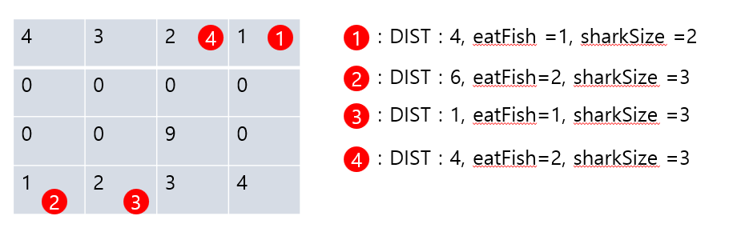
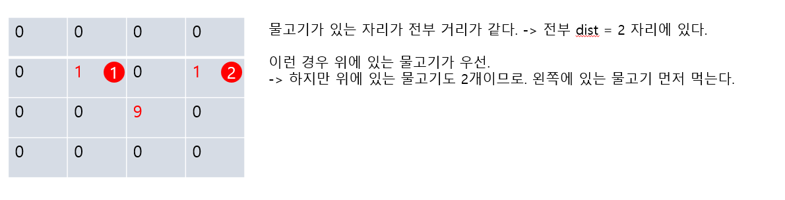

```java
import java.io.BufferedReader;
import java.io.IOException;
import java.io.InputStreamReader;
import java.util.LinkedList;
import java.util.Queue;
import java.util.StringTokenizer;

public class P16326 {
    static int N;
    static int[][]map;
    static int sharkSize = 2;
    static int[]dx = {-1, 0, 1, 0};
    static int[]dy = {0, -1, 0, 1};
    static int minX =0; // 아가상어가 먹은 최소 위치 좌표
    static int minY =0; 
    static int minDist =0;// 아가상어가 먹은 최소 위치 거리.
    static int eatCount =0;

    public static void main(String[] args) throws IOException {
        BufferedReader br = new BufferedReader(new InputStreamReader(System.in));
        StringTokenizer st = new StringTokenizer(br.readLine());
        N = Integer.parseInt(st.nextToken());
        map = new int[N][N];
        int sharkX=0;
        int sharkY=0;
        for(int i = 0 ; i<N; i++){
            st = new StringTokenizer(br.readLine());
            for(int j =0; j<N; j++){
                map[i][j] = Integer.parseInt(st.nextToken());
                if(map[i][j] == 9){
                    sharkX = j;
                    sharkY = i;
                    map[i][j] = 0;
                }
            }
        }
        int sum =0;

        while (true){
            minDist = Integer.MAX_VALUE;
            minX = Integer.MAX_VALUE;
            minY = Integer.MAX_VALUE;
            bfs(sharkX, sharkY);
            //minDist minX minY 3개를 알 수 있음
            //상어 사이즈 업그레이드

//            System.out.println("min : "+minX+", minY : " + minY+", DIST : " + minDist +", eat : " + eatCount);

            if(minDist == Integer.MAX_VALUE){ //먹는거에 실패
                break;
            }else { //먹는거 성공
                //상어사이즈 업그레이드
                eatCount++;
                if(sharkSize == eatCount){
//                    System.out.println("sharkt : "+ sharkSize + ", eat : " + eatCount);
                    sharkSize++;
                    eatCount = 0;
                }
//                System.out.println("sharkt2 : "+ sharkSize + ", eat2 : " + eatCount);
                map[minY][minX] = 0;
                sharkX = minX;
                sharkY = minY;
                sum += (minDist-1); //거리합산
            }
        }
        System.out.println(sum);

    }
    private static void bfs(int sharkX, int sharkY){
        Queue<int[]>que = new LinkedList<>();
        que.add(new int[]{sharkX, sharkY});
        int[][]dist = new int[N][N];
        dist[sharkY][sharkX] = 1;

        while (!que.isEmpty()){
            int []temp = que.poll();
            sharkX = temp[0];
            sharkY = temp[1];
            for(int i =0; i<4; i++){
                int nx = sharkX + dx[i];
                int ny = sharkY + dy[i];
                //nx ny 조건 들어가야함.
                if(nx >=0 && ny >=0 && nx <N && ny <N){
                    if(map[ny][nx]<=sharkSize && dist[ny][nx] == 0){
                        dist[ny][nx] = dist[sharkY][sharkX] + 1;
                        //minX, minY, minDist 를 알아야함.
                        if(map[ny][nx] < sharkSize && map[ny][nx] != 0){ //먹을 수 있는상태
                            if(minDist > dist[ny][nx]){ //먹을 수 있는 상태
                                minDist = dist[ny][nx];
                                minY = ny;
                                minX = nx;
                            }else if(minDist == dist[ny][nx]){ // 최소거리에 동시에 2개 존재할때 위에부터 비교 하고 왼쪽 부터 오는 걸로 비교
                                if(minY > ny){ //y좌표 비교
                                    minDist = dist[ny][nx];
                                    minY = ny;
                                    minX = nx;
                                }else if(minY == ny){ //y 좌표까지 같을때
                                    //x 좌표로 비교
                                    if(minX > nx){
                                        minDist = dist[ny][nx];
                                        minX = nx;
                                        minY = ny;
                                    }
                                }
                            }
                        }
                        que.add(new int[]{nx, ny});
                    }
                }
            }
        }
    }
}
```

### 예제 3번



### 풀이
---
#### 생각해야할 것.
아가상어가 물고기를 먹을 때.
1. 아가상어랑 물고기랑 크기가 같으면 지나갈 수만 있다.
2. 아가상어보다 큰 물고기는 지나갈 수 없다.
3. 아가 상어가 물고기가 보다 작을 때만 먹을 수 있다.
   1. 물고기가 많을 때 가장 가까운 물고기를 먹는다.
      1. 가까운 물고기가 많을 땐, 북쪽 물고기 우선이고, 북쪽에도 여러마리라면 서쪽에 있는 물고기를 먹는다.
   

dfs()를 한번만 돌아서 풀리는 문제는 아니다.
- dfs()가 한번 돌때는 가장 가까운 물고기를 먹었을 때이다.
( 즉, 물고기를 한번 먹으면 dfs는 한번 멈춰야 하고, 먹은 물고기의 좌표와 거리가 필요하다)
  - -> 그리고 이렇게 얻은 먹은물고기의 좌표를 기준으로 더 가까운 물고기가 있는지 탐색한다.

이러한 dfs가 종료되는 조건은. 더이상 먹을 물고기가 없는 경우이다.
- 즉, dfs가 끝나는 시점에 먹은 물고기의 좌표(minX, minY, minDist)가 초기값이라면,먹을 물고기가 없다는 의미다.


