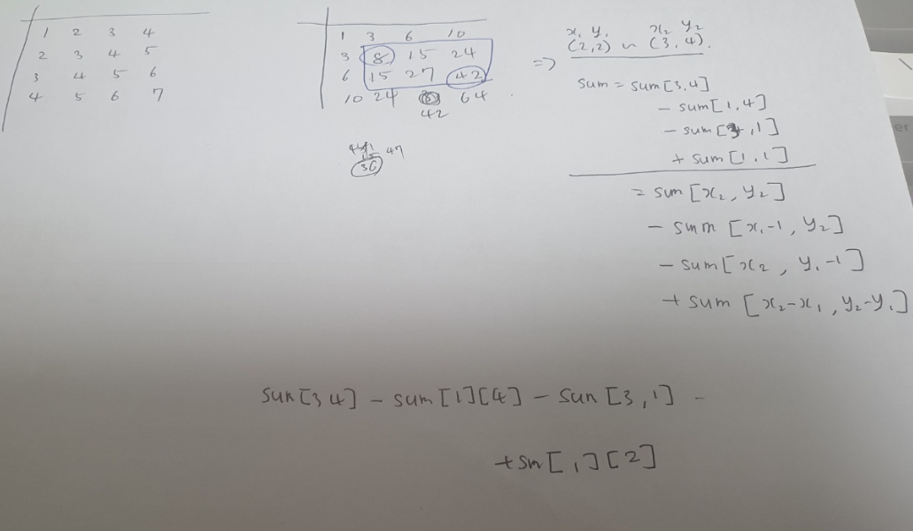

```java
package study;

import java.io.BufferedReader;
import java.io.IOException;
import java.io.InputStreamReader;

public class P11660 {
    public static void main(String[] args) throws IOException {
        BufferedReader br = new BufferedReader(new InputStreamReader(System.in));
        String[] str = br.readLine().split(" ");

        int N = Integer.parseInt(str[0]);
        int M = Integer.parseInt(str[1]);

        int[][] arr = new int[N+1][N+1];
        int[][] sum = new int[N+1][N+1];

        for (int i = 1; i<N+1; i++) {
            str = br.readLine().split(" ");
            for(int j=0; j<N; j++) {
                arr[i][j+1] = Integer.parseInt(str[j]);
            }
        }

        for (int i = 1; i<N+1; i++) {
            for (int j= 1; j<N+1; j++) {
                sum[i][j] = sum[i-1][j] + sum[i][j-1] - sum[i-1][j-1] + arr[i][j];
            }
        }

        for (int i=0; i<M; i++) {
            str = br.readLine().split(" ");
            int x1 = Integer.parseInt(str[0]);
            int y1 = Integer.parseInt(str[1]);
            int x2 = Integer.parseInt(str[2]);
            int y2 = Integer.parseInt(str[3]);

            int result = sum[x2][y2] - sum[x1-1][y2] - sum[x2][y1-1] + sum[x1-1][y1-1];
            System.out.println(result);
        }
    }
}
```



sum[i][j] = sum[i][j-1] + sum[i-1][j] - sum[i-1][j-1] + arr[i][j]
 