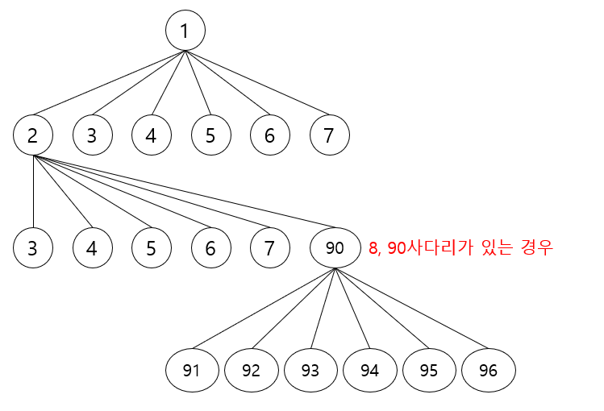

```java
4 7
32 62
42 68
12 66
18 99
95 13
97 25
93 37
79 27
75 19
49 47
67 17

정답 : 4
```



이런 느낌이려나…

```java
package study;

import java.io.BufferedReader;
import java.io.IOException;
import java.io.InputStreamReader;
import java.util.*;

public class P16928 {
    //만약 주사위를 굴린 결과가 100번 칸을 넘어간다면 이동할 수 없다
    //도착한 칸이 사다리면, 사다리를 타고 위로 올라간
    //뱀이 있는 칸에 도착하면, 뱀을 따라서 내려가게 된
    // - >사다리를 이용해 이동한 칸의 번호는 원래 있던 칸의 번호보다 크고, 뱀을 이용해 이동한 칸의 번호는 원래 있던 칸의 번호보다 작아진다.
    // 동시에 뱀과 사다리를 가지고 있느 경우는 없다.

    // 100번 칸에 도착하기 위해 주사위를 굴려야 하는 횟수의 최솟값
    // -> 최솟값 탐색이니.. BFS?
    static int N; // 게임판의 사다리 수 1<= N <=15
    static int M; // 게임판의 뱀의 수 1<= M <=15

    // 가장 베스트는 가장 앞에 있는 사다리를 타서 최대한 멀리가는 것.
    // 사다리만 사용
    // 사다리 -> 뱀 -> 사다리

    // map?

    // 주사위를 굴려서 사다리 map의 키를 찾아서 value 값으로 위치를 바꾸는 거지.
    // 가장 문제가 될만한게 사다리 -> 뱀 -> 사다리넹..

    static Map<Integer, Integer> gameMap = new HashMap<>(); // JVM 클래스로더로 인행 링크시점에 할당 및 초기화.
    static int start=1;
    static int end = 100;
    static int result = 0;

    static boolean[] visited;

    public static void main(String[] args) throws IOException {
        BufferedReader br = new BufferedReader(new InputStreamReader(System.in));

        StringTokenizer token = new StringTokenizer(br.readLine());
        N = Integer.parseInt(token.nextToken());
        M = Integer.parseInt(token.nextToken());
        visited = new boolean[101];

        for (int i=0; i<N; i++) {
            token = new StringTokenizer(br.readLine());
            int key = Integer.parseInt(token.nextToken());
            int value= Integer.parseInt(token.nextToken());
            gameMap.put(key, value);
        }

        for (int i=0; i<M; i++) {
            token = new StringTokenizer(br.readLine());
            int key = Integer.parseInt(token.nextToken());
            int value= Integer.parseInt(token.nextToken());
            gameMap.put(key, value);
        }

        //////////////////////////////////////////////메인 로직 ///////////////////////////////////////////////////////////////

//        int locate = 1; // 1부터 시작.
        bfs();

        System.out.println(result);

    }

    private static void bfs() {

        Queue<Integer> queue = new LinkedList<>();
        queue.add(start);
        visited[start] = true;

        while (!queue.isEmpty()) {
            result++; // queueSize 만큼 다 돌았다는 것은 -> 주사위 이미 6까지는 굴려봤다는 의미니깐
            int queueSize = queue.size();

            for (int i = 0; i < queueSize; i++) {
                int now = queue.poll(); // 현재 위치.

                // 주사위 돌리기
                for (int j=1; j<=6; j++) {
                    int move = now + j;
                    if (move == end) return;

                    if(move > end) continue;
                    if(visited[move]) continue;

                    visited[move] = true;
                    if(gameMap.containsKey(move)) { // 사다리나 뱀을 만난 경우.
                        move = gameMap.get(move);
                    }
                    queue.add(move);
                }
            }
        }
    }
}
```