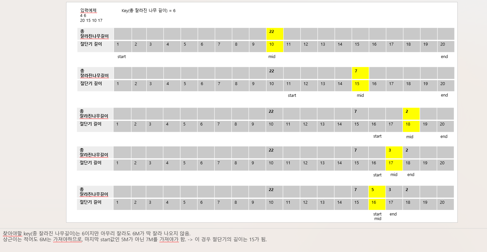

[반례]<br>
6 1<br>
0 2 0 0 0 2
```java
import java.io.BufferedReader;
import java.io.IOException;
import java.io.InputStreamReader;
import java.util.*;

public class P2805_2 {

    static int N; // 나무 수
    static int M; // 필요한 나무 길이

    static int[] arr;
    //    static List<Integer> result;
//    static int[] result;
    static Map<Integer, Integer> result = new HashMap<>();

    public static void main(String[] args) throws IOException {
        BufferedReader br = new BufferedReader(new InputStreamReader(System.in));
        StringTokenizer token = new StringTokenizer(br.readLine());
        N  = Integer.parseInt(token.nextToken());
        M  = Integer.parseInt(token.nextToken());
        int min = 0;
        int max = 0;
        int[] tree = new int[N];

        token = new StringTokenizer(br.readLine());
        for(int i = 0; i < N; i++) {
            tree[i] = Integer.parseInt(token.nextToken());

            /*
             * 나무들 중 최댓값을 구하기 위해 매 입력 때마다 max 변수와 비교하여
             * 입력 받은 나무가 max보다 클 경우 max 값을 해당 나무의 높이로 갱신해준다.
             */
            if(max < tree[i]) {
                max = tree[i];
            }
        }

        // 이분 탐색 (upper bound)
        while(min < max) {

            int mid = (min + max) / 2;
            long sum = 0;
            for(int treeHeight : tree) {

                /*
                 *  tree의 잘린 길이 = tree의 높이 - 자르는 위치(mid)
                 *  tree의 잘린 길의의 합을 구한다.
                 *  이 때 자르는 위치가 주어진 나무의 높이보다 클 수 있기 때문에
                 *  0 이하인 경우(=음수)에는 합산을 하지 않고 양수만 합산하도록 해야한다.
                 */
                if(treeHeight - mid > 0) {
                    sum += (treeHeight - mid);
                }
            }

            /*
             * 자른 나무 길의의 합이 M보다 작다는 것은
             * 자르는 위치(높이)가 높다는 의미이므로 높이를 낮춰야 한다.
             * 즉, 상한(max)를 줄여야 한다.
             */
            if(sum < M) {
                max = mid;
            }

            /*
             * 자른 나무 길이의 합이 M보다 크다는 것은
             * 자르는 위치(높이)가 낮다는 의미이므로 높이를 높여야 한다.
             * 또한, 같을 경우에는 최대한 적게 자르기 위해 자르는 높이를
             * 높여야 하므로 하한(min)을 올려야 한다.
             */
            else {
                min = mid + 1;
            }
        }

        System.out.println(min - 1);

    }

}
```



