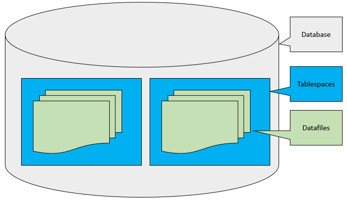

### 테이블 스페이스란?
물리적인 저장 공간을 관리하는 논리적인 단위.
테이블, 인덱스 와 같은 DB객체들이 저장되는 장소를 정의하구, DB의 물리적인 팡리들과 논리적인 객체간의 매핑을 제공함.
    -> 객체들을 그룹화하여 DB를 보다 구조화하고 관리하기 쉽게 만듦.

여러 테이블 스페이스를 가질 수 있으며, 각 테이블 스페이스는 하나 이상의 데이터 파일로 구성됨.



### Oracle 기본 테이블 스페이스
```sql
SELECT 
    tablespace_name
    ,contents
FROM DBA_TABLESPACES;
```


#### SYSTEM
: DB 엔진의 핵심 시스템객체와 메타데이터 저장.
시스템 테이블, 시스템 뷰, 데이터 딕셔너리 객체, 사용자 및 권한 정보 등이 저장됨.

#### SYSAUX
: SYSTEM 테이블 스페이스를 보완하여 여러 DB 구성요소에 대한 추가적인 정보 및 기능 제공.
 Oracle Enterprise Manager, Oracle Streams, Oracle Text, 참조 무결성, XML 데이터 등과 관련된 객체들이 저장됨.

#### UNDOTBS1
: Undo 데이터를 저장하는 데 사용됨.
Undo 데이터는 트랜잭션의 롤백 시점에서 필요한 정보를 포함하고 있음.
-> 따라서 롤백이 필요한 경우 해당 트랜잭션을 취소하는데 사용됨.
데이터베이스의 일관성과 격리성을 유지하는 데 중요한 역할을 함.

#### TEMP
정렬 및 집계 작업과 같은 임시 작업에 사용됨.


#### USERS
사용자가 생성한 테이블, 뷰, 인덱스 등의 객체를 저장하는 데 사용.


---
내용 및 이미지출처 : https://www.oracletutorial.com/oracle-administration/oracle-tablespace/