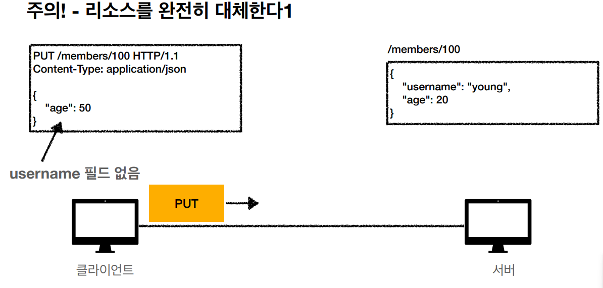
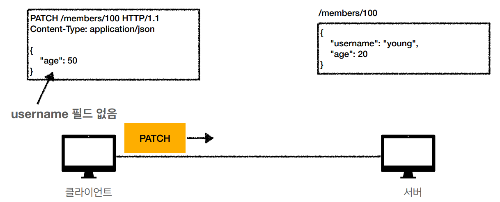

# 설계 시 중요! - 리소스 식별.

# API URI

### API URI  - 리소스

회원을 등록/수정/조회하는게 리소스가 아님.

—> `회원` 이라는 개념 자체가 리소스임.

( 등록/수정/조회하는 건 배제. )

### API URI - 행위

리소스와 해당 리소스를 대상으로 하는 행위를 분리.

리소스 : 회원

행위 : 조회, 등록, 삭제, 변경

리소스는 명사. 행위는 동사.

→ 이를 HTTP 메서드로 구분.

### PUT VS PATCH

PUT :  기존데이터 있으면 덮어 씀. (주의! 보내지 않는 데이터는 NULL로 들어감. ) ( 갈아치운다고 생각.) 

→ 그래서 PUT으로 등록도 가능. (단, 클라이언트가 리소스에 대해 알고 있어야 함. _

ex) put /files/{filename} (/file/star.jpg) 와 같이 클라이언트가 리소스를 관리하며, 이러한 저장소를 `스토어(Store)`라 함. → 이 예시에서 스토어는 /files가 됨.

위와 같이 고객100번의 username과 age 기존 데이터가 있는데, age만 PUT으로 보내버리면. 기존의 고객 100번의 username은 삭제됨.

PATCH : 데이터를 부분 변경함.

username을 보내지 않아도 username 사라지지 않음.

### API URI 설계 예시

회원 목록 조회 : `GET` `/members`

회원 조회 : `GET` `/members/{id}`

회원 등록 : `POST` `/members`

회원 수정 : `PUT,PATCH,POST` `/members/{id}`

회원 삭제 : `DELETE` `/members/{id}`

# HTTP 메서드 속성

## 안전(Safe)

GET은 호출해도 리소스를 변경하지 않으니 `안전`

하지만 POST, PUT, PATCH는 리소스를 변경하니 안전하지 않음.

## 멱등(Idempotent)

한 번 호출하든 두번 호출하든 100번 호출하든 결과가 똑같음.

`GET` : 한 번 조회하든, 두 번 조회하든 같은 결과 조회.

`PUT/PATCH` : 결과를 대체할 뿐, 같은 요청을 여러번 해도 최종 결과는 같음.

`DELETE` : 결과를 삭제할 뿐, 같은 요청을 여러번 해도 삭제된 결과는 같음.

`POST` : **멱등아님!!!!** 두 번 호출하면 같은 결제가 중복해서 발생할 수 있음.

### 멱등의 활용

자동 복구 메커니즘.

ex) 서버가 TIMEOUT와 같은 장애 발생으로 정상 응답을 주지 못했을 때, 클라이언트가 같은 요청을 다시 해도 되는가? → 이 판단 근거가 됨.

( 멱등하면 다시 요청해도 상관없지만, 멱등하지 않으면 다시 요청하면 안됨 )

### 멱등의 예외

만일 재요청 중간에 다른 곳에서 리소를 변경한 경우는?

ex)

사용자1 : GET → username:A, age:20

사용자2 : PUT → username:A, age:30

사용자1 : GET → username:A, age:20 → 사용자2에 의해 바뀐 데이터 조회.

→ **멱등은 외부 요인으로 중간에 리소스가 변경되는 것까지는 고려하지 않음.**

## 캐시가능(Cacheable)

응답 결과 리소스를 캐시해서 사용해도 되는지?

GET, HEAD, POST, PATCH는 캐시가능.

실제로는 GET, HEAD 정도만 캐시로 사용.

→ POST, PATCH는 본문 내용까지 캐시 키로 고려해야 하는데, 구현이 어려움.

( 캐시를 하기 위해선 키가 필요함 )

출처 : https://www.inflearn.com/course/http-%EC%9B%B9-%EB%84%A4%ED%8A%B8%EC%9B%8C%ED%81%AC/dashboard