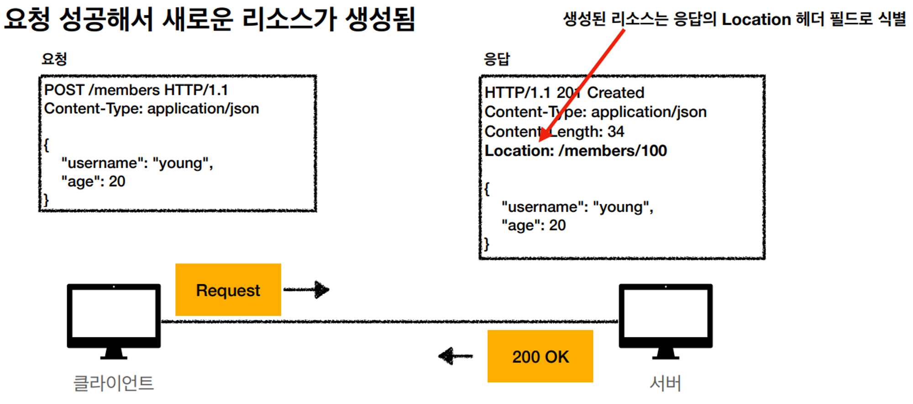
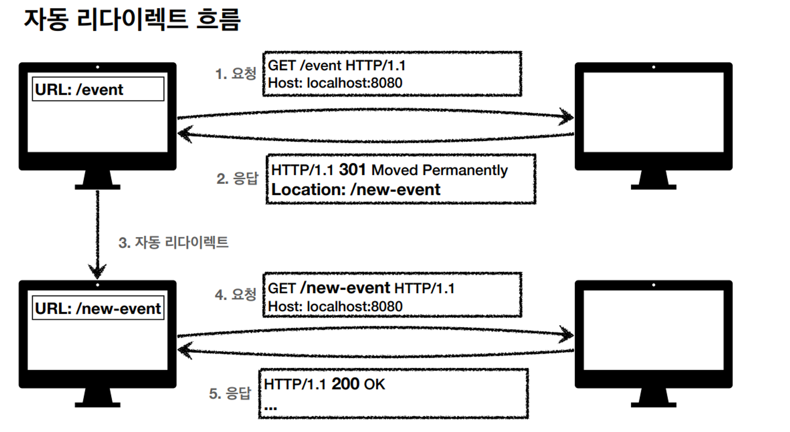
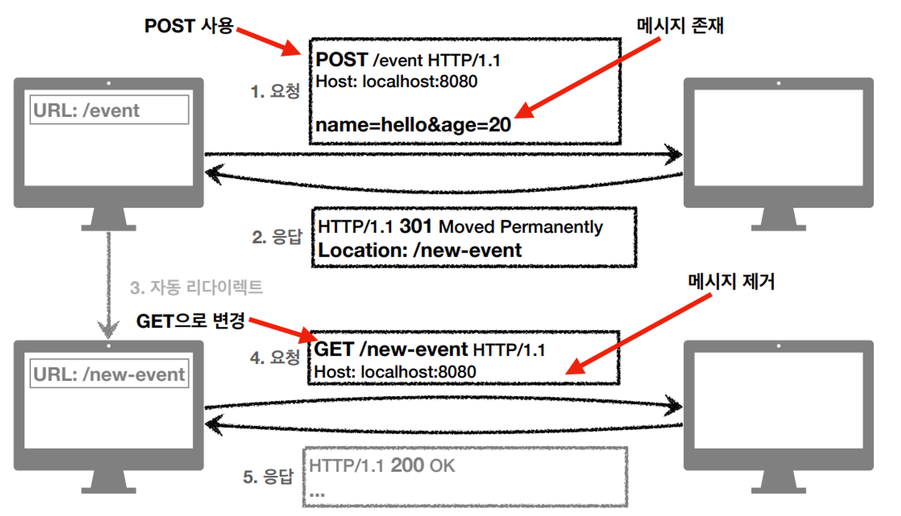
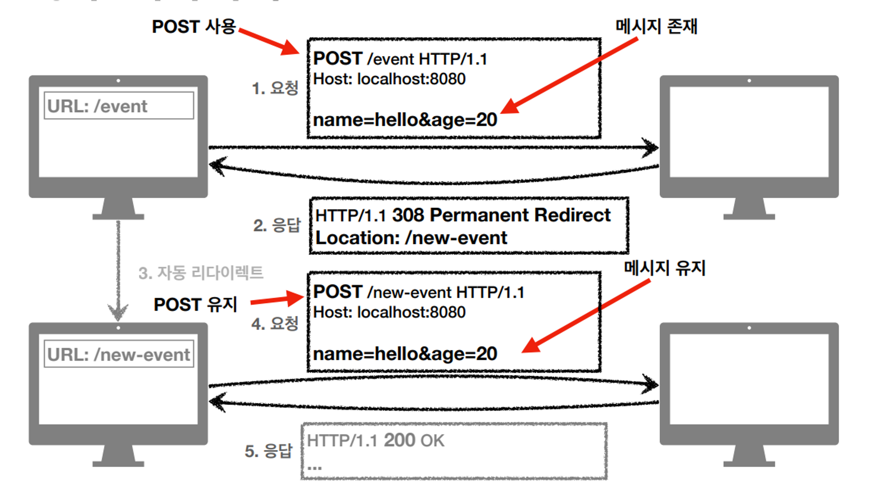
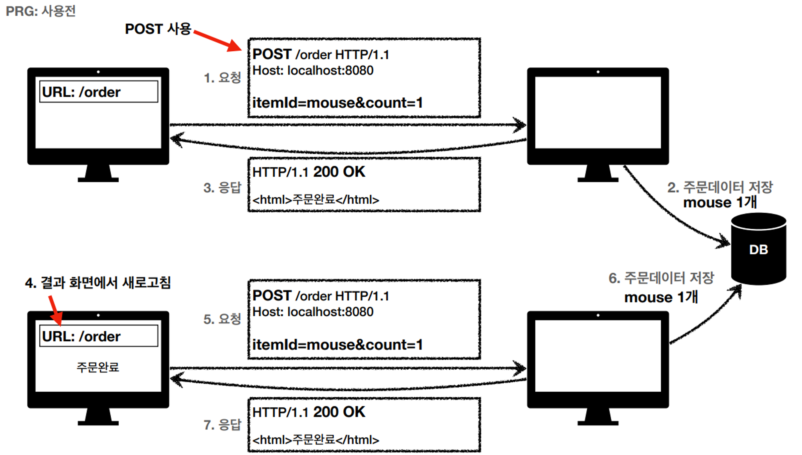
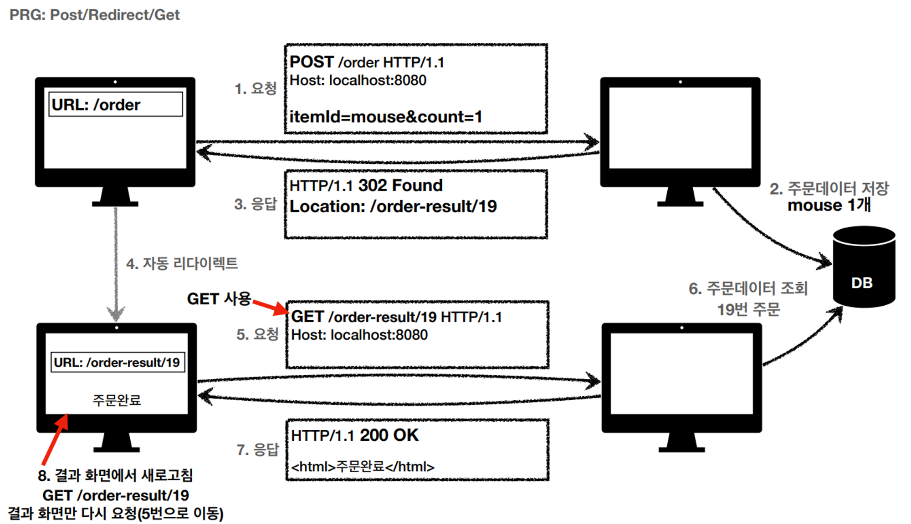

`1xx (Informational`) : 요청이 수신되어 처리중 ( 거의 쓰이지 않음 )

`2xx (Successful)` : 요청 정상 처리

`3xx (Redirection)` : 요청을 완료하려면 추가 행동이 필요

`4xx (Client Error)` : 클라이언트 오류, 잘못된 문법등으로 서버가 요청을 수행할 수 없음

`5xx (Server Error)` : 서버 오류, 서버가 정상 요청을 처리하지 못함.

→ 만일 새로운 상태코드가 추가되어도 상위 상태 코드로 해석해서 처리.

ex) 299이라는 상태코드가 추가되어도, 클라이언트는 2xx로 해석해서 처리.

# 2xx - 성공

200 OK

201 Created

202 Accepted

204 No Content  

### 201 - Created

  

### 202 Accepted

요청은 접수가 되었으나, 처리가 완료되지 않음.

→ 배치 처리 같은 곳에서 사용.

ex) 요청 접수 후 1시간 뒤에 배치 프로세스가 요청을 처리.

→ 근데 잘 사용안함..
  

### 204 No Content

서버가 요청을 성공적으로 수행했으나, 응답 페이로드 본문에 보낼 데이터가 없음.

ex) 웹 문서 편집기에서 save 버튼을 누르면, 딱히 서버쪽에서 내려보낼 응답이 없음.

→ save 버튼의 결과로 아무 내용이 없어도 됨 → 쓸데가 없음..

→ save 버튼을 눌러도 같은 화면을 유지해야함.

→ 결과 내용이 없어도 204 메세지는 2xx 상위 메시지로 성공으로 인식할 수 있음.  

## 3xx - 리다이렉션

요청을 완료하기 위해 추가 조치가 필요하여 클라이언트에게 다시 보냄.

300 Multiple Choices ( 거의 안씀 )

301 Moved Permanently

302 Found

303 See Other

304 Not Modified

307 Temporary Redirect

308 Permanent Redirect
---

### 리다이렉션이란

웹 브라우저는 3xx 응답의 결과에 Location 헤더가 있으면, Location 위치로 자동 이동  → `리다이렉트`

만일 `/event`라는 경로가 `/new-event`로 바뀌었을 때.

북마크도 할 수 있고, 공유가 됐을 수도 있으니.

`/event` 경로로 접근한 경우, 서버에서는 새로운 주소를 `Location`에 담아서 `301`응답을 보내면, 클라이언트에서 자동으로 `Location`에 담긴 주소 `/new-event`로 이동 하면서, 서버에 `GET /new-evnet`로 다시 요청함.

## 리다이렉션 종류

`영구 리다이렉션` : 특정 리소스의 URI가 영구적으로 이동.

ex ) /event → /new-event로 아예 경로가 바뀐 경우

`일시 리다이렉션` : 일시적인 변경

주문 완료 후 주문 내역 화면으로 이동.

PRG패턴 사용.

`특수 리다이렉션`

결과 대신 캐시를 사용.

ex) 클라이언트에서 캐시가 있는데 만료가 된것같애.

그래서 클라이언트가 서버에 이거 캐시 만료된 것 같은데 하면서 요청을 보냄. → 이때 캐시 생성일자같은걸 넘김

서버가 보고 그대로 써도 됨. 캐시에서 다시 조회하렴 서버가 응답을 보냄. → 결과 대신에 캐시를 사용.  

### 영구 리다이렉션 - 301, 308

리소스의 URI가 영구적으로 이동.

원래의 URL를 사용하지 않고, 검색 엔진 등에서도 변경인지.

( ex) /event 경로는 더이상 쓰지 않고 /new-event로 바뀐 경우 )   

301 - Moved Permanently

: 리다이렉트 시, 요청 메서드가 GET으로 변하고, 본문이 제거될 수 있음.(MAY) → 가장 많이 씀.

( 단, 제거되지 않을 수 있음. 초기에는 제거되게 구현. )

: 결국 /event 에서 입력한 값을 새로운 /new-event 창에서 다시 입력하여 요청해야 함.

  

308 - Permanent Redirect

: 301과 기능은 같음.

단, 리다이렉트 시, 요청 메서드와 본문을 유지함. (처음 POST로 보내면 리다이렉트도 POST 유지)

: 스펙이 있으니깐 설명할 뿐. 실제로는 안씀.

대부분 URI 가 바뀌면 필요한 데이터 자체도 바뀌는 경우가 많아서.

## 일시적인 리다이렉션 - 302, 307, 303

가장 많이 사용하는 리다이렉션.

리소스의 URI가 일시적으로 변경.

→ 따라서 검색 엔진 등에서 URL를 변경하면 안됨.  

302 Found

: 리다이렉트 시, 요청 메서드가 GET으로 변하고, 본문이 제거될 수 있음.(MAY) → 가장많이 씀.

→ 301과 비슷.  

307 Temporary Redirect

: 302와 기능은 같음.

리다이렉트 시, 요쳥 메서드와 본문유지( 요청 메서드를 변경하면 안됨.  MUST NOT)
  

303 See Other

: 302와 기능은 같음

리다이렉트 시, 요청 메서드가 GET으로 변경.

## PRG : POST/Redirect/Get

POST로 주문후에 웹 브라우저를 새로고침하면? 

→ 중복 주문이 될 수 있음.

### PRG 사용 전

 원칙적으로 서버에서 중복을 막는게 맞음..

하지만 클라이언트에서도 조치 필요

### PRG 사용 후

 POST로 주문후에 새로고침으로 인한 중복 주문 방지를 위해

→ POST로 주문후에 주문 결과 화면을 GET메서드로 리다이렉트 시킴.

새로고침해도 결과 화면을 GET으로 조회하게 됨.

→  이러면 중복 주문 대신에 결과 화면만 GET으로 다시 요청

## 304 - Not Modified

캐시를 목적으로 사용

클라이언트에게 리소스가 수정되지 않았음을 알려준다. 따라서 클라이언트는 로컬PC에
저장된 캐시를 재사용한다. (캐시로 리다이렉트 한다.로 이해하면 됨.)

304 응답은 응답에 메시지 바디를 포함하면 안된다. (로컬 캐시를 사용해야 하므로)

조건부 GET, HEAD 요청시 사용

# 정리

`302 Found` -> GET으로 변할 수 있음

`307 Temporary Redirect` -> 메서드가 변하면 안됨

`303 See Other` -> 메서드가 GET으로 변경 

역사

처음 302 스펙의 의도는 HTTP 메서드를 유지하는 것

그런데 웹 브라우저들이 대부분 GET으로 바꾸어버림(일부는 다르게 동작)

그래서 모호한 302를 대신하는 명확한 `307`, `303`이 등장함(301 대응으로 308도 등장) 

현실

307, 303을 권장하지만 현실적으로 **이미 많은 애플리케이션 라이브러리들이 `302`를 기본값으로 사용.**

**자동 리다이렉션시에 GET으로 변해도 되면 그냥 302를 사용해도 큰 문제 없음**
  
# 4xx (Client Error)

클라이언트의 요청에 잘못된 문법등으로 서버가 요청을 수행할 수 없음

오류의 원인이 클라이언트에 있음

**중요!** 클라이언트가 이미 잘못된 요청, 데이터를 보내고 있기 때문에, 똑같은 재시도가 실
패함 → 5xx 오류와 가장 큰 차이.
  
## 400 Bad Request

클라이언트가 잘못된 요청을 해서 서버가 요청을 처리할 수 없음.

→ 요청 구문, 메시지 등등 오류.

클라이언트는 요청 내용을 다시 검토하고, 보내야 함.

ex) 요청 파라미터가 잘못되거나, API 스펙이 맞지 않을 때  

## 401 Unauthorized

클라이언트가 해당 리소스에 대한 인증이 필요함

인증(Authentication) 되지 않음.

401 오류 발생시 응답에 WWW-Authenticate 헤더와 함께 인증 방법을 설명.  

#참고

인증(Authentication): 본인이 누구인지 확인, (로그인)

인가(Authorization): 권한부여 (ADMIN 권한처럼 특정 리소스에 접근할 수 있는 권한,
인증이 있어야 인가가 있음)

오류 메시지가 Unauthorized 이지만 인증 되지 않음 (이름이 아쉬움)

## 403 Forbidden

서버가 요청을 이해했지만 승인을 거부함

주로 인증 자격 증명은 있지만, 접근 권한이 불충분한 경우

ex) 어드민 등급이 아닌 사용자가 로그인은 했지만, 어드민 등급의 리소스에 접근하는 경우.

## 404 Not Found

요청 리소스를 찾을 수 없음

요청 리소스가 서버에 없음. 또는 클라이언트가 권한이 부족한 리소스에 접근할 때 해당 리소스를 숨기고 싶을 때

# 5xx (Server Error)

서버 문제로 오류 발생

서버에 문제가 있기 때문에 재시도 하면 성공할 수도 있음. (복구가 되거나 등등) 

→ 이게 4xx랑 큰 차이점.

진짜 서버 오류인 경우에만 사용

ex) 고객의 잔고가 부족하다고 500 떨구면 안됨.

## 500 Internal Server Error

서버 문제로 오류 발생하며 애매한 오류는 대개 500 오류로 처리.

## 503 Service Unavailable

서비스 이용 불가

서버가 일시적인 과부하 또는 예정된 작업으로 잠시 요청을 처리할 수 없음

→ Retry-After 헤더 필드로 얼마 뒤에 복구되는지 보낼 수도 있음

→ 볼 수 있는 경우는 거의 없고.. 대부분 500이 떨어짐.

출처 : https://www.inflearn.com/course/http-%EC%9B%B9-%EB%84%A4%ED%8A%B8%EC%9B%8C%ED%81%AC/dashboard