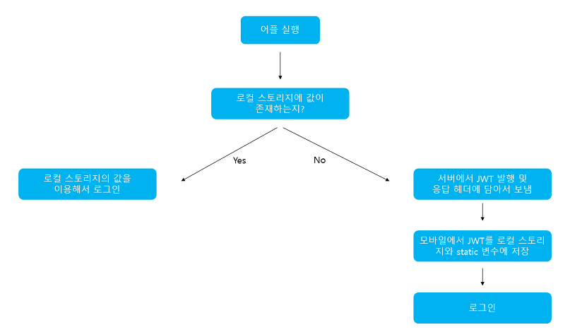
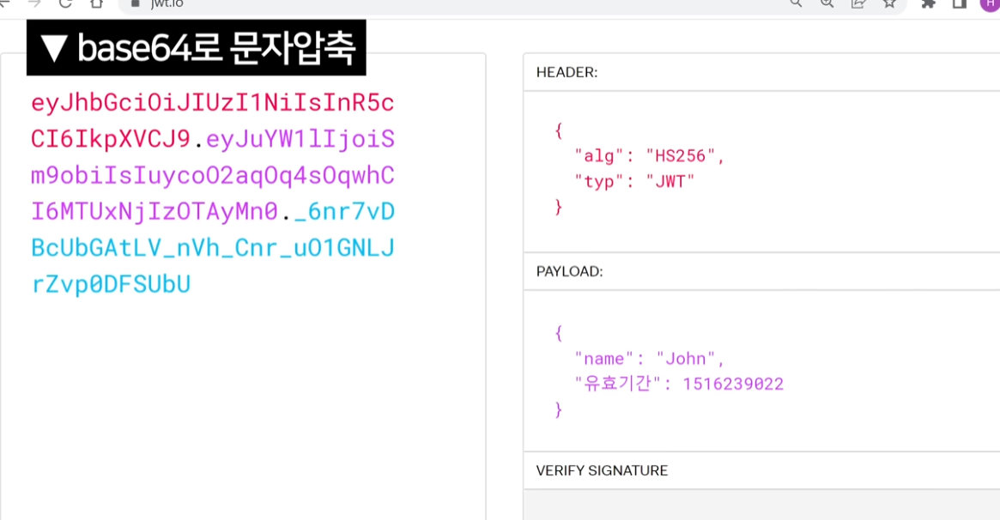

### JWT(Json Web Token)란

Json 포맷을 이용하여 사용자에 대한 속성을 저장하는 claim(사용자 정보나 데이터 속성 등) 기반 web Token.

토큰 자체를 정보로 사용 → `self-Contained 방식`.

애플리케이션이 실행될 때, JWT를 static 변수와 로컬 스토리지에 저장



위와 같이 어플리케이션이 실행 될 때, JWT를 static 변수와 로컬 스토리지에 저장.

( static 변수에 저장되는 이유는 HTTP 통신 시, 헤더에 담아 보낼 때 계속 스토리지에서 불러오면 오버헤드 발생할 수 있음 )

클라이언트에서 JWT를 포함해서 보내면 서버는 허가된 JWT인지 확인.

( 로그아우 시, 로컬 스토리지에 저장된 JWT는 제거. 또는 블랙리스트 DB테이블로 관리하기도 함)

## JWT 구조

1. Header
2. Payload
3. Signature

→ 위 3가지 부분은 Base64Url로 인코딩 되어 표현됨.

또한 각 부분을 이어주는 `.`구분자를 사용함.




### JWT구조 - 1. Header

Header는 typ와 alg 정보로 구성

alg : Signature를 해싱하기 위한 알고리즘 지정. 

ex)HS256(SHA256) 또는 RSA

typ : 토큰의 타입 지정

ex) JWT

```java
{
	"alg" : "HS256"
	"typ" : "JWT"
	}
```

### JWT구조 - 2. payLoad(페이로드)

토큰에서 사용할 정보의 조각인 클레임(Claim)이 담겨 있음.

3가지로 구성되어 있음.

1. 등록된 클레임(Registered Claim)

토큰 정보를 표현하기 위해 이미 정해진 종류의 데이터이며, 선택적으로 작성 가능.

`iss` : 토큰 발급자
`sub` : 토큰 제목
`aud` : 토큰 대상자
`exp` : 토큰의 만료시간
`nbf` : 토큰 활성 날짜. 이 날짜가 지나기 전의 토큰은 활성화되지 않는다.
`iat` : 토큰이 발급된 시간. 이 값을 통해 토큰 발급된 이후 시간의 경과를 알 수 있다.
`jti` : JWT의 고유 식별자. 중복 방지를 위해 사용하며, 일회용 토큰(ex. Access Token)에 사용된다.

1.  공개 클레임(public Claim)

충돌 방지를 위한 이름. URI 포맷을 사용.

사실 단순히 서버와 클라이언트 사이에서 사용자를 인증하는 용도로 사용한다면 크게 신경쓰지 않아도 좋다. 서버-클라이언트 사이의 단순 통신을 넘어 제 3자도 JWT 토큰을 사용할 때 충돌이 일어나지 않도록 합의된 클레임이라고 생각하면 된다.

```java
{
  "email": "sample@domain.com",
  "profile": "http://domain.com/image.png",
  "http://domain.com/xxx/yyy/is_admin": true
}
```

위 처럼 등록된 공개 클레임인 **`email`** , **`profile`** 등을 사용할 수도 있음.고, **`http://domain.com/xxx/yyy/is_admin`** 처럼 URI 형태로도 사용할 수 있다.

[JSON Web Token (JWT)](https://www.iana.org/assignments/jwt/jwt.xhtml)

1. 비공개 클레임(Private Claim)

서버와 클라이언트 사이에서만 협의된 클레임으로, 공개 클레임과 충돌나지 않게 사용.

```java
{ 
    "token_type": access 
}
```

### JWT구조 - 3. Signature(서명)

토큰을 인코딩하거나 유효성 검증할 때 사용하는 고유한 암호화 코드.

헤더(Header)와 페이로드(payload)값을 각 Base64url로 인코딩하고, 인코딩한 값을 비밀키를 이용해 헤더(Header)에서 정의한 알고리즘으로 해싱하고, 이 값을 다시 Base64Url로 인코딩 생성.

## JWT 토큰

Header, payLoad, Signature를 기반으로 만들어진 JWT토큰은

HTTP 통신 시, Autorization 이라는 key, value로 사용됨.

( 일반적으로 value에는 Baearer이 앞에 붙음. )

```java
{ 
    "Authorization": "Bearer {생성된 토큰 값}",
 }
```

## JWT 주의. ( 단점 )

1. 문제점 1.

header에 “lag”는 무조건 HS256으로 쓰자.

절대 none으로 해서는 안됨.

(none인 경우 간혹 어떤 서버들은 입장이 됨. none일 때 거절하는 기능도 있는지 확인 필요)

( 최신 라이브러리 잘 쓰면 걱정 없음. )

1. 문제점2.

jwt는 디코딩이 매우 쉬움.

그래서 입장권 내용 중에 민감한 내용은 절대 쓰면 안됨.

1. 문제점 3

시크릿키 문제.

대충 적는사람이 너무 많다..

→ 때려맞추기가 쉬워진다…

이 시크릿키가 털리면 입장권을 마음대로 발행할 수 있게 됨.

1. 키를 매우 길게 적어라.
2. 공유금지.
3. 생성용키/검증용키 2개를 사용 (private key + public key )

( 라이브러리에서 이런거 지원하는지 확인하면 좋음 )

1. 문제점4

jwt 탈취. → 잃어버린 놈 문제.

어떤 user가 입장권을 도난 당하면 이걸 정지시키는 것도 중요함.

→ 근데 jwt는 그딴거 몬함.

그래서 나타난 솔류션

1. 훔치기 어렵게.
    1. HttpOnly cookie
2. jwt 블랙리스트 운영
    1. 특정 입장권은 입장 불가.
        1. 그런데 이렇게 하면 jwt를 쓰는 장점이 없어짐 → session 방식이랑 별 차이가 없음.
3. jwt 유효기간을 짧게.
    1. refresh token을 따로 운영해야 함.
        1. refresh token이 있으면 5분마다 새로 jwt 발급 가능하도록.
        2. 근데 이것도 탈취당할 수 있기 때문에 Refresh token rotation 이 필요함.
        
<br><br>
참고 : 
[직접 만들어보며 이해하는 JWT](https://hudi.blog/self-made-jwt/)
<br>[[Server] JWT(Json Web Token)란?](https://mangkyu.tistory.com/56)
<br>
https://www.youtube.com/watch?v=XXseiON9CV0&list=RDCMUCSLrpBAzr-ROVGHQ5EmxnUg&index=3