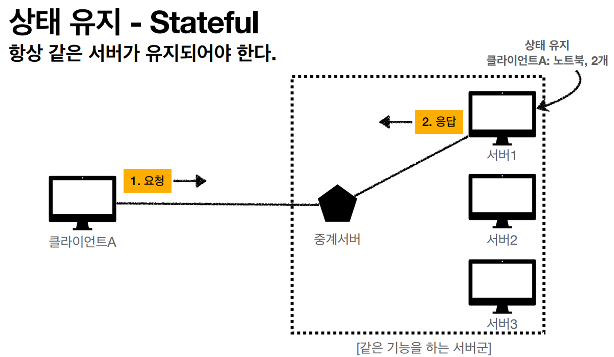
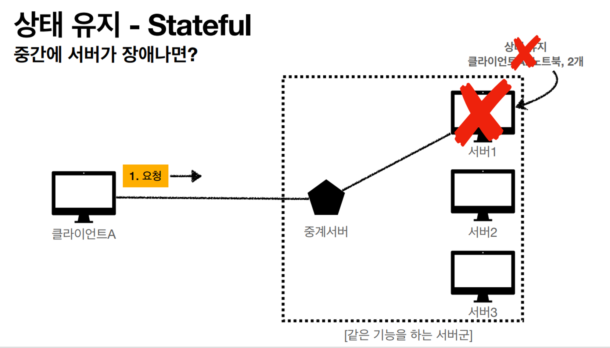
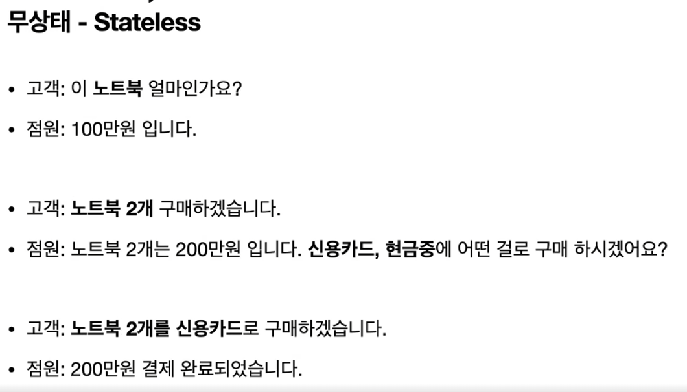
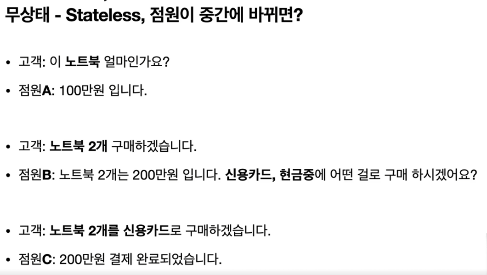
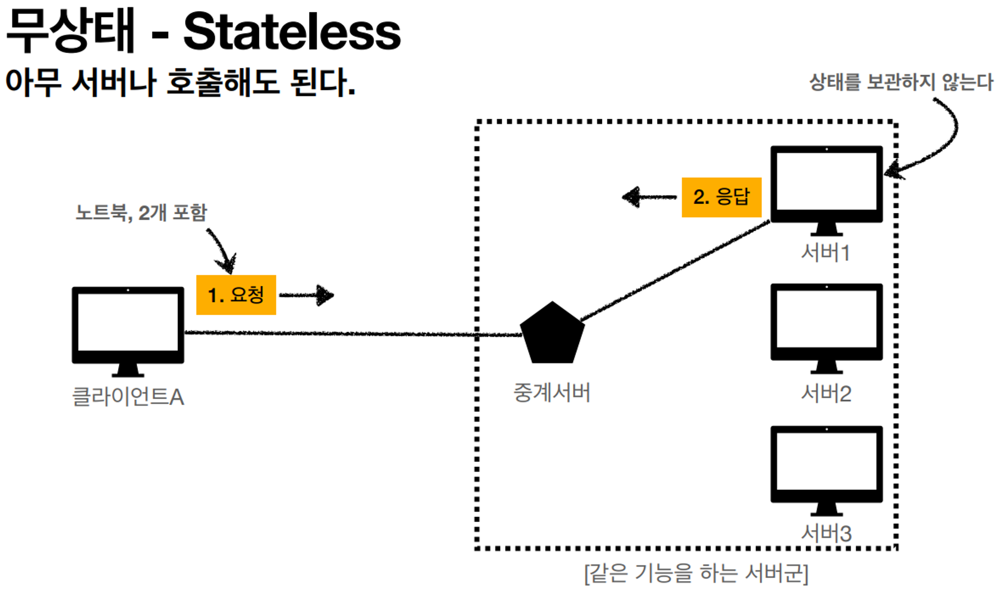
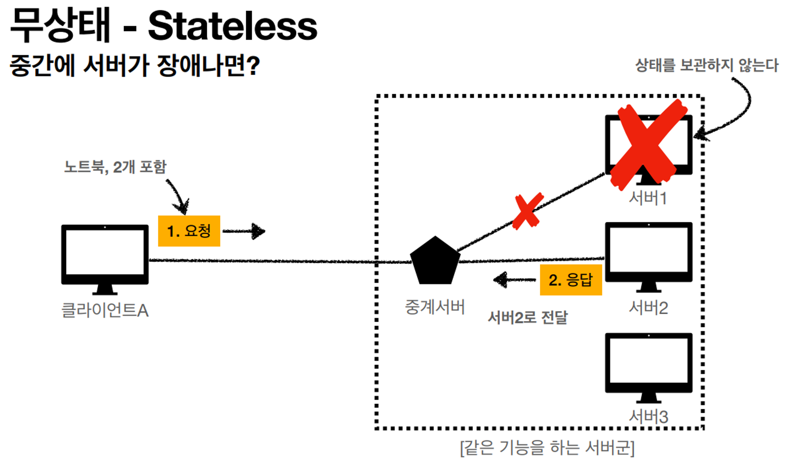
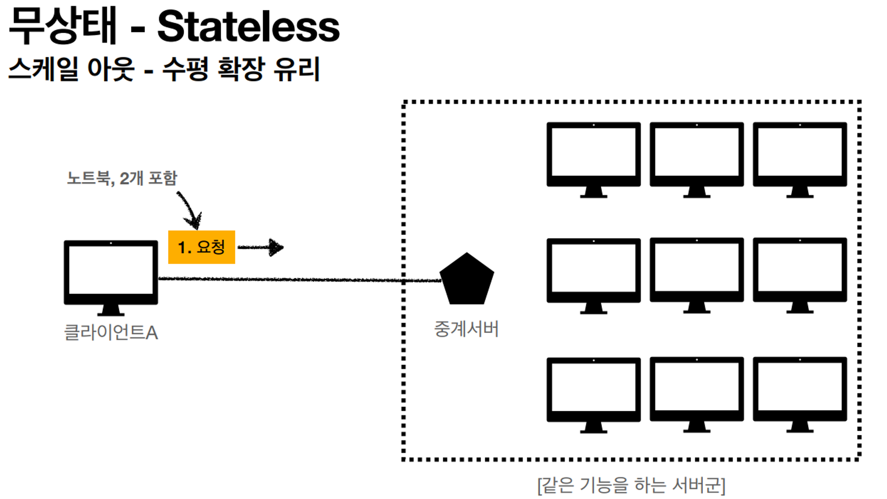

### 무상태 프로토콜(Stateless)

서버가 클라이언트 상태를 보존 X → 그래서 클라이언트가 계속 필요한 데이터를 던져줘야해.

### 단점

모든 것을 무상태로 설계할 수 없는 경우도 있다.

ex ) 로그인이 필요한 경우

→ 이런 경우 로그인한 사용자가 로그인 했다는 상태를 서버에 유지해야 함.

일반적으로 브라우저 쿠키와 서버 세션등을 사용해 상태를 유지함. 

데이터를 양이 많은 편이라 상태유지는 최소한만 사용하도록.

### 상태 유지 (Stateful)

서버가 클라이언트의 상태를 보존하고 있음.

## Stateful과 Stateless 예시

### 상태유지(Stateful)

고객이 클라이언트고, 점원이 서버임.

다른 점원(서버)가 바뀌면 고객(클라이언트)의 상태를 모름.

원래 점원만 해당 고객의 상태를 알고 있음. 

 다시 처음부터 데이터를 보내야 함.  

### 무상태(Stateless)

점원(서버)가 바뀌어도 클라이언트가 계속 상태를 가지고 있기 때문에 괜찮음.

( 고객이 필요한 정보를 그때그때 잘 던져주니깐 )

 

서버가 장애가 나더라도 클라이언트는 평소와 똑같이 데이터를 보내면 됨.

그렇기 때문에 무한적 서버 증설이 가능함.

## Stateful, Stateless 차이

`**상태 유지(Stateful)**` : 중간에 다른 점원으로 바뀌면 안된다.

( 중간에 다른 점원으로 바뀔 때 상태 정보를 다른 점원에게 미리 알려줘야 함)

`**무상태(Stateless)**` : 중간에 다른 점원으로 바뀌어도 됨.

( 갑자기 클라이언트 요청이 증가해도 서버를 대거 투입할 수 있음)

( 즉, 무상태는 응답 서버를 쉽게 바뀔 수 있음. → 무한한 서버 증설 가능 )

출처 : https://www.inflearn.com/course/http-%EC%9B%B9-%EB%84%A4%ED%8A%B8%EC%9B%8C%ED%81%AC/dashboard