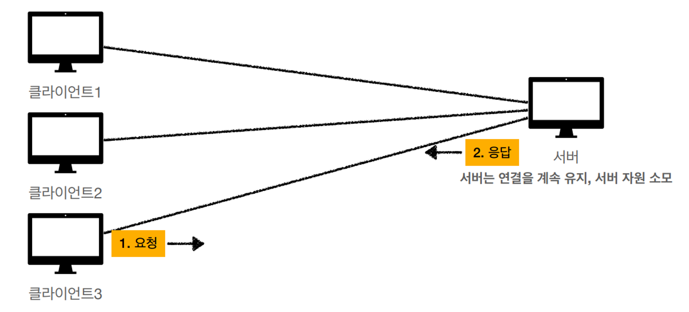
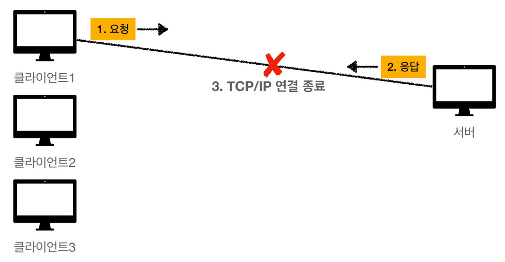
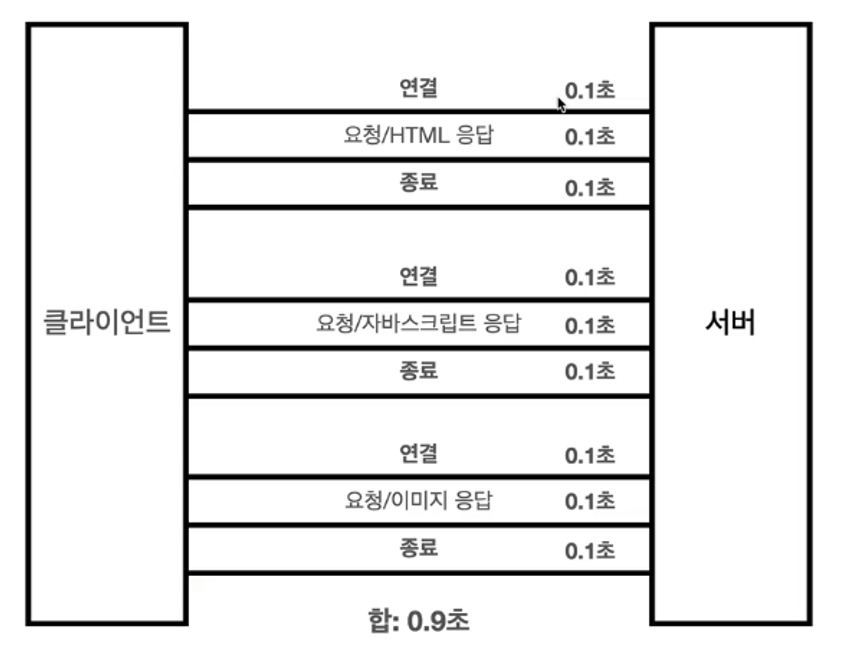
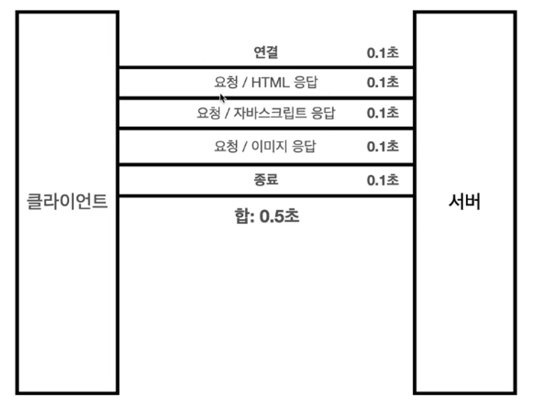

## 연결성

 클라이언트1이 연결되어 있는 동안 클라이언트2,3도 계속 연결을 유지하고 있을 수 있다.

→ 만일 해당 연결을 사용하지 않아도 계속 연결되어 있으므로 서버 자원이 소모됨.  

## 비연결성

클라이언트와 서버의 연결을 계속 유지하지 않음.

클라이언트1의 연결은 요청이 끝나면 끊김.

그리고 다시 클라이언트1의 요청을 하면 다시 연결되는 방식.

→ 최소한의 자원 사용.

HTTP는 기본적으로 연결을 유지하지 않는 모델.

일반적으로 초 단위의 이하의 빠른 속도로 응답.

1시간 동안 수천명이 서비스를 사용해도 실제 서버에서 동시에 처리하는 요청은 수십개 이하로 매우 작음.  

### 비연결성 단점.

TCP/IP 연결을 새로 맺어야 한다 → 3 way handshake 시간이 추가.

웹 브라우저에는 HTML 뿐 아니라, css, 이미지등 여러 자원들이 많은데, 이게 한꺼번에 다운이 됨.

→ 이 많은 걸 다운받을 때 마다 연결을 계속해서 다시 하면 매우 비효율적.

지금은 HTTP 지속연결(Persistent Connections)로 문제를 해결했으며, HTTP/2, HTTP/3에서 더 많은 최적화가 되어 잇음.
  
### HTTP 초기 - 연결, 종료 낭비.

  

### HTTP 지속 연결(Persistent COnnections)

내부 메커니즘에 따라 다르긴 하나, 몇십초 동안 유지하거나, HTML 하나 다 받을 때까지 유지함.
 

### +) 추가 내용 - Stateless를 기억하자.

서버개발자들이 어려워하는 업무가 같은 시간에 따 맞춰서 발생하는 대용량 트래픽이다.

ex) 선착순 이벤트, 명절 KTX 예약, 학과 수업등록…

→ 이래도 어떻게든 Stateless 하기 설계하는 게 중요함. ( 머리를 쮜어짜더라도…!!! )

Stateless로 설계하면 서버를 확 증설해서 대응할 수 있는 부분이 많아짐.

출처 : https://www.inflearn.com/course/http-%EC%9B%B9-%EB%84%A4%ED%8A%B8%EC%9B%8C%ED%81%AC/dashboard