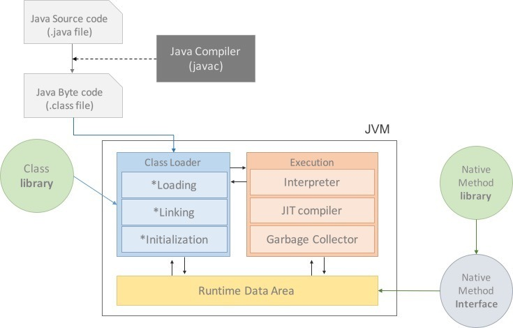
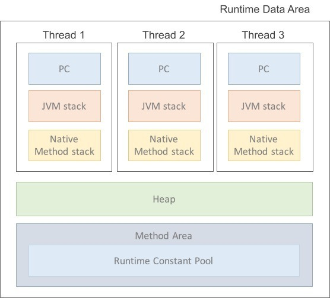
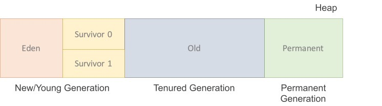
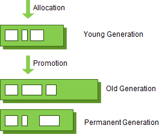
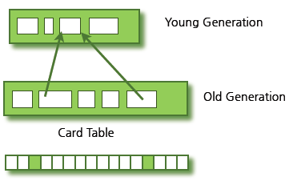

# JVM이란?

JVM(Java Virtual Machine)은 Java 프로그램을 실행하기 위한 가상머신.

1. Java 바이트 코드를 기계어로 변환하고 실행하여 Java 프로그램이 여러 플랫폼에서 동작할수 있게 해줌. → Java와 OS 사이에 중개자 역할을 함. 이덕분에 java는 OS에 구애받지 않고 실행할 수 있음.
2. GC(가비지 컬렉션)을 통해서 동적으로 할당된 메모리를 관리함. 더이상 필요하지 않는 객체를 자동으로 감지하고 제거하여 메모리 누수를 방지해줌.
    
    [가비지 컬렉션이 감지하는 더이상 필요하지 않는 객체는?](https://www.notion.so/9299830ae6f84dbe9b88c0da1fdb7020?pvs=21)
    
3. 바이트 코드 실행 : Java 컴파일러는 Java 소스 코드를 바이트 코드로 컴파일 함. JVM은 이 바이트 코드를 실행하여 프로그램을 구동. 이러한 중간 단계의 바이트 코드는 플랫폼에 의존하지 않고 실행할 수 있음.



# Java 프로그램 실행과정?

자바 프로그램이 실행될 때 

1. `컴파일 단계`
    1. Java 소스코드(.java 파일)를 자바 컴파일러(javac)를 사용해서 바이트코드(.class파일)로 변환함.
    2. 이 바이트 코드는 JVM이 실행할 수 있는 중간형식 ( 플랫폼에 독립적 )
2. `런타임(Runtime) 단계`
    1. 컴파일된 바이트 코드를 JVM에서 실행함.
    2. JVM이 실행될 때 아래와 같은 단계를 거침.
        1. **로딩(Loading)** : 클래스 로드(class Loader)가 컴파일된 클래스 파일(.class)을 메모리에 로딩.
        2. **링크(Linking)** : 로딩된 클래스들을 링크하여 참조하는 다른 클래스와 연결. 이 단계에서 클래스 또는 메서드에 필요한 다른 클래스/메서드를 찾아내고 필요한 리소스를 할당.
            
            (클래스의 정적변수(static변수)는 메모리 할당 및 초기화.)
            
            ( 인스턴스 변수 메모리를 준비만 하는 단계이지 초기화하는 단계는 아님. )
            
            ```java
            public class MyClass {
                // 정적 변수 -> 링크단계에서 초기화
                static int staticVariable;
            
                // 인스턴스 변수 -> 초기화단계에서 초기화.
                int instanceVariable;
            }
            ```
            
            (클래스들 간의 의존성을 해결하고 실행 가능한 형태로 준비. )
            
        3. **초기화(Initialization)** : 클래스 변수(static 변수)들을 적절한 값으로 초기화.
        4. **실행(Execution)** : main 메서드를 찾아 실행.
3. `프로그램 실행`
    1. main 메서드가 실행되면, 프로그램은 해당 메서드 내부 코드를 순차적으로 실행.

### **Class Loader(클래스 로더)**

JVM(Java Virtual Machine)에서 클래스 파일(.class)을 로딩하고, 해당 **클래스를 JVM 내부에서 사용할 수 있도록 메모리에 적재하는 역할**

클래스 로더는 다음과 같은 주요 기능을 수행.

1. **로딩(Loading):** 클래스 로더는 클래스 파일을 파일 시스템이나 네트워크 등에서 읽어와 JVM 내의 메모리로 로딩.
2. **링크(Linking):** 로딩된 클래스들을 링크하여 참조하는 다른 클래스와 연결하며, 링크 단계에서는 검증(Verification), 준비(Preparation), 해결(Resolution) 작업을 수행.
3. **초기화(Initialization):** 클래스 변수(static 변수)들을 적절한 값으로 초기화.

클래스 로더는 JVM에 내장되어 있으며, 클래스 로딩은 동적으로 로딩

즉, **프로그램이 실행되는 도중에 필요한 클래스가 필요한 시점에 동적으로 로딩**. 

이는 자바의 중요한 특성 중 하나로, 필요한 클래스만 메모리에 로딩하여 자원을 효율적으로 사용할 수 있게 함.

### Java 클래스 로더 종류

1. **부트스트랩 클래스 로더(Bootstrap Class Loader):** 최상위 클래스 로더로서, 자바의 기본 클래스들을 로딩. 이 클래스 로더는 C로 구현되어 있으며, JVM이 시작될 때 미리 로딩 됨.
2. **익스텐션 클래스 로더(Extension Class Loader):** 표준 확장(JRE의 ext 디렉토리에 위치하는) 클래스들을 로딩.
3. **애플리케이션 클래스 로더(Application Class Loader):** 사용자가 작성한 애플리케이션 클래스들을 로딩. 이 클래스 로더는 주로 CLASSPATH 환경 변수에 지정된 디렉토리에서 클래스 파일을 찾아 로딩.

또한, 사용자가 직접 커스텀 클래스 로더를 작성하여 독자적으로 클래스를 로딩할 수도 있음. 클래스 로더는 자바의 동적 클래스 로딩 및 다중 클래스 로더 구조를 지원하여 유연한 클래스 관리를 가능하게 함.

### **Execution Engine(실행 엔진)**

**자바 바이트 코드를 실제로 실행하는 역할**을 담당하는 JVM(Java Virtual Machine)의 구성 요소 중 하나임.

자바 프로그램은 소스 코드를 자바 컴파일러를 통해 바이트 코드로 변환하고, 이 바이트 코드를 JVM이라 불리는 가상 머신에서 실행됩니다. 실행 엔진은 이러한 바이트 코드를 해석하고 실행하여 프로그램의 동작을 구현.

1. **인터프리터(Interpreter):** 바이트 코드를 한 줄씩 읽어 해석하고 실행.
    
    이는 실행 시간에 바로 코드를 해석하여 실행하기 때문에 빠른 시작 속도를 제공하지만, 전반적인 실행 속도는 상대적으로 느릴 수 있음.
    
2. **JIT 컴파일러(Just-In-Time Compiler):** 바이트 코드를 실행하기 전에 전체 코드나 일부 코드를 기계어로 변환하는 컴파일 과정을 거침. 
    
    변환된 기계어 코드는 캐시에 저장되어 나중에 재사용될 수 있음. JIT 컴파일러는 인터프리터에 비해 높은 성능을 제공하며, 반복적으로 실행되는 코드의 경우 특히 효과적입니다.
    

**자바의 실행 엔진은 일반적으로 인터프리터와 JIT 컴파일러를 혼합하여 사용**합니다. 초기에는 인터프리터에 의해 빠르게 시작되고, 프로그램이 실행될수록 JIT 컴파일러에 의해 더 효율적인 기계어 코드로 변환되어 최적화된 실행이 가능해집니다.

실행 엔진은 바이트 코드를 메모리 상에서 실행 가능한 형태로 변환하고, 프로그램의 흐름을 제어하며 메모리를 관리합니다. 이러한 과정을 통해 Java의 "Write Once, Run Anywhere(WORA)" 특성이 실현되며, 다양한 플랫폼에서 동일한 바이트 코드를 실행할 수 있게 됩니다.

# Runtime Data Area?

JVM이 프로그램을 실행 할 때 OS에서 할당 받은 메모리 공간.



1. 메서드 영역(Method Area) = 클래스영역(Class area) = 정적 영역(Static area)
    1. 클래스에 대한 메타데이터, 정적변수, 상수, 메서드 코드 등이 저장.
    2. 클래스 정보를 처음 메모리 공간에 올릴 때 초기화되는 대상을 저장하기 위한 메모리 공간.
    3. 모든 스레드가 공유하는 영역으로 JVM이 시작될 때 생성되며, 프로그램이 종료될 때까지만 유지.
2. 힙(Heap)
    1. 동적으로 생성된 인스턴스(객체)가 저장되는 곳. ( new 연산자로 생성된 객체 )
        
        
3. 스레드 영역
    1. 자바 스택(Java Stacks)
        1. 각 스레드마다 개별적으로 할당되며, 메서드 호출 및 지역변수를 저장.
        2. 메서드 호출 시마다 새로운 프레임이 스택에 추가되고, 메서드가 종료되면 해당 프레임이 제거됨.
    2. 프로그램 카운터 레지스터(PC Register)
        1. 현재 스레드가 실행 중인 명령의 주소를 저장.
        2. 스레드마다 별도로 할당되며, 스레드 전환 시에 현재 실행 중인 스레드의 상태를 저장.
    3. 네이티브 메서드 스택(Navice Method stack)
        1. 자바 코드가 아닌 네이티브 코드(주로 C 또는 C++로 작성된 코드)를 실행하는 메서드의 호출 정보를 저장.
        2. Java 언어 외부에서 실행되는 코드의 스택정보를 유지하는 영역.
    

→ 위 영역들은 Java 프로그램이 실행되는 동안 동적으로 할당되며, 각 역할에 따라 다른 데이터와 상태를 관리함.

### runtime data area - 힙 영역

객체를 저장하는 가상 메모리 공간이다. new연산자로 생성된 객체와 배열을 저장한다. 물론 class area영역에 올라온 클래스들만 객체로 생성할 수 있다. 힙은 세 부분으로 나눌 수 있다.

https://t1.daumcdn.net/cfile/tistory/266E283B576B8E060B




**New(Young) 영역**

- **Eden** : 객체들이 최초로 생성되는 공간. 부분의 객체가 금방 접근 불가능 상태가 되기 때문에 매우 많은 객체가 Young 영역에 생성되었다가 사라진다.
    - 이 영역에서 객체가 사라질때 Minor GC가 발생한다고 말한다.
- **Survivor 0 / 1** : Eden에서 참조되는 객체들이 저장되는 공간.

Survivor 영역이 2개이기 때문에 총 3개의 영역으로 나뉘는 것이다. 각 영역의 처리 절차를 순서에 따라서 기술하면 다음과 같다.

- 새로 생성한 대부분의 객체는 Eden 영역에 위치한다.
- Eden 영역에서 GC가 한 번 발생한 후 살아남은 객체는 Survivor 영역 중 하나로 이동된다.
- Eden 영역에서 GC가 발생하면 이미 살아남은 객체가 존재하는 Survivor 영역으로 객체가 계속 쌓인다.
- 하나의 Survivor 영역이 가득 차게 되면 그 중에서 살아남은 객체를 다른 Survivor 영역으로 이동한다. 그리고 가득 찬 Survivor 영역은 아무 데이터도 없는 상태로 된다.
- 이 과정을 반복하다가 계속해서 살아남아 있는 객체는 Old 영역으로 이동하게 된다.

이 절차를 확인해 보면 알겠지만 **Survivor 영역 중 하나는 반드시 비어 있는 상태로 남아 있어야 한다.** 만약 두 Survivor 영역에 모두 데이터가 존재하거나, 두 영역 모두 사용량이 0이라면 여러분의 시스템은 정상적인 상황이 아니라고 생각하면 된다.

**Eden 영역에 최초로 객체가 만들어지고, Survivor 영역을 통해서 Old 영역으로 오래 살아남은 객체가 이동한다는 사실은 꼭 기억하기 바란다.**

**Old 영역**

New area에서 일정 시간 참조되고 있는, 살아남은 객체들이 저장되는 공간 Eden영역에 객체가 가득차게 되면 첫번째 GC(minor GC)가 발생한다. Eden영역에 있는 값들을 Survivor 1 영역에 복사하고 이 영역을 제외한 나머지 영역의 객체를 삭제한다.

인스턴스는 소멸 방법과 소멸 시점이 지역 변수와는 다르기에 힙이라는 별도의 영역에 할당된다. 자바 가상 머신은 매우 합리적으로 인스턴스를 소멸시킨다. 더이상 인스턴스의 존재 이유가 없을 때 소멸시킨다.

대부분 Young 영역보다 크게 할당하며, 크기가 큰 만큼 Young 영역보다 GC는 적게 발생한다. 이 영역에서 객체가 사라질 때 Major GC(혹은 Full GC)가 발생한다고 말한다.

**Permanent Generation(perm 영역)**

생성된 객체들의 정보의 주소 값이 저장된 공간이다. Class loader에 의해 load되는 Class, Method 등에 대한 Meta 정보가 저장되는 영역이고 JVM에 의해 사용된다. 

Reflection을 사용하여 동적으로 클래스가 로딩되는 경우에 사용된다. 내부적으로 Reflection 기능을 자주 사용하는 Spring Framework를 이용할 경우 이 영역에 대한 고려가 필요하다.

그렇다면 "Old 영역에 있는 객체가 Young 영역의 객체를 참조하는 경우가 있을 때에는 어떻게 처리될까?"라고 궁금해 하는 분도 더러 있을 것이다. 이러한 경우를 처리하기 위해서 Old 영역에는 512바이트의 덩어리(chunk)로 되어 있는 카드 테이블(card table)이 존재한다.

카드 테이블에는 Old 영역에 있는 객체가 Young 영역의 객체를 참조할 때마다 정보가 표시된다. Young 영역의 GC를 실행할 때에는 Old 영역에 있는 모든 객체의 참조를 확인하지 않고, 이 카드 테이블만 뒤져서 GC 대상인지 식별한다.



카드 테이블은 write barrier를 사용하여 관리한다. write barrier는 Minor GC를 빠르게 할 수 있도록 하는 장치이다. write barrirer때문에 약간의 오버헤드는 발생하지만 전반적인 GC 시간은 줄어들게 된다.

### 참고 및 이미지 출처

[#자바가상머신, JVM(Java Virtual Machine)이란 무엇인가?](https://asfirstalways.tistory.com/158)

[Java Garbage Collection](https://d2.naver.com/helloworld/1329)