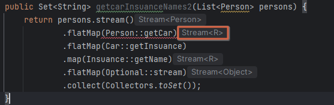
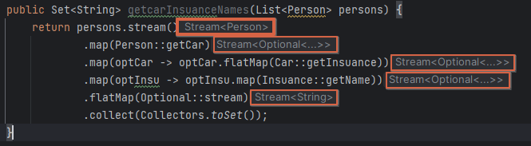

# 11.2 Optional 클래스

Optional은 선택형값을 캡슐화하는 클래스.

특정 객체가 null인 경우 null로 할당하는 것이 아닌 `Optional<객체>` 로 설정 가능

값이 있으면 Optional 클래스는 값을 감싸며, 

값이 없으면 Optional.empty 메서드로 Optional을 반환함.

Optional 을 사용하면 값이 없는 상황이 우리 데이터에 문제가 있는 것인지, 아니면 알고리즘의 버그인지 명확하게 구분할 수 있음.

그렇다고 모든 null참조를 Optional로 대치하는 것은 바람직하지 않다. Optional의 역할은 더 이해하기 쉬운 API를 설계하도록 돕는 것임.

즉, Optional이 등장하면 이를 언랩해서 값이 없을 수 있는 상황에 적절하게 대응하도록 강제하는 효과가 있음.

# 11.3 Optional 적용 패턴

### 11.3.1 Optional 객체 만들기

1. 빈 Optional
    
    ```java
    Optional<Car> optCar = Optional.empty();
    ```
    
2. null이 아닌 값으로 Optional
    
    단, 이경우 of메서드의 인수 car가 null이면 NPE 발생함.  
    
    ```java
    Optional<Car> optCar = Optional.of(car);
    ```
    
3. null값으로 Optional 만들기
    
    car가 null이면 빈 Optional 객체가 반환.
    
    ```java
    Optional<Car> optCar = Optional.ofNullable(car);
    ```
    

### 11.3.2 맵으로 Optional 값을 추출하고 변환하기.

예를 들어 보험회사의 이름을 추출한다고 가정.

```java
String name = null;
if (insurance != null ) {
	name - insuance.getName()
}
```

```java
Optional<Insurance> optInsurance = Optional.ofNullable(insurance);
Optional<String> name = optInsuance.map(Insurance::getName);
```

Optional의 map메서드는 스트림의 map과 개념적으로 비슷함.

스트림의 map은 스트림의 각 요소에 제공된 함수를 적용하는 연산임.

마찬가지로 Optional이 값을 포함하면 map의 인수로 제공된 함수가 값을 바꾸며, Optional이 비어있으면 아무 일도 일어나지 않음.

( 위 경우 Insurance를 map의 인수로 제공된 getName 함수를 적용하여 String으로 값을 바꿈 )

( 그저 Insurance와 String이 Optional로 감싸져 있을 뿐 )

### 11.3.3 flatMap으로 Optional 객체 연결

위 map은 아래와 같이 사용이 가능함.

```java
Optional<Person> optPerson = Optional.of(person);
Optional<String> name = optPerson.map(Person::getCar)
																.map(Car::getInsurance)
																.map(Insuance::getName);
```

하지만 위 코드는 컴파일 되지 않음.

`optPerson`은 `Optional<Person>` 형식이므로 **map 메서드를 호출할 수 있음.**

하지만 getCar는 **Optional<Car> 형식을 반환**하는데 **이를 map연산을 하게 되면** `Optional<Optional<Car>` 형식을 반환하게 됨.

( 즉, 계속 Optional이 중첩이 됨 )

이를 해결하기 위해 `flatMap` 메서드를 사용함.

스트림의 flatMap은 **함수를 인수로 받아서 다른 스트림으로 반환하는 메서드**임.

( 즉, 함수를 적용해서 생성된 모든 스트림이 하나의 스트림으로 병합되어 평준화 됨 )

flatMap을 사용하여 위 코드를 아래와 같이 만들 수 있음.

```java
Optional<Person> optPerson = Optional.of(person);

// 방법1
Optional<String> name = optPerson.flatMap(Person::getCar)
																.flatMap(Car::getInsurance)
																.map(Insuance::getName);

// 방법2
String name = optPerson.flatMap(Person::getCar)
																.flatMap(Car::getInsurance)
																.map(Insuance::getName)
																.orElse("Unknown"); // Optional이 비었으면 기본값 사용.
```

Optional을 사용하므로 도메인 모델과 관련한 암무적인 지식에 의존하지 않고 명시적으로 형식 시스템을 정의할 수 있으며, 정확한 정보 전달은 언어의 가장 큰 목표 중 하나임.

Optional을 인수로 받거나 Optional을 반환하는 메서드를 정의한다면 결과적으로 이 메서드를 사용하는 묻는 사람에게 이 메서드가 빈 값을 받거나 빈 결과를 반환할 수 있음을 잘 문서화해서 제공하는 것과 같음.

### 추가) 도메인 모델에 Optional을 사용했을 때 데이터를 직렬화 할 수 없는 이유

자바 언어 아키텍트인 브라이언 고츠(Brian Goetz)는 Optional의 용도가 선택형 반환값을 지원하는 것이라고 명확하게 못받았음.

Optional클래스는 필드 형식으로 사용할 것을 가정하지 않았으므로 Serializable 인터페이스를 구현하지 않았음.

따라서 도메인 모델에 Optional을 사용한다면 직렬화(Serializable) 모델을 사용하는 도구나 프레임워크에서 문제가 발생할 수 있음.

하지만 위와 같은 단점에도 불구하고 여전히 Optional을 사용해 도메인 모델을 구성하는 것은 바람직하다고 생각함.

만일 **직렬화 모델이 필요하다면 아래와 같이 Optional로 값을 반환받을 수 있는 메서드를 추가하는 방식을 권장함.**

```java
public class Person {
	private Car car;
	**public Optional<Car> getCarAsOptional() {
			return Optional.ofNullable(car);
	}**
}
```

### 11.3.4 Optional 스트림 조작

자바 9에서는 Optional을 포함하는 스트림을 쉽게 처리할 수 있도록 Optional에 stream() 메서드를 추가함.

```java
public Set<String> getcarInsuanceNames(List<Person> persons) {
	return persons.stream()
							.map(Person::getCar) // Optional<Car> 스트림으로 변환.
							.map(optCar -> optCar.flatMap(Car::getInsuance)) // flatMap연산으로 Optional<Car>를 Optional<Insurance>로 변환
							.map(optIns -> optIns.map(Insurance::getName))
							.flatMap(Optional::stream)
							.collect(toSet());
```





스트림의 map 으로 Optional을 Stream으로 감싸줘야함.

그냥 flatMap을 사용해 버리면 Optional을 감싸지 않고 Stream으로 뱉어버리기 때문에 체이닝이 불가함.

즉.

1. `.map(Person::getCar)` : Stream<Optional<Car>> 변환.
2. `.map(optCar -> optCar.flatMap(Car::getInsuance))`  : flatMap연산으로 스트림 요소인 Optional<Car>를 Optional<Insurance>로 변환하고 map 메서드로 Stream<Optional<Insurance>>으로 변환.
3. `.map(optIns -> optIns.map(Insurance::getName))` : 스트림 요소인 Optional<Insurance>을 map으로 Optional<String> 변환 후 map 메서드로 Stream<Optional<String>>으로 변환
4. `.flatMap(Optional::stream)` : Stream<Optional<String>>을 Stream<String>으로 변환.

아래와 같은 방식도 가능.

```java
public Set<String> getcarInsuanceNames(List<Person> persons) {
    Stream<Optional<String>> stream = persons.stream()
                                        .map(Person::getCar)
                                        .map(optCar -> optCar.flatMap(Car::getInsuance))
                                        .map(optInsu -> optInsu.map(Insuance::getName));

    Set<String> result = stream.filter(Optional::isPresent)
            .map(Optional::get)
            .collect(Collectors.toSet());
    
    return result;

}
```

### 11.3.5 디폴트 액션과 Optional 언랩

Optional 인스턴스에 포함된 값을 읽는 다양한 방법을 제공

1. `get()` : 값을 읽는 가장 간단한 메서드면서 동시에 가장 안전하지 않는 메서드.
    
    Optional에 값이 반드시 있다고 가정할 수 있는 상황이 아니면 get메서드는 사용하지 않음.
    
    (  값이 없으면 NoSuchElementException 발생 )
    
2. `orElse(T other)` : Optional이 값을 포함하지 않을 때 기본값을 제공.
3. `orElseGet(Supplier<? Extends T> other)` : Optional에 값이 없을 때만 Supplier가 실행.
    
    디폴트 메서드를 만드는데 시간이 걸리거나(효율성 때문에) Optional이 비어있을 때만 기본값을 생성하고 싶을 때 사용.
    
4. `orElseThrow(Supplier<? extends X> exceptionSupplier)` : Optional이 비어있을 때 발생하는 예외지정 가능.
5. `ifPresent(Consumer<? super T > consumer)` : 값이 존재할 때 인수로 넘겨준 동작을 실행. ( 값이 없으면 아무일도 일어나지 않음)
6. `ifPresentOrElse(Consumer<? super T> action, Runnabel emptyAction)` : Optional이 비었을 때 실행할 수 있는 Runnalbe을 인수로 받음.

### 11.3.6 두 Optional 합치기

아래 코드는 null 확인 코드와 크게 다를 바가 없음.

```java
private Insuance findCheapestInsuance(Person person, Car car) {
    // 다양한 보험회사가 제공하는 서비스 조회.
    // 모든 결과 데이터 비교 로직 ..
    // ...
    return new Insuance();
}
```

```java
public Optional<Insuance> nullSafeFindCheapestInsuance(Optional<Person> person, Optional<Car> car) {
    if (person.isPresent() && car.isPresent()) {
        return Optional.of(findCheapestInsuance(person.get(), car.get()));
        
    } else {
        return Optional.empty();
    }
}
```

아래와 같이 Optional을 언랩하지 않고 합칠 수 있음.

```java
public Optional<Insuance> nullSafeFindCheapestInsuance2(Optional<Person> person, Optional<Car> car) {
    **return person.flatMap(p -> car.map(c -> findCheapestInsuance(p, c)));**
}
```

### 11.3.7 필터로 특정값 거르기

종종 객체의 메서드를 호출해서 어떤 property를 확인해야 할 때가 있음.

예를 들어 아래와 같이 Insuance 객체가 null이 아님을 체크한 후 작업을 수행함.

```java
Insurance insurance = ... ;
if (**insuance != null** && "CambridgeInsurance".equals(insurance.getName())) {
	sout("ok");
}
```

Optional 객체에 filter 메서드를 이용해서 다음과 같이 코드를 재구현할 수 있음

```java
Optional<Insurance> optInsurance = ... ;
optInsurance.filter( insurance -> "CambridgeInsurance".equals(insurance.getName()))
					.ifPresent(x -> sout("ok"));
```

또 아래와 같은 예시도 가능.

아래 메서드를 인수 person이 minAge이상의 나이일 떄만 보험회사 이름을 반환하도록 수정.

```java
public String getCarInsuanceName(Optional<person> person) {
	return person.flatMap(Person::getCar)
							.flatMap(Car::getInsurance)
							.map(Insuance::getName)
							.orElse("Unknown");
}
```

```java
public String getCarInsuanceName(Optional<person> person, int minAge) {
	return person.filter(p -> p.getAge() >= minAge)
							.flatMap(Person::getCar)
							.flatMap(Car::getInsurance)
							.map(Insuance::getName)
							.orElse("Unknown");
}
```

# 11.4 Optional을 사용한 실용예제

기존 자바 API는 Optional을 적절하게 사용하지 못하고 있음.

Optional기능을 활용할 수 있도록 작은 유틸리티 메서드를 추가하는 방식으로 문제를 해결 가능.

### 11.4.1 잠재적으로 null이 될 수 있는 대상을 Optional로 감싸기

기존의 자바 API에서는 null을 반환하면서 요청한 값이 없거나 어떤 문제로 계산에 실패했음을 알림.

예를 들어 Map의 get메서드가 그러함.

get메서드의 시그니처는 우리가 고칠 수 없지만 get메서드의 반환값은 아래와 같이 Optional로 감쌀 수 있음.

```java
Optional<Object> value = Optional.ofNullable(map.get("key"));
```

### 11.4.2 예외와 Optional 클래스

자바 API는 어떤 이유에서 값을 제공할 수 없을 때 null을 반환하는 대신 예외를 발생시킬 때도 있음.

예를 들어 Integer.parseInt()가 그러함.

해당 메서드는 문자열을 정수로 바꾸지 못할 때 NumberFormatException을 발생 시킴.

**이러한 경우 아래와 같이 작은 유틸리티 메서드를 구현해서 Optional로 반환할 수 있음.**

```java
public static Optional<Integer> stringToInt(String s) {
    try {
        return Optional.of(Integer.parseInt(s));
    } catch (NumberFormatException e) {
        return Optional.empty();
    }
}
```

### 11.4.3 기본형 Optional을 사용하지 말아야 하는 이유

스트림처럼 Optional도 기본형으로 특화된 OptionalInt, OptionalLong, OptionalDouble 등의 클래스를 제공함.

기본형 특화 Optional들은 Optional클래스의 유용한 메서드 map, flatMap, filter등을 지원하지 않으므로 기본형 특화 Optional을 사용할 것을 궎장하지 않음.

또한 스트림과 마찬가지로 기본형 특화 Optional로 생성한 결과는 다른 일반 Optional과 혼용할 수 없음.

### 11.4.4 응용

```java
public int readDuration(Properties props, String name) {
    String value = props.getProperty(name);
    if (value != null) {
        try {
            int i = Integer.parseInt(value);
            if (i>0) {
                return i;
            }
        } catch (NumberFormatException e) {}
    }
    return 0;
}
```

```java
public int readDuration2(Properties props, String name) {
    return Optional.ofNullable(props.getProperty(name))
	            .flatMap(p -> stringToInt(p))
	            .filter(i -> i>0)
	            .orElse(0);
}
```

props.getProperty(name) 메서드는 null을 반환하므로 ofNullable 팩토리 메서드를 이용해서 Optional을 반환하도록 바꿀수 있음.

Integer.parseInt()는 위에서 유틸리티 메서드로 만든 stringToInt를 전달해 Optional<Integer>로 변환.