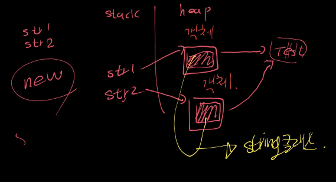
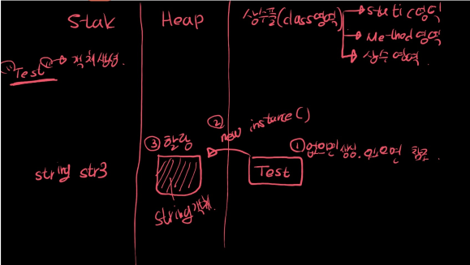

### new String()로 객체 생성

new String() 생성자를 사용하면 새로운 String 객체가 Heap 영역에 생성됨.

만일, 리터럴풀(class영역,상수풀)에 문자열이 이미 존재하면,  Heap 영역에만 새로운 객체를 생성하고, 리터럴풀(class영역,상수풀)의 기존 문자열을 참조함.



### “”(문자열 리터럴)로 객체 생성

new String과 마찬가지로 Heap 영역에 새로운 String 객체를 생성하고, 상수풀의 문자열을 참조함.

만일, 상수풀에 문자열이 이미 있으면, Heap의 동일한 객체를 참조하고, 상수풀의 문자열도 동일하게 참조함. (문자열 리터럴은 불변이므로)


```java
String str = "hello";
String str2 = "hello";
String str3 = "hello";
```

위와 같이 선언되어도 Heap 영역에는 String 객체가 하나이고, 상수풀의 문자열도 1개이다.

( 세 변수가 똑같은 Heap 영역의 String 객체를 공유하고 있다 )