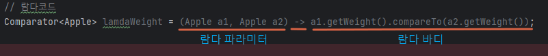

# 3.1 람다란?

메서드로 전달할 수 있는 익명 함수를 단순화한 것

```java
// 기본코드
Comparator<Apple> byWeight = new Comparator<Apple>() {
    @Override
    public int compare(Apple o1, Apple o2) {
        return o1.getWeight().compareTo(o2.getWeight());
    }
};

// 람다코드
Comparator<Apple> lamdaWeight 
        = (Apple a1, Apple a2) -> a1.getWeight().compareTo(a2.getWeight());
```



# 3.2 어디서 람다 사용?

`함수형 인터페이스`라는 문맥에서 람다 표현식을 사용할 수 있음.

### 함수형 인터페이스?

정확히 하나의 추상 메서드를 지정하는 인터페이스임.

ex) 자바 API의 함수형 인터페이스로 Comparator, Runnable등이 잇음

```java
public interface Comparator<T> {
	int compare(T o1, T o2);
}
```

```java
// 함수형 인터페이스 O
public interface Adder {
	int add(int a, int b);
}

// 함수형 인터페이스 X -> 추상메서드를 가지고 있는 클래스를 상속받고 있으므로 추상 메서드가 2개임. 따라서 함수형 인터페이스가 아님
public interface SamrtAdder extends Adder {
	int add(double a, double b);
}

// 함수형 인터페이스 X -> 추상 메서드가 없으므로 아님.
public interface NOting {
}
```

그래서 함수형 인터페이스로 뭘 할 수 있는데?

→ 람다 표현식으로 함수형 인터페이스의 추상메서드 구현을 직접 전달가능 하며, 전체 표현식을 함수형 인터페이스의 인스턴스로 취급할 수 있다. (기술적으로 따지면 함수형 인터페이스를 구현한 클래스의 인스턴스)

```java
// 람다코드
Runnable r1 = () -> System.out.println("hello");

// 익명클래스
Runnable r2 = new Runnable() {
    @Override
    public void run() {
        System.out.println("hello");
    }
};
```

```java
// 람다코드
Runnable r1 = () -> System.out.println("hello1");

// 익명클래스
Runnable r2 = new Runnable() {
    @Override
    public void run() {
        System.out.println("hello2");
    }
};

public static void process(Runnable r) {
    r.run();
}

process(r1); // hello1
process(r2); // hello2
**process(() -> System.out.println("hello3")); // hello3 : 직접 절달된 람다 표현식으로 출력 가능.**
```

`@FunctionalInterface`: 함수형 인터페이스임을 가리키는 어노테이션. ( 해당 어노테이션으로 선언햇으나 실제로 함수형 인터페이스가 아니면 컴파일러가 에러를 발생. )

# 3.3 람다 활용 : 실행 어라운드 패턴

실행 어라운드 패턴 : 실제 자원을 처리하는 코드를 설정과 정리 두 과정이 둘러싸는 형태를 갖음.

1. 아래 코드는 한줄만 읽을 수 있는 코드 : 즉, 여러줄은 읽을 수 없음 → 확장성 X

```java
public String processFile() throws IOException {
    try (BufferedReader br = new BufferedReader(new FileReader("data.txt"))) {
        return br.readLine();
    }
}
```

1. 확장성을 높이기 위해 동작하는 부분을 파라미터화 처리 및 함수형 인터페이스를 이용해 동작 전달

```java
**@FunctionalInterface
public interface BufferedReaderProcessor {
    String process(BufferedReader b) throws IOException;
}**

public String processFile(**BufferedReaderProcessor brp**) throws IOException {
    try (BufferedReader br = new BufferedReader(new FileReader("data.txt"))) {
        **return brp.process(br);**
    }
}

String oneLine = processFile((BufferedReader br) -> br.readLine());
String twoLine = processFile((BufferedReader br) -> br.readLine() + br.readLine());
```

# 3.4 함수형 인터페이스 사용

`함수 디스크립터` : 함수형 인터페이스의 추상메서드 시그니처

`추사메서드 시그니처` : 예를들어 compartor의 시그니처는 (T, U) → int 임.

다양한 람다 표현식을 사용하려면 공통의 함수 디스크립터를 기술하는 함수형 인터페이스 집합이 필요함.

자바 8 라이브러리 `java.util.function` 패키지에서 여러 함수형 인터페이스를 제공.

T형식의 객체를 사용하는 boolean표현식이 필요한 상황에서 사용가능.

```java
@FunctionalInterface
public interface Predicate<T> {
	boolean test(T t);
}

public static <T> List<T> filter(List<T> list, Predicate<T> p) {
    List<T> results = new ArrayList<>();
    for (T t : list) {
        if (p.test(t)) {
           results.add(t);
        }
    }
    return results;
}

Predicate<String> nonEmptyStringPredicate = (String s) -> !s.isEmpty();
List<String> nonEmpty = filter(Arrays.asList("a", "", "c"), nonEmptyStringPredicate);
for (String t : nonEmpty) {
    System.out.println(t); // a c
}
```

```java
// Object는 함수형 인터페이스가 아님.
Object o = () -> {sout("test"); };

// 이와 같이 Object가 아닌 Runnable로 받거나, Runnable로 캐스팅하면 됨.
Runnable r = () -> {sout("test"); };
Object o = (Runnable）() -> {sout("test"); };
```

# 3.5 형식 검사 ,형식 추론약

### 형식추론

컴파일러는 람다 표현식의 파라미터 형식에 접근할 수 있으므로 람다 문법에서 이를 생략할 수 있음.

자바 컴파일러는 다음처럼 람다 파라미터 형식을 추론할 수 있음.

```java
Comparator<Apple> c = (Apple a1, Apple a2) -> a1.getWeight().compareTo(a2.getWeight());

// 컴파일러가 형식을 추론하여 생략가능.
Comparator<Apple> c2 = (a1, a2) -> a1.getWeight().compareTo(a2.getWeight());
```

### 지역변수 사용

자유변수 : 파라미터로 넘겨진 변수가 아닌 외부에서 정의된 변수)

자유변수 사용가능.

```java
int portNumber = 1337;
Runnable r = () -> System.out.println(portNumber);
```

단, 람다에서 사용하는 자유변수는 정적이여야 함. final로 명시적으로 선언되어 있거나 final로 취급되어야 함.

# 3.6 메서드 참조

특정 메서드만을 호출하는 람다의 축약형.

메서드 참조는 새로운 기능이 아닌 하나의 메서드를 참조하는 람다를 편리하게 표현할 수 있는 문법으로 간주.

```java
Comparator<Apple> lamdaWeight = (Apple a1, Apple a2) -> a1.getWeight().compareTo(a2.getWeight());

Comparator<Apple> weight = Comparator.comparing(Apple::getWeight);
```

ex) 람다와 메서드 참조 단축 표현 예제

```java
(Apple apple ) -> apple.getWeight()         ------->    Apple::getWeight
() -> Thread.currentThread().dumpStack()    ------->    Thread.currentThread()::dumpStack()
(str, i) -> str.substring(i)                ------->    String::substring
(String s) -> System.out.println(s)         ------->    System.out::println
(String s) -> this.isValidName(s)           ------->    this::isValidName
```

### 생성자 참조

// 사실 이건 잘 모르겟다잉… 120p

같은 시그니처를 가져야한다는데 무슨말이지

BiFunction 함수형 인터페이스가 Apple(String color, Integer weight)와 같은 시그니처를 가져서 아래와 같이 쓸수 있따고..?

```java
// 메서드 참조
BiFunction<Color, Integer, Apple> c = Apple::new; // Apple(String color, Integer weight)의 생성자 참조
Apple a = c.apply(GREEN, 110);

// 람다
BiFunction<String, Integer, Apple> c = (color, weight) -> new Apple(color, weight);
Apple a = c.apply(GRREN, 110);
```

만약 생성자의 인수가 3개여서 이와 같은 시그니처를 가지는 함수형 인터페이스가 없다면 직접 만들어서 사용해야해..

```java
Color(int, int, int)

public interface TriFunction<T, U, V, R> {
	R apply(T t, U u, V v);
}

TriFunction<Intger, Integer, Integer, Color> colorFactory = Color::new;
```

# 3.7 람다, 메서드 참조 활용

### 1단계 : 코드전달.

sort 메서드에 정렬 전략을 어떻게 전달할까

```java
void sort(Comparator<? super E> c)
```

Comparator 객체를 받아 비교.

객체 안에 동작을 포함시키는 방식으로 다양한 전략을 전달할 수 있음.

```java
public static class AppleComparator implements Comparator<Apple>{
    public int compare(Apple a1, Apple a2) {
        return a1.getWeight().compareTo(a2.getWeight());
    }
}

List<Apple> inventory = new ArrayList<>();
inventory.sort(new AppleComparator());
```

### 2단계 : 익명 클래스 사용

```java
List<Apple> inventory = new ArrayList<>();
//inventory.sort(new AppleComparator());

**inventory.sort(new AppleComparator(){
    public int compare(Apple a1, Apple a2) {
        return a1.getWeight().compareTo(a2.getWeight());
    }
});**
```

### 3단계 : 람다 표현식 사용

**함수형 인터페이스를 기대하는 곳 어디에서나 람다 표현식을 사용할 수 있다.**

( 함수형 인터페이스 : 오직 하나의 추상 메서드를 정의하는 인터페이스 )

**추상 메서드의 시그니처(함수 디스크립터라 불림)는 람다 표현식의 시그니처를 정의함.**

`Comparator`의 함수 디스크립터는 `(T, T) → int` 임.

```java
List<Apple> inventory = new ArrayList<>();
//        inventory.sort(new AppleComparator());
//        inventory.sort(new AppleComparator(){
//            public int compare(Apple a1, Apple a2) {
//                return a1.getWeight().compareTo(a2.getWeight());
//            }
//        });
**inventory.sort((Apple a1, Apple a2) -> a1.getWeight().compareTo(a2.getWeight()));**
```

자바 컴파일러는 람다 표현식이 사용된 콘텍스트를 활용해서 람다의 파라미터 형식을 추론함.

따라서 아래와 같은 형식도 가능

```java
**inventory.sort((a1, a2) -> a1.getWeight().compareTo(a2.getWeight()));**
```

Compartor는 Comparable 키를 추출해서 Comparator 객체로 만드는 Function 함수를 인수로 받는 정적 메서드 comparing을 포함함.

```java
@FunctionalInterface
public interface Comparator<T> {
	...
			/**
	     * Accepts a function that extracts a {@link java.lang.Comparable
	     * Comparable} sort key from a type {@code T}, and returns a {@code
	     * Comparator<T>} that compares by that sort key.
	     *
	     * <p>The returned comparator is serializable if the specified function
	     * is also serializable.
	     *
	     * @apiNote
	     * For example, to obtain a {@code Comparator} that compares {@code
	     * Person} objects by their last name,
	     *
	     * <pre>{@code
	     *     Comparator<Person> byLastName = Comparator.comparing(Person::getLastName);
	     * }</pre>
	     *
	     * @param  <T> the type of element to be compared
	     * @param  <U> the type of the {@code Comparable} sort key
	     * @param  keyExtractor the function used to extract the {@link
	     *         Comparable} sort key
	     * @return a comparator that compares by an extracted key
	     * @throws NullPointerException if the argument is null
	     * @since 1.8
	     */
    public static **<T, U extends Comparable<? super U>> Comparator<T>** comparing(
            **Function<? super T, ? extends U> keyExtractor**)
    {
        Objects.requireNonNull(keyExtractor);
        return (Comparator<T> & Serializable)
            (c1, c2) -> keyExtractor.apply(c1).compareTo(keyExtractor.apply(c2));
    }
	...
}
```

위 comparing 메서드를 활용하면 아래와 같이 사용가능.

```java
import static java.util.Comparator.*;

**inventory.sort(comparing(apple -> apple.getWeight()));**
```

### 4단계 : 메서드 참조 사용

메서드 참조를 이용해 람다 표현식의 인수를 더 깔끔하게 전달 가능.

코드 짧아짐 + 의미 명확해짐.

코드 자체로 **“Apple을 weight별로 비교해서 inventory를 sort하라”** 의미 전달 가능.

```java
List<Apple> inventory = new ArrayList<>();
//        inventory.sort(new AppleComparator());
//        inventory.sort(new AppleComparator(){
//            public int compare(Apple a1, Apple a2) {
//                return a1.getWeight().compareTo(a2.getWeight());
//            }
//        });
//        inventory.sort((a1, a2) -> a1.getWeight().compareTo(a2.getWeight()));
//        inventory.sort(comparing(apple -> apple.getWeight()));
**inventory.sort(comparing(Apple::getWeight));**
```

# 3.8 람다 표현식을 조합할 수 있는 유용한 메서드

### Comparator

역정렬 ( 기본 오름차순 )

```java
**inventory.sort(comparing(Apple::getWeight).reversed()); // 내림차순**
```

같은 값인 경우 다른 데이터로 정렬

```java
**inventory.sort(comparing(Apple::getWeight)
								.reversed()); // 내림차순
								.thenComparing(Apple::getCountry)); // 두 사과 무게가 같으면 국가별로 정렬**
```

### Predicate

negate, and, or 세가지 메서드 제공.

```java
@FunctionalInterface
public interface Predicate<T> {
 
		// 주어진 arguments를 검증
    boolean test(T t);

		// 다른 Predicate와 연결하는 역할 &&
    default Predicate<T> and(Predicate<? super T> other) {
        Objects.requireNonNull(other);
        return (t) -> test(t) && other.test(t);
    }

    // test()의 반대 결과 반환 (ex: true -> false)
    default Predicate<T> negate() {
        return (t) -> !test(t);
    }

   // 다른 Predicate와 연결하는 역할 ||
    default Predicate<T> or(Predicate<? super T> other) {
        Objects.requireNonNull(other);
        return (t) -> test(t) || other.test(t);
    }

   // 동일한지 체크
    static <T> Predicate<T> isEqual(Object targetRef) {
        return (null == targetRef)
                ? Objects::isNull
                : object -> targetRef.equals(object);
    }

    @SuppressWarnings("unchecked")
    static <T> Predicate<T> not(Predicate<? super T> target) {
        Objects.requireNonNull(target);
        return (Predicate<T>)target.negate();
    }
}
```