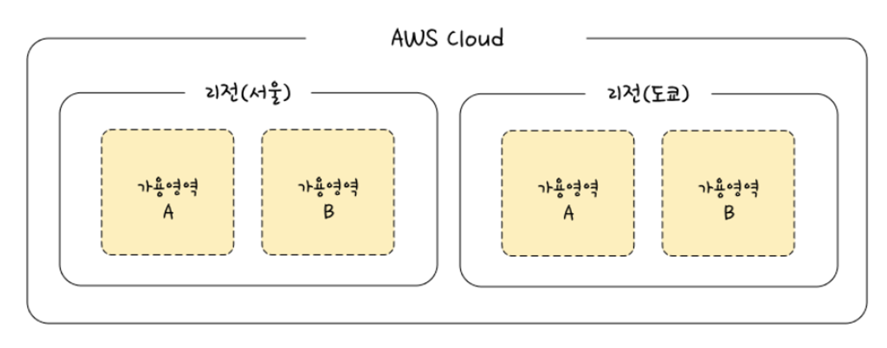
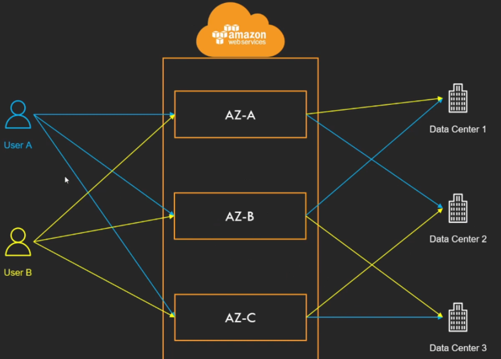
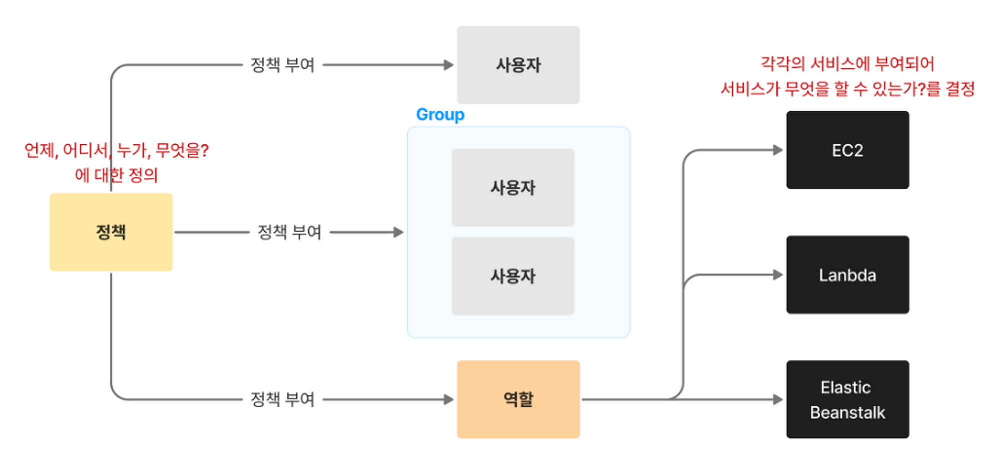
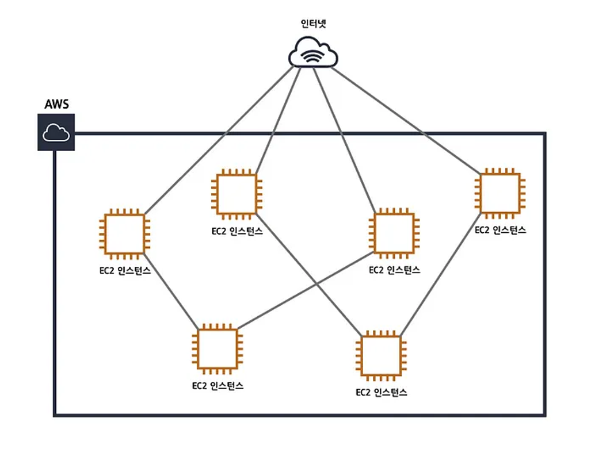
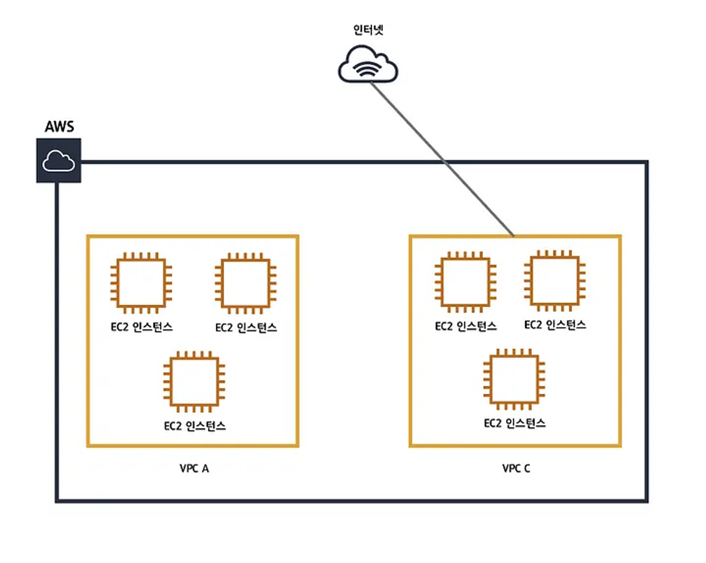
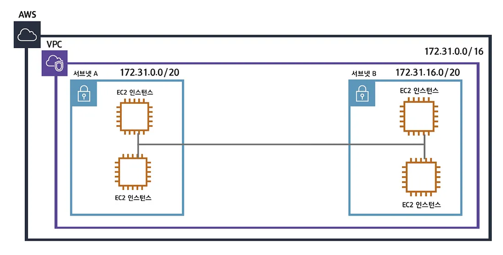
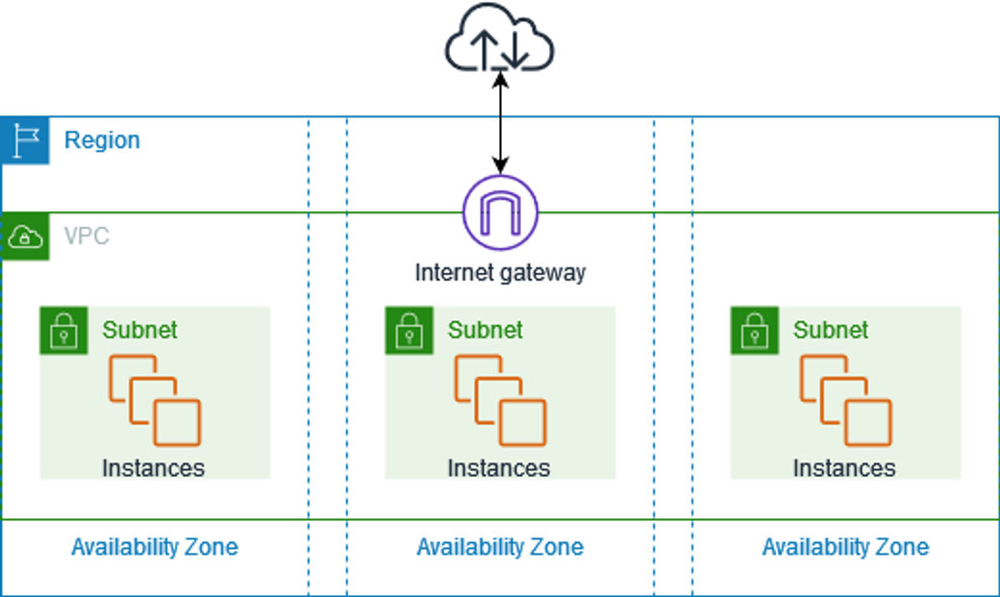

AWS(Amazon Web Services)는 전세계적으로 분포한 데이터 센터를 기반으로 포괄적으로 사용되고 있는 아마존 클라우드 플랫폼.

### AWS Cloud

AWS가 제공하는 많은 서비스 중 AWS Cloud는 아래와 같이 생김.

### 리전

AWS가 제공되는 데이터 서버의 물리적 위치임.

전세계에 분포되어 있으며, 각 리전마다 고유 코드가 부여됨.

그 중 us-east-1은 모든 서비스를 제공하고, 리전 별로 가능한 서비스가 다르다.

따라서 리전은 아래와 같은 항목을 고려하여 선택해라.

1. 속도(가까울 수로 빠름)
2. 저작권, 세금 등 서비스에 관한 법률
3. 사용가능한 AWS 서비스

### 가용영역(Availability Zone, AZ)

각 리전안의 데이터센터. ( 국가의 IDC라고 생각하면 될 듯..? )

리전의 하부단위로, **하나의 리전에는 반드시 2개 이상의 가용영역으로 구성**되어 있으며, **하나의 가용영역은 하나 이상의 데이터 센터로 구성**되어 있음.

AZ 건물들은 물리적으로 일정거리 ( 몇 Km 이상) 씩 떨어져 있음.

따라서 하나의 AZ에 화재,재해 등 작동불능이 되어도 다른 AZ에서 서비스를 재개하여 유지할 수 있다.

(단, 모든 AZ는 서로 100km 이내의 거리에 있어야 함)

( 각 데이터 센터는 광통신 전용망으로 연결 되어있는데, 서로간 너무 멀리 떨어져 있으면 속도가 떨어짐 )

---

데이터센터가 여러개로 나눠지면 보안적인 측면에서 이점이 있다.

AZ 특징 중 하나가 각 계정 별로 부여된 AZ 코드와 실제 위치가 다르다는 점.

예를들면, 유저A와 유저B가 각 서울 리전에 서비스를 구축하였고,

AWS에서 각 계정에게 AZ를 유저A에게는 강남센터, 유저B에게는 송파센터. 이런식으로 고정적으로 배치해주는 것이 아닌. AZ을 매핑하여 중간단계 같이 배치를 해주는데, 이는 보안이나 한 AZ로 트래픽 몰림을 방지한다.

각 계정마다 AZ를 랜덤하게 배치하면서 유저A가 민감한 데이터를 저장해도 어느 데이터 센터에 저장되는지 추측할 수 없게 되어 보안적인 효과를 얻을 수 있따.

즉, 내 계정의 가용영역 A는 다른 계정 가용영역 A와 데이터 센터 저장위치가 다르다고 이해하면 됨.

### 엣지 로케이션

AWS의 ClodFront(CDN) 등의 여러 서비스를 가장 빠른 속도로 제공하기 위한 거점을 의미.

즉, CDN을 위한 거짐임.

### IAM

Identity and Access Management(IAM)은 AWS 리소스에 대한 액세스를 안전하게 제어할 수 있는 웹 서비스.

### VPC(Virtual Private Cloud)

vpc가 없으면 ec2인스턴스들이 서로 거미줄처럼 연결되고 인터넷과 연결됨.

이런 구조는 시스템의 복잡도도 높아지지만 하나의 인스턴스만 추가되어도 모든 인스턴스를 수정해야하는 불편함이 생김.

( 마치 인터넷 전용선을 다시 까는 것과 같음 )

그래서 vpc를 적용하면 아래와 같이 **vpc별로 네트워크를 구성**할 수 있고 **각각의 VPC에 따라 다르게 네트워크 설정을** 줄 수 있음.

또한 **각각의 VPC는 완전히 독립된 네트워크처럼 작동.**

### 서브넷

VPC를 만들었다면 이제 서브넷을 만들 수 있음.

서브넷은 VPC를 잘 쪼개는 과정이며, 서브넷은 VPC안에 있는 VPC보다 더 작은단위이기 때문에  서브넷마스크가 더 높게되고 아이피범위가 더 작은값을 갖게됩니다. 서브넷을 나누는 이유는 더 많은 네트워크망을 만들기 위해서입니다.

각각의 서브넷은 가용영역안에 존재하며 서브넷안에 RDS, EC2와같은 리소스들을 위치시킬 수 있습니다.

----
출처

[[AWS] 가장쉽게 VPC 개념잡기](https://medium.com/harrythegreat/aws-가장쉽게-vpc-개념잡기-71eef95a7098)

[[AWS] 2. AWS의 IAM 계정이란 무엇인가?](https://brunch.co.kr/@danni/14)

[AWS 구조2(가용영역, AZ)](https://velog.io/@eeapbh/AWS-구조2가용영역-AZ)

[[AWS] 1. AWS 클라우드의 기초개념과 구조파악](https://brunch.co.kr/@danni/12)