# 캐시

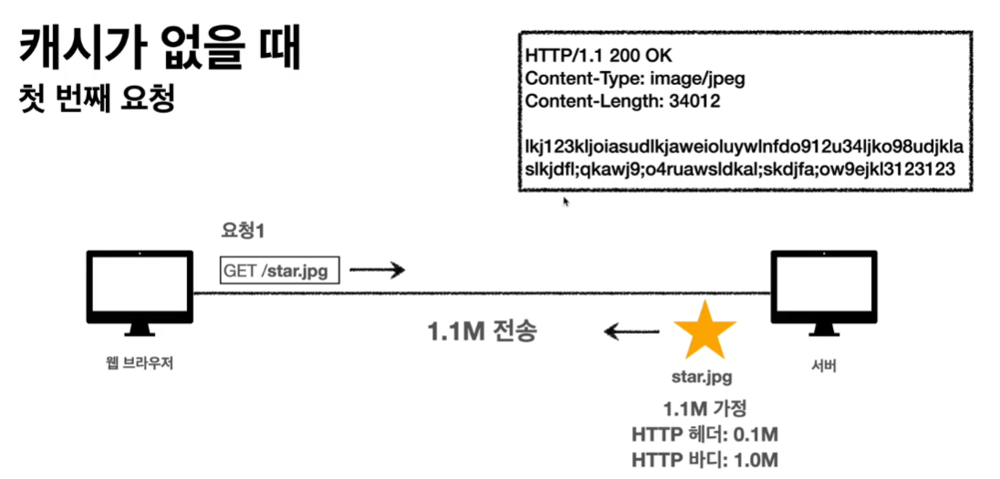

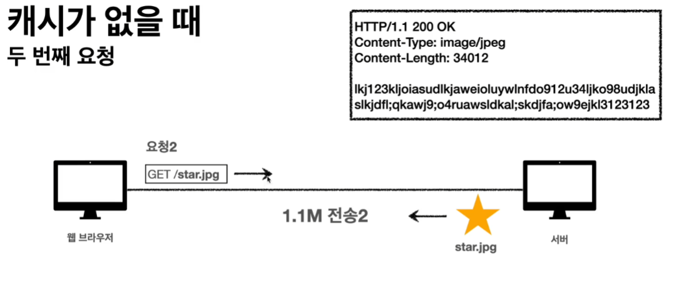

또 같은 리소스를 요청하더라도 똑같이 1.1M 사이즈를 응답을 내려줌

### 캐시가 없을 떄

데이터가 변경되지 않아도 계속 네트워크를 통해서 데이터를 다운 받아야 함.

느리고 비쌈.

### 캐시적용

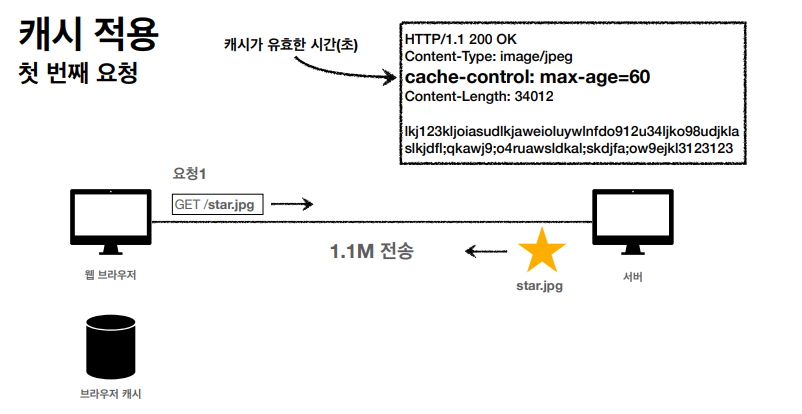

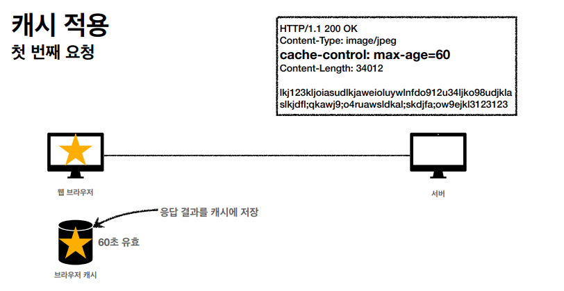

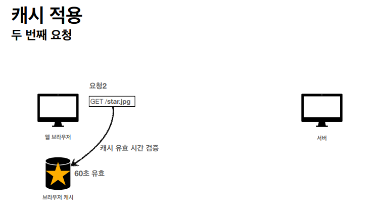
요청을 하기 전에 브라우저 캐시를 뒤져서 동일한 리소스가 있는지 확인하고 있으면, 브라우저 캐시에서 가져옴. 

—> 네트워크를 탈 필요가 없다.

요청 하기 전에 브라우저 캐시를 뒤져 동일한 리소스를 발견하더라도 유효시간이 지난 경우 재요청 해야 함.

그 후 받은 응답은 기존 브라우저 캐시에 있던 내용을 지우고 새롭게 받은 응답으로 다시 저장.

### 캐시 시간 초과

캐시 유효 시간이 초과하면 서버를 통해 데이터를 다시 조회하고 캐시를 갱신해야 함.

이떄 네트워크 다운로드 발생함.

—> 리소스가 변경되지 않았는데도 동일한 용량을 받아야하는게 너무 낭비다..

### 

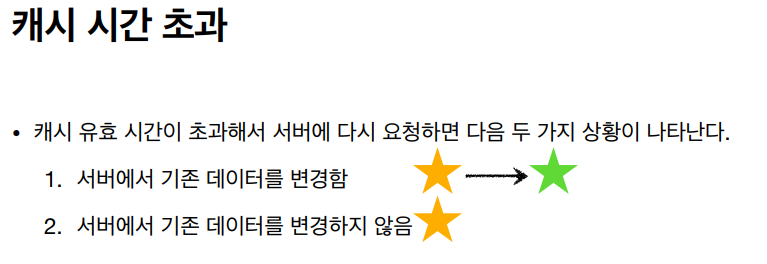
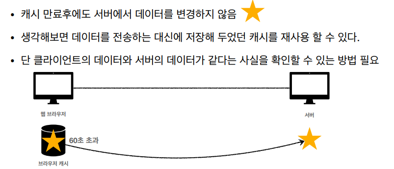

---

# 검증 헤더

캐시 데이터와 서버 데이터가 같은지 검증하는 데이터.

`Last-Modified`,  `ETag`

### 조건부 요청 헤더

검증 헤더 조건에 따른 분기 헤더.

`If-Modified-Since` → 검증헤더 Last-Modified를 사용할 때 사용.

`If-None-Match` → 검증헤더 ETag를 사용할 때 사용.

—> 이들은 조건을 만족하면 `200 OK`를 뱉고

만족하지 않으면 `304 Not Modifed`를 뱉음 ( 304 : 너의 캐시로 리다이렉션 해라 )

## 검증헤더1 - Last-Modified, 조건부1 - If-Modifed-Since

`Last-Modified`를 추가.

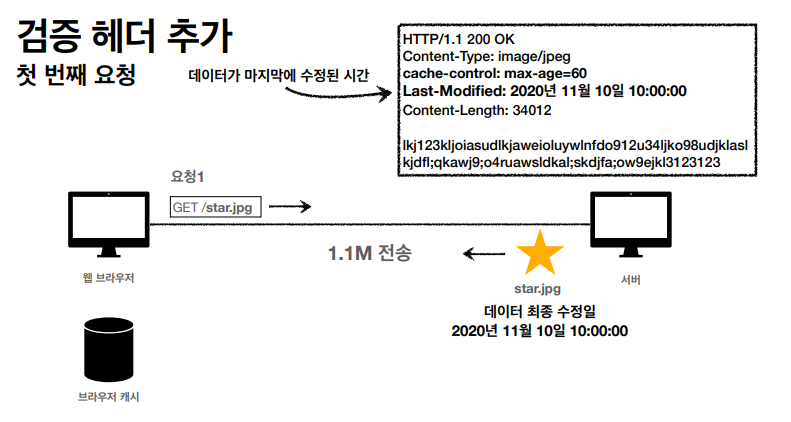

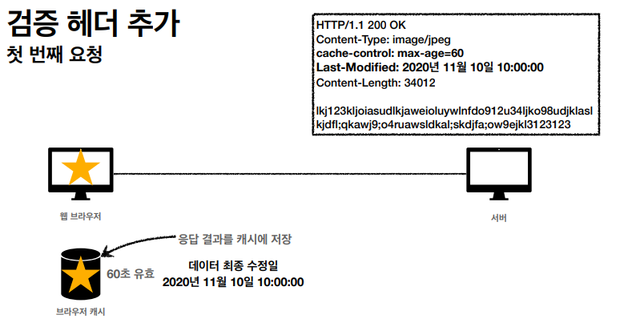

서버는 클라이언트에서 받았던 `Last-Modified` 을 그대로 응답 결과에 포함시켜 응답.

그러면 응답을 받은 클라이언트는 브라우저 캐시에 응답 결과 + `Last-Modified` 도 같이 저장.

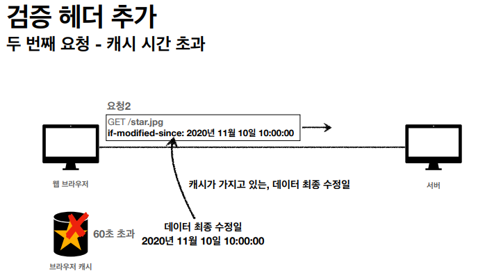

캐시에 동일한 리소스가 있고 `Last-Modified` 도 같이 있으면 해당 내용을 `if-modified-since` 헤더에 담아서 요청을 보냄.

요청 받은 헤더에 `if-modified-since` 가 있으면 서버는 해당 리소스의 최종 수정일과 `if-modified-since` 을 비교함.

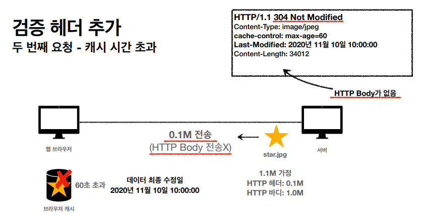

비교 했을 때, `if-modified-since` 와 최종 수정일이 같은 경우 `304 Not Modified` 를  응답하며, 이때 HTTP Body는 따로 없음. **(즉, 요청한 리소스를 보내지 않음. 헤더 용량(0.1M)만 보냄.)**

( 이때 서버는 서버의 파일시스템이 관리하는 파일 정보를 통해 최종수정일을 앎.

일반적으로 OS의 파일시스템은 파일정보로 마지막 수정된 날짜를 가지고 있음 )

( Java 에서는 Etag기능을 Servlet Filter를 통해 지원함 - ShallowEtagHeaderFilter )

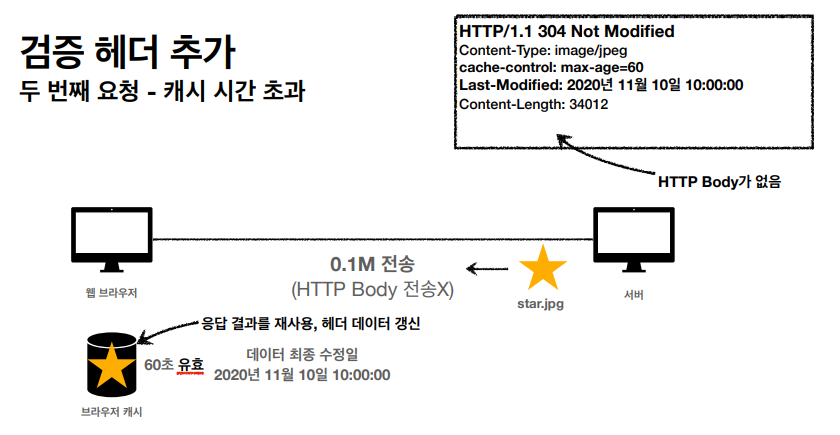

304 응답을 받은 클라이언트는 헤더 데이터를 갱신하며, 이때 유효기간도 업데이트가 됨.

### 실제 브라우저 확인

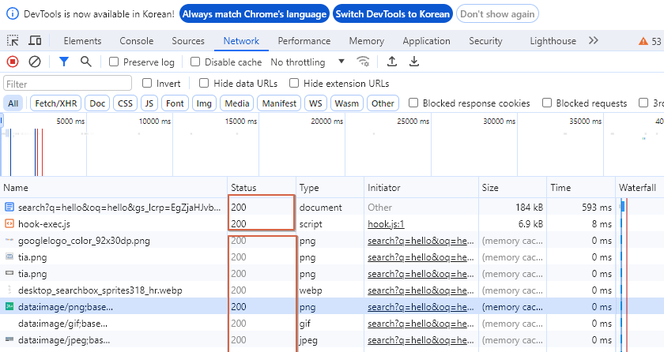

위에 status에 진한 글씨는 서버에서 리소스를 가져온 것이고,

흐린 글씨는 캐시에서 가져온 것임.

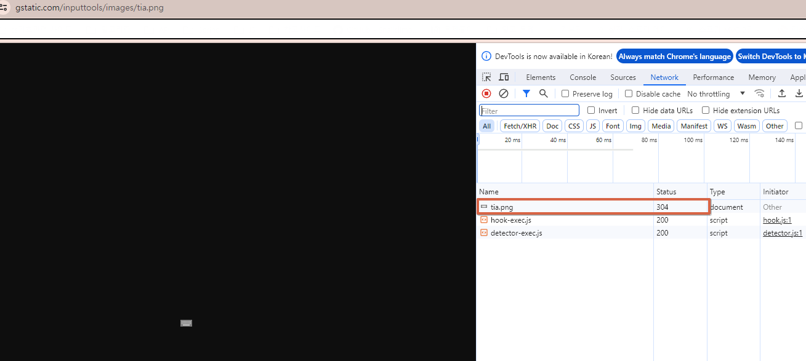
그 중 하나를 선택해서 보면  해당 리소스의 status가 `304`인걸 확인할 수 있음.

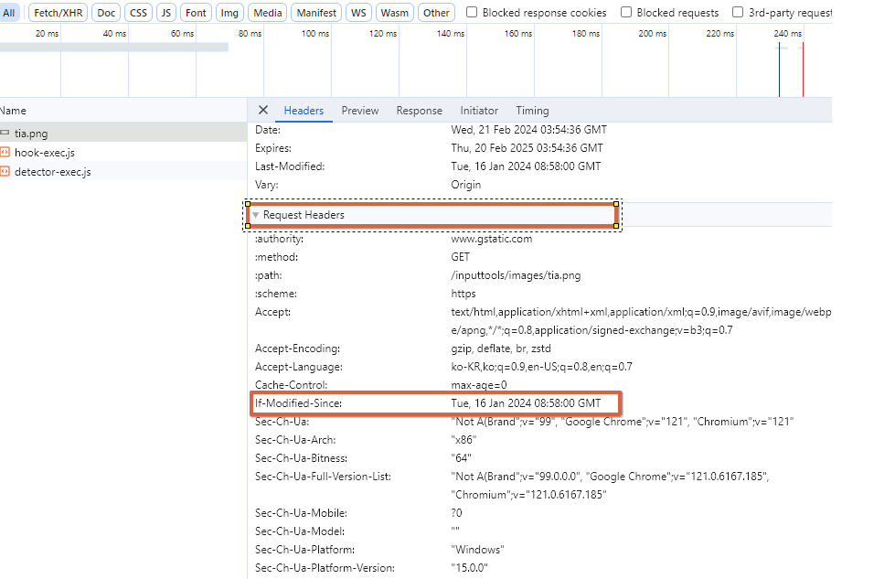

`Request Headers`를 확인해보면 `If-Modified-Since`가 있는걸 확인할 수 있음.

### 단점

1초 미만( 0.x초) 단위로 캐시 조정이 불가능함.

날짜 기반의 로직을 사용.

데이터를 수정해서 날짜가 다르지만, 수정 후에도 데이터 결과가 같은 경우.

( a→b로 수정했는데, 다시 b→a 로 수정한 경우 )

서버에서 별도의 캐시 로직을 관리하고 싶은 경우.

ex) 스페이스나 주석처럼 크게 영향이 없는 변경에서 캐시를 유지하고 싶을 떄.

## 검증헤더2 - ETage, 조건부 - If-None-Match

### ETag(Entity Tag)

캐시용 데이터에 임의의 고유한 버전 이름을 달아둠.

ex ) 

ETge:”v1.0”(버전을 쓰기도 하고) , 

Etge : “adf2fdfagdf2” ( 파일 해싱값을 쓰기도 함. 파일이 동일하면 똑같은 결과를 뱉으니)

따라서 ETag만 보내서 같으면 유지, 다르면 다시 받음.

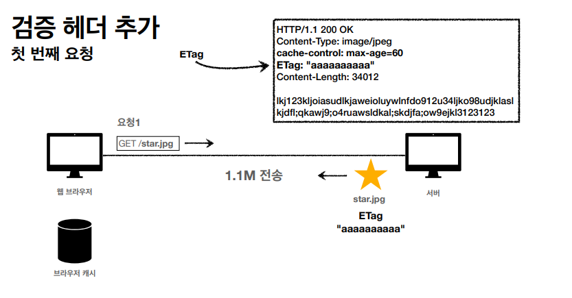
클라이언트에서 요청을 보낼 때 ETag를 포함해서 보내고, 응답결과를 브라우저 캐시에 저장함.

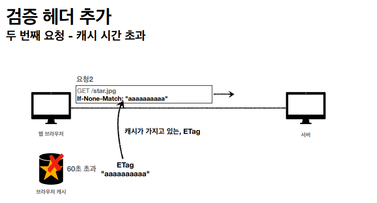

또 다시 요청을 보내기 전에 브라우저 캐시를 뒤져서 동일한 리소스 확인.

동일한 리소스가 있음에도 유효시간이 초과된 경우 `If-None-Match`를 헤더에 포함하여 요청함.

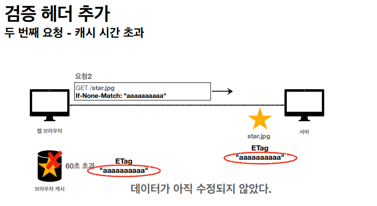
요청을 받은 서버는 `ETag`의 데이터를 확인

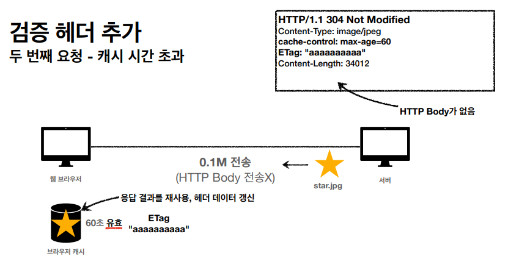

데이터가 수정되지 않았으면 `304 Not Modifed` 를 뱉고,

이 응답을 받은 클라이언트는 헤더 유효기간을 업데이트함.

### 특징

단순히 ETag만 서버에 보내서 같으면 유지, 다르면 다시 요청.

**클라이언트는 캐시 메너티즘에 대해서 전혀 몰라도 됨**. 그냥 `ETag`와`If-None-Match` 만 던져주면 되니깐.

ex) 애플리케이션 배포 주기에 맞춰서 ETag를 모두 갱신.

# 캐시 제어 헤더

`Cache-Control` : 캐시 제어 ( 캐시 유효 시간, 초단위)

`Pragma` : 캐시 제어(하위호환) 

`Expires` : 캐시 유효 기간(하위 호환)

### Cache-Control  - 캐시지시어(Directives)

`Cache-Control : max-age`

: 캐시 유효 시간, 초단위

`Cache-Control : no-cache`

: 데이터는 캐시해도 되지만, 항상 실제서버에 해당 데이터가 바뀌지 않았는지 확인해야 함.

`Cache-Control : no-store`

: 데이터에 민감한 정보가 있으면 저장하면 안됨. ( 메모리에서 사용하고 최대한 빨리 삭제해라)

### Paragma - 캐시 제어(하위 호환)

`Pragma: no-cache`

HTTP 1.0 하위 호환. 지금은 거의 사용 X

### Expires - 캐시 만료일 지정(하위 호환)

`expires: Mon, 01 Jan 1990 00:00:00 GMT`

캐시 만료일을 정확한 날짜로 지정.

HTTP 1.0부터 사용.

지금은 좀 더 유연한 `Cache-Control: max-age` 권장

`Cache-Control: max-age`와 함께 사용하면 `Expires`는 무시.

# 프록시 캐시

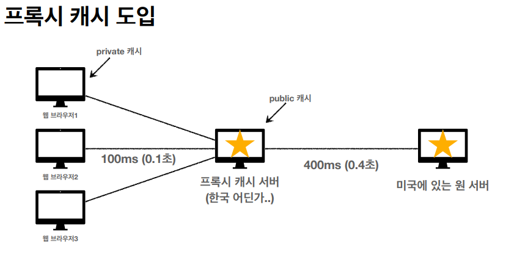

웹 브라우저들이 미국에 있는 원 서버에 직접 접근하면 500ms 씩 걸림.

그래서 중간에 프록시 캐시 서버를 둠.

### Cache-Control : 캐시 지시어(Directives) - 기타

`Cache-Control: public`

: 응답이 public 캐시에 저장되어도 됨.

`Cache-Control: private`

: 응답이 해당 사용자만을 위한 것. ( 기본값 )

`Cache-Control: s-maxage`

: 프록시 캐시에만 적용되는 max-age

`Age: 60` (HTTP 헤더)

: 오리진 서버에서 응답 후 프록시 캐시 내에 머문 시간(초)

# 캐시 무효화

### Cache-Control : 확실한 캐시 무효화 응답

따로 설정하지 않아도 브라우저가 데이터를 캐싱함.

하지만 특정 리소스에 대해서 캐싱을 원치 않는 경우 아래와 같이 설정을 다 넣어줘야 함.

`Cache-Control: no_cache, no-store, must-revalidate`

`Pragma: no-cache` ( HTTP 1.0은 Cache-Control을 모르기 때문에 혹시라도 HTTP 1.0 요청을 대비해서 넣어줌 )

### no-cache VS must-revalidate

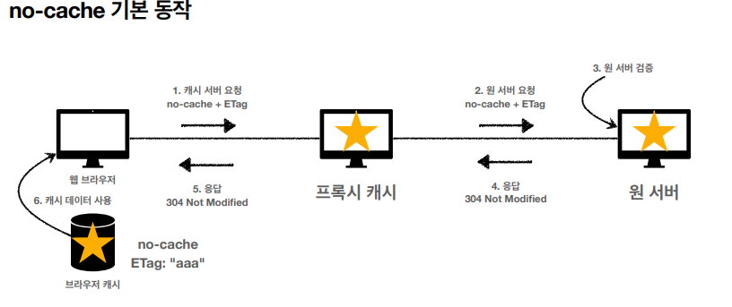

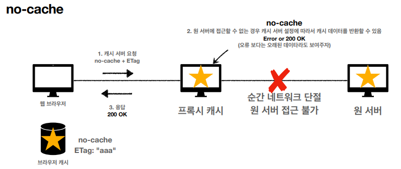

예외 상황으로 no-cache로 요청을 보냈는데, 프록시서버에서 원서버로 가능 길에 네트워크 단절 등의 이유로 원 서버에 접근이 불가한 경우. 

→ 오류보단 오래된 데이터라도 보여주기 위해 `200 OK`를 내려보내기도 함.

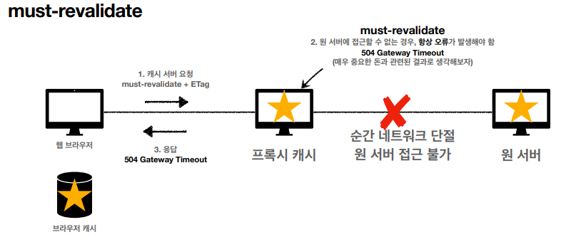

must-revalidate는 요청을 보냈는데, 프록시서버에서 원서버로 가능 길에 네트워크 단절 등의 이유로 원 서버에 접근이 불가한 경우. 

→ `504 Gateway Timeout` 오류를 뱉어냄.

출처 : https://www.inflearn.com/course/http-%EC%9B%B9-%EB%84%A4%ED%8A%B8%EC%9B%8C%ED%81%AC/dashboard