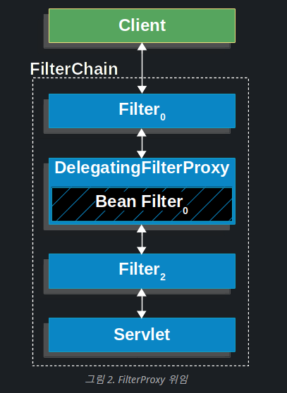
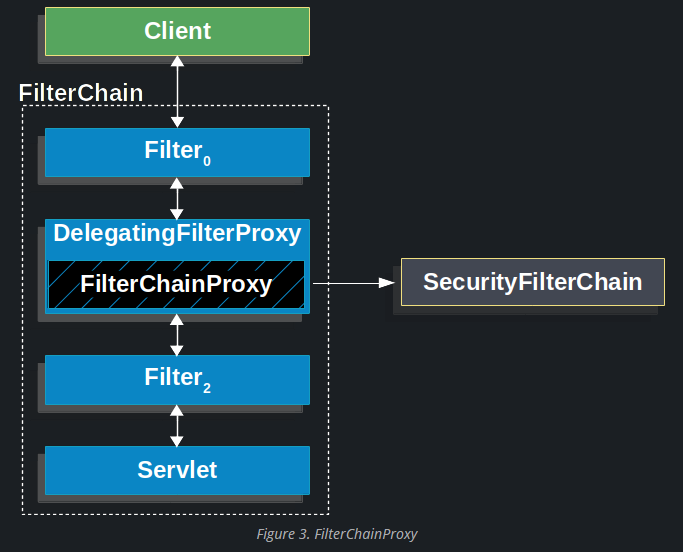
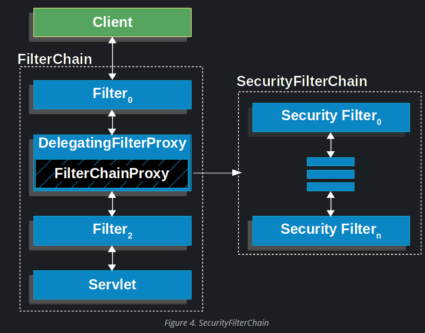
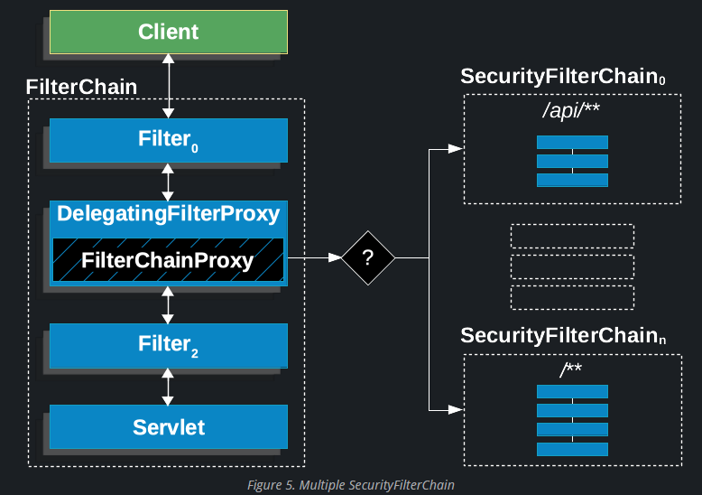

https://docs.spring.io/spring-security/reference/servlet/architecture.html#servlet-delegatingfilterproxy-figure


## DelegatingFilterProxy

security는 기본적으로 필터로 동작.

하지만 필터는 spring container 밖에 있으므로 Bean을 인식할 수 없음.

이것을 해결하기 위해 `DelegatingFilterProxy`를 두어 요청을 위임함.



## FilterChainProxy



**`FilterChainProxy`는 `SecurityFilterChain`을 통해 많은 필터 인스턴스에 위임을 허용하는 Spring Security에서 제공하는 특수 필터임.** 

**`FilterChainProxy`는 Bean이므로 일반적으로 DelegatingFilterProxy에 래핑됩니다.**


## SecurityFilterChain

`SecurityFilterChain`은 현재 요청에 대해 호출되어야 하는 Spring Security Filter 인스턴스를 결정하기 위해 `FilterChainProxy`에서 사용됩니다.



**`SecurityFilterChain`의 Security Filter는 일반적으로 Bean이지만 `DelegatingFilterProxy` 대신 `FilterChainProxy`로 등록됩니다.** 

**`FilterChainProxy`는 Servlet 컨테이너 또는 DelegatingFilterProxy에 직접 등록할 때 여러 가지 이점을 제공합니다.** 

**첫째, Spring Security의 모든 서블릿 지원에 대한 시작점을 제공합니다.** 

**이러한 이유로 Spring Security의 Servlet 지원 문제를 해결하려는 경우 FilterChainProxy에 디버그 지점을 추가하는 것이 좋은 시작점입니다.**

둘째, `FilterChainProxy`는 Spring Security 사용의 핵심이므로 선택 사항으로 간주되지 않는 작업을 수행할 수 있습니다. 

예를 들어 메모리 누수를 방지하기 위해 SecurityContext를 지웁니다. 또한 특정 유형의 공격으로부터 애플리케이션을 보호하기 위해 Spring Security의 HttpFirewall을 적용합니다.
또한 `SecurityFilterChain`을 호출해야 하는 시기를 결정하는 데 더 많은 유연성을 제공합니다. 

서블릿 컨테이너에서 필터 인스턴스는 URL만을 기반으로 호출됩니다. 

그러나 `FilterChainProxy`는 RequestMatcher 인터페이스를 사용하여 HttpServletRequest의 모든 항목을 기반으로 호출을 결정할 수 있습니다.



Multiple SecurityFilterChain 그림에서 `FilterChainProxy`는 어떤 `SecurityFilterChain`을 사용해야 하는지 결정합니다. 

일치하는 첫 번째 SecurityFilterChain만 호출됩니다. 

`/api/messages/`의 URL이 요청되면 먼저 `/api/**`의 `SecurityFilterChain0` 패턴과 일치하므로 SecurityFilterChain(n)에서도 일치하더라도 SecurityFilterChain0만 호출됩니다. 

`/messages/`의 URL이 요청되면 /api/**의 SecurityFilterChain0 패턴과 일치하지 않으므로 **FilterChainProxy는 계속해서 각 SecurityFilterChain을 시도**합니다. 

일치하는 다른 SecurityFilterChain 인스턴스가 없다고 가정하면 `SecurityFilterChain(n)`이 호출됩니다.
`SecurityFilterChain0`에는 보안 필터 인스턴스가 3개만 구성되어 있습니다. 

그러나 SecurityFilterChain(n)에는 4개의 보안 필터 인스턴스가 구성되어 있습니다. 

**각 SecurityFilterChain은 고유할 수 있으며 별도로 구성될 수 있다는 점에 유의하는 것이 중요**합니다. 실제로, 애플리케이션이 Spring Security가 특정 요청을 무시하도록 하려는 경우 SecurityFilterChain에는 보안 필터 인스턴스가 없을 수 있습니다.

## Security Filters

보안 필터는 `SecurityFilterChain API`를 사용하여 `FilterChainProxy`에 삽입됩니다. 

이러한 필터는 인증, 권한 부여, 악용 방지 등과 같은 다양한 목적으로 사용될 수 있습니다. 

**필터는 적시에 호출되도록 특정 순서로 실행**됩니다. 

예를 들어 인증(authentication)을 수행하는 필터는 인가(authorization) 수행하는 필터보다 먼저 호출되어야 합니다. 

일반적으로 Spring Security 필터의 순서를 알 필요는 없다. 

하지만 순서를 아는 것이 도움이 될 때가 있는데, 알고 싶다면 FilterOrderRegistration 코드를 확인하면 됩니다.
위 단락을 예시하기 위해 다음 보안 구성을 고려해 보겠습니다.

```java
@Configuration
@EnableWebSecurity
public class SecurityConfig {

    @Bean
    public SecurityFilterChain filterChain(HttpSecurity http) throws Exception {
        http
            .csrf(Customizer.withDefaults())
            .authorizeHttpRequests(authorize -> authorize
                .anyRequest().authenticated()
            )
            .httpBasic(Customizer.withDefaults())
            .formLogin(Customizer.withDefaults());
        return http.build();
    }

}
```

위 코드의 필터 순서는 아래와 같음.

[HttpSecurity#csrf](https://docs.spring.io/spring-security/reference/servlet/exploits/csrf.html)

[HttpSecurity#formLogin](https://docs.spring.io/spring-security/reference/servlet/authentication/passwords/form.html#servlet-authentication-form)

[HttpSecurity#httpBasic](https://docs.spring.io/spring-security/reference/servlet/authentication/passwords/basic.html)

[HttpSecurity#authorizeHttpRequests](https://docs.spring.io/spring-security/reference/servlet/authorization/authorize-http-requests.html)

1. CSRF 공격으로부터 보호하기 위해 CsrfFilter가 호출됩니다.
2. 요청을 인증하기 위해 인증 필터가 호출됩니다.
3. 요청을 승인하기 위해 AuthorizationFilter가 호출됩니다.

## Printing the Security Filters

특정 요청에 대해 호출되는 보안 필터 목록을 확인하는 것이 유용한 경우가 많습니다. 

예를 들어, 추가한 필터가 보안 필터 목록에 있는지 확인하려고 합니다.
필터 목록은 애플리케이션 시작 시 INFO 수준에서 인쇄되므로 콘솔 출력에서 다음과 같은 내용을 볼 수 있습니다.

```java
2023-06-14T08:55:22.321-03:00  INFO 76975 --- [           main] o.s.s.web.DefaultSecurityFilterChain     : Will secure any request with [
org.springframework.security.web.session.DisableEncodeUrlFilter@404db674,
org.springframework.security.web.context.request.async.WebAsyncManagerIntegrationFilter@50f097b5,
org.springframework.security.web.context.SecurityContextHolderFilter@6fc6deb7,
org.springframework.security.web.header.HeaderWriterFilter@6f76c2cc,
org.springframework.security.web.csrf.CsrfFilter@c29fe36,
org.springframework.security.web.authentication.logout.LogoutFilter@ef60710,
org.springframework.security.web.authentication.UsernamePasswordAuthenticationFilter@7c2dfa2,
org.springframework.security.web.authentication.ui.DefaultLoginPageGeneratingFilter@4397a639,
org.springframework.security.web.authentication.ui.DefaultLogoutPageGeneratingFilter@7add838c,
org.springframework.security.web.authentication.www.BasicAuthenticationFilter@5cc9d3d0,
org.springframework.security.web.savedrequest.RequestCacheAwareFilter@7da39774,
org.springframework.security.web.servletapi.SecurityContextHolderAwareRequestFilter@32b0876c,
org.springframework.security.web.authentication.AnonymousAuthenticationFilter@3662bdff,
org.springframework.security.web.access.ExceptionTranslationFilter@77681ce4,
org.springframework.security.web.access.intercept.AuthorizationFilter@169268a7]
```

그러면 각 필터 체인에 대해 구성되는 보안 필터에 대해 꽤 좋은 아이디어를 얻을 수 있습니다.
그러나 이것이 전부는 아닙니다. 

각 요청에 대해 각 개별 필터의 호출을 인쇄하도록 애플리케이션을 구성할 수도 있습니다. 

이는 추가한 필터가 특정 요청에 대해 호출되는지 확인하거나 예외가 발생하는 위치를 확인하는 데 도움이 됩니다. 이를 위해 보안 이벤트를 기록하도록 애플리케이션을 구성할 수 있습니다.

## Adding a Custom Filter to the Filter Chain

대부분의 경우 기본 보안 필터는 애플리케이션에 보안을 제공하기에 충분합니다. 

그러나 보안 필터 체인에 사용자 지정 필터를 추가하려는 경우가 있을 수 있습니다.
예를 들어 **Tenant**  ID 헤더를 가져오는 필터를 추가하고 현재 사용자가 해당 **Tenant** 에 액세스할 수 있는지 확인한다고 가정해 보겠습니다. 이전 설명은 이미 필터를 추가할 위치에 대한 단서를 제공합니다. 현재 사용자를 알아야 하므로 인증 필터 뒤에 추가해야 합니다.
먼저 필터를 만들어 보겠습니다.

+)**Tenant  : Tenant 는 임차인이라는 뜻을 가지고 있습니다. 자신의 건물이 아닌, 다른 건물을 빌려서 사용하는 주체입니다. 자신의 자원이 아닌 서비스 제공자의 클라우드 자원을 빌려서 서비스를 이용하는 주체가 Tenant.**

```java
import java.io.IOException;

import jakarta.servlet.Filter;
import jakarta.servlet.FilterChain;
import jakarta.servlet.ServletException;
import jakarta.servlet.ServletRequest;
import jakarta.servlet.ServletResponse;
import jakarta.servlet.http.HttpServletRequest;
import jakarta.servlet.http.HttpServletResponse;

import org.springframework.security.access.AccessDeniedException;

public class TenantFilter implements Filter {

    @Override
    public void doFilter(ServletRequest servletRequest, ServletResponse servletResponse, FilterChain filterChain) throws IOException, ServletException {
        HttpServletRequest request = (HttpServletRequest) servletRequest;
        HttpServletResponse response = (HttpServletResponse) servletResponse;

        String tenantId = request.getHeader("X-Tenant-Id"); (1)
        boolean hasAccess = isUserAllowed(tenantId); (2)
        if (hasAccess) {
            filterChain.doFilter(request, response); (3)
            return;
        }
        throw new AccessDeniedException("Access denied"); (4)
    }

}
```

위의 샘플 코드는 다음을 수행합니다.

1. 요청 헤더에서 테넌트 ID를 가져옵니다.
2. 현재 사용자가 테넌트 ID에 액세스할 수 있는지 확인하세요.
3. 사용자에게 액세스 권한이 있으면 체인의 나머지 필터를 호출합니다.
4. 사용자에게 액세스 권한이 없으면 AccessDeniedException이 발생합니다.

**필터를 구현하는 대신 요청당 한 번만 호출되는 필터의 기본 클래스인 OncePerRequestFilter에서 확장할 수 있으며 HttpServletRequest 및 HttpServletResponse 매개변수와 함께 doFilterInternal 메소드를 제공합니다.**

**이제 보안 필터 체인에 필터를 추가해야 합니다.**

```java
@Bean
SecurityFilterChain filterChain(HttpSecurity http) throws Exception {
    http
        // ...
        .addFilterBefore(new TenantFilter(), AuthorizationFilter.class);
    return http.build();
}
```

**`AuthorizationFilter` 앞에 TenantFilter를 추가하려면 HttpSecurity#addFilterBefore를 사용하세요.**

`AuthorizationFilter` 앞에 필터를 추가함으로써 인증 필터 다음에 TenantFilter가 호출되도록 합니다. 

HttpSecurity#`addFilterAfter`를 사용하여 특정 필터 뒤에 필터를 추가하거나 HttpSecurity#`addFilterAt`를 사용하여 필터 체인의 특정 필터 위치에 필터를 추가할 수도 있습니다.
이제 필터 체인에서 TenantFilter가 호출되어 현재 사용자가 **Tenant** ID에 액세스할 수 있는지 확인합니다.
@Component로 주석을 달거나 구성에서 bean으로 선언하여 필터를 Spring bean으로 선언할 때 주의하세요. 

Spring Boot가 이를 내장된 컨테이너에 자동으로 등록하기 때문입니다. 

이로 인해 필터가 컨테이너에 의해 한 번, Spring Security에 의해 한 번, 다른 순서로 두 번 호출될 수 있습니다.

**예를 들어 종속성 주입을 활용하고 중복 호출을 피하기 위해 필터를 Spring 빈으로 선언하려는 경우 FilterRegistrationBean 빈을 선언하고 활성화된 속성을 다음과 같이 설정하여 Spring Boot에 컨테이너에 등록하지 않도록 지시할 수 있습니다**

```java
@Bean
public FilterRegistrationBean<TenantFilter> tenantFilterRegistration(TenantFilter filter) {
    FilterRegistrationBean<TenantFilter> registration = new FilterRegistrationBean<>(filter);
    registration.setEnabled(false);
    return registration;
}
```


