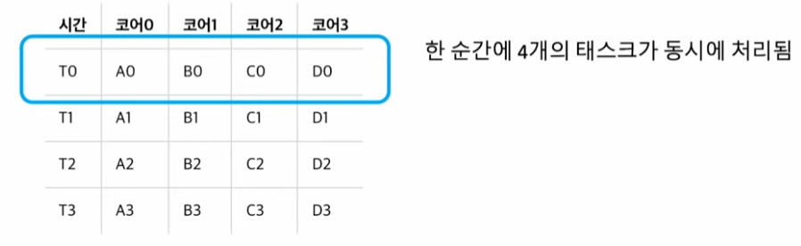

# 동시성(Concurrency)

**Task들이 빠르게 전환되면서 실행되기 때문에 동시에 실행되는 것처럼 보이는 것**.

싱글 코에서도 여러 작업이 동시적으로 실행되며, 실시간으로 Task간의 `Context Switch`가 발생하면서 여러 작업들을 동시에 실행하는 것처럼 보이게 함.

→ 싱글코어에서 멀티스레드로 동작.

# 병렬성(Parallelism)

Task들이 실제로 동시에 실행되며, 멀티코어에서 멀티 쓰레드를 동작시키는 방식.

→ 멀티코어에서 멀티쓰레드 동작.

병렬성은 동시성에 포함되는 개념임.

→ 일반적으로는 병렬성이 동시성보단 좋으나 몇가지 단점이 있음.

1. 병렬성은 물리적인 코어의 개수에 제한을 받음. → 그만큼 많은 코어가 있어야 함.
2. 실제 작업이 병렬적으로 처리할 수 없는 경우가 많음.( 어떤작업을 쪼개처리할 수 없다면,(선행되어야 하는 이벤트가 있는 경우) 병렬성은 사용할 수 없음. )
3. 처리하는 작업이 주로 I/O작업인 경우 
    
    : 파일을 읽은 후에 다음작업을 처리할 수 있는 경우 → 병렬성이 효과적이지 못함. ( 데이터가 없어서 쉬는 시간이 존재하기 때문에 )

 
     

참고 : 
https://www.youtube.com/watch?v=vKs7I3vGpF8