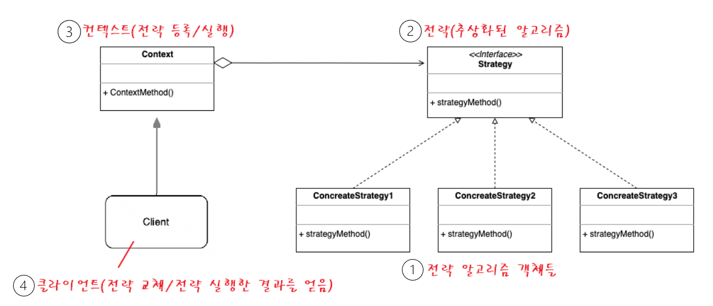

### 전략패턴

전략 패턴은 실행(런타임) 중에 알고리즘 전략을 선택하여 객체 동작을 실시간으로 바뀌도록 할 수 있게 하는 행위 디자인 패턴 이다.

즉, 어떤 일을 수행하는 알고리즘이 여러가지 일때, 동작들을 미리 전략으로 정의함으로써 손쉽게 전략을 교체할 수 있는, 알고리즘 변형이 빈번하게 필요한 경우에 적합한 패턴이다.



1. 전략 알고리즘 객체들 : 알고리즘, 행위, 동작을 객체로 정의한 구현체
2. 전략 인터페이스 : 모든 전략 구현제에 대한 공용 인터페이스 
3. 컨텍스트(Context) : 알고리즘을 실행해야 할 때마다 해당 알고리즘과 연결된 전략 객체의 메소드를 호출.
4. 클라이언트 : 특정 전략 객체를 컨텍스트에 전달 함으로써 전략을 등록하거나 변경하여에시 전략 알고리즘을 실행한 결과를 누린다.

### 전략 패턴 사용 시기

1. 전략 알고리즘의 여러 버전 또는 변형이 필요할 때 클래스화를 통해 관리
2. 알고리즘 코드가 노출되어서는 안 되는 데이터에 액세스 하거나 데이터를 활용할 때 (캡슐화)
3. 알고리즘의 동작이 런타임에 실시간으로 교체 되어야 할때

### 전략 패턴 주의점

1. 알고리즘이 많아질수록 관리해야할 객체의 수가 늘어난다는 단점이 있다.
2. 만일 어플리케이션 특성이 알고리즘이 많지 않고 자주 변경되지 않는다면, 새로운 클래스와 인터페이스를 만들어 프로그램을 복잡하게 만들 이유가 없다.
3. 개발자는 적절한 전략을 선택하기 위해 전략 간의 차이점을 파악하고 있어야 한다. (복잡도 ↑)


### 예시

결제수단이 달라질 때.

전략 인터페이스(추상화된 알고리즘) 

```java
public interface PayStrategy {
    void pay(int amount);
}
```

컨텍스트 클래스(전략 등록 및 실행)

```java
import java.util.ArrayList;
import java.util.List;

public class Cart {
    List<Item> items;

    public Cart() {
        items = new ArrayList<>();
    }

    public void setItem(Item item) {
        items.add(item);
    }

// 전략을 파라미터로 받아 전략에 따라 pay 실행.
    public void pay(**PayStrategy payStrategy**) {
        int amount = 0;

        for (Item item : items) {
            amount += item.getPrice();
        }

        payStrategy.pay(amount);

    }
}

```

전략알고리즘 - 구현체

```java
public class KaKaoPay implements PayStrategy{
    @Override
    public void pay(int amount) {
        System.out.println("카카오페이 결제 : " + amount);
    }
}

```

```java
public class NaverPay implements PayStrategy{
    @Override
    public void pay(int amount) {
        System.out.println("네이버 결제 : " + amount);
    }
}

```

클라이언트

```java
public class PayClient {
    public static void main(String[] args) {
        Cart cart = new Cart();

        Item item1 = new Item("item1", 1000);
        Item item2 = new Item("item2", 2000);

        cart.setItem(item1);
        cart.setItem(item2);

        cart.pay(new KaKaoPay());
        cart.pay(new NaverPay());

    }
}
```

참고 : [💠 전략(Strategy) 패턴 - 완벽 마스터하기](https://inpa.tistory.com/entry/GOF-💠-전략Strategy-패턴-제대로-배워보자)