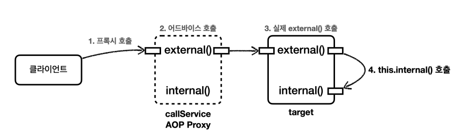

### 프록시 내부 호출 문제사항

AOP는 프록시 기반으로 동작.

따라서 AOP를 적용하기 위해서는 항상 프록시를 통해서 대상 객체(Target)을 호출해야 함.

만약 프록시를 거치지 않고 대상 객체를 호출하면 AOP가 적용되지 않고, 어드바이스도 호출되지 않음.

### 문제사항 예시

Aspect

```java
@Slf4j
@Aspect
public class CallLogAspect {

    @Before("execution(* hello.aop.internalcall..*.*(..))")
    public void doLog(JoinPoint joinPoint) {
        log.info("aop={}", joinPoint.getSignature());
    }
    
}
```

```java
package hello.aop.internalcall;

@Slf4j
@Component
public class CallServiceV0 {

    public void external() {
        log.info("call external");
        internal(); // 내부 메서드 호출.
    }
    public void internal() {
        log.info("call internal");
    }
}

```

실행 코드

```java
@Import(CallLogAspect.class)
@SpringBootTest
class CallServiceV0Test {

    @Autowired
    CallServiceV0 callServiceV0;
    
    @Test
    void external() {
        callServiceV0.external();
    }
    
    @Test
    void internal() {
        callServiceV0.internal();
    }
}
```

위와 같은 상황에서 `CallServiceV0Test.external()`을 호출하면 아래와 같은 결과가 나옴.

```java
1. //프록시 호출
2. CallLogAspect : aop=void hello.aop.internalcall.CallServiceV0.external()
3. CallServiceV0 : call external
4. CallServiceV0 : call internal
```

→ `external()`을 호출할 때는 aop가 적용되었으나, 그 내부에서 호출한 `internal`은 aop가 적용되지 않음.

### 문제의 원인



위 그림과 같이 `external()`안에서 호출한 `internal()`메서드는 프록시를 거치지 않았기 때문에 aop가 적용되지 않음.

자바에서는 메서드 앞에 별도의 참조가 없으면 `this`라는 자기 자신의 인스턴스를 가리킴.

여기서 this는 프록시가 아닌 실제 대상 객체의 인스턴스를 뜻함.

( `CallServiceV0Test.internal()`을 호출한 경우는 aop가 정상적으로 적용됨. )

### 해결방안1 - 지연 조회

ObjectProvider를 사용하여 지연조회 적용.

```java
/**
 * ObjectProvider(Provider), ApplicationContext를 사용해서 지연(LAZY) 조회
 */
@Slf4j
@Component
@RequiredArgsConstructor
public class CallServiceV2 {

    // private final ApplicationContext applicationContext; // 너무 많은 기능을 담고 있음.
    private final ObjectProvider<CallServiceV2> callServiceProvider;
    
    public void external() {
        log.info("call external");
			// CallServiceV2 callServiceV2 = applicationContext.getBean(CallServiceV2.class);
        CallServiceV2 callServiceV2 = callServiceProvider.getObject();
        callServiceV2.internal(); //외부 메서드 호출
    }
    
    public void internal() {
        log.info("call internal");
    }
}
```

위와 같이 ObjectProvider인 callServiceProvider.getObject()를 호출하는 시점에 스프링 컨테이너에서 빈을 조회함.

→ 생성자를 사용할 수는 없음. 자기자신을 생성자로 만들면 아래와 같은 순환참조 문제가 발생함.

```java
Error creating bean with name 'callServiceV1': Requested bean is currently in 
creation: Is there an unresolvable circular reference?
```

### 해결방안2 - 구조변경