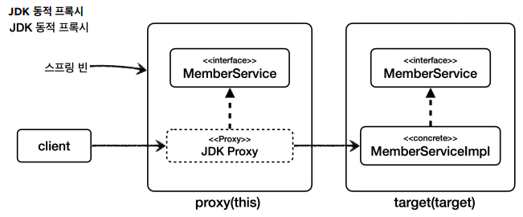

# 타입 캐스팅

JDK 동적 프록시는 인터페이스가 필수이며, 인터페이스 기반으로 프록시를 생성함.

CGLIB는 구체 클래스를 기반으로 프록시를 생성한다.

( 즉, 인터페이스가 없고 구체 클래스만 있는 경우 CGLIB만 사용이 가능 하다 )

`proxyTargetClass=false` JDK 동적 프록시를 사용해서 인터페이스 기반 프록시 생성 ( default )
`proxyTargetClass=true` CGLIB를 사용해서 구체 클래스 기반 프록시 생성
→ 옵션과 무관하게 인터페이스가 없으면 JDK 동적 프록시를 적용할 수 없으므로 CGLIB를 사용함.

### 캐스팅 테스트1 - JDK 동적 프록시

```java
import hello.aop.member.MemberService;
import hello.aop.member.MemberServiceImpl;
import lombok.extern.slf4j.Slf4j;
import org.junit.jupiter.api.Test;
import org.springframework.aop.framework.ProxyFactory;
import static org.junit.jupiter.api.Assertions.assertThrows;

@Slf4j
public class ProxyCastingTest {

	@Test
	void jdkProxy() {
		MemberServiceImpl target = new MemberServiceImpl(); 
		ProxyFactory proxyFactory = new ProxyFactory(target);
		proxyFactory.setProxyTargetClass(false); // JDK 동적 프록시
		
		// 프록시 인터페이스로 캐스팅 가능.
		MemberService memberServiceProxy = (MemberService) proxyFactory.getProxy();
		log.info("proxy class={}", memberServiceProxy.getClass());
		
		// JDK 동적 프록시를 구현 클래스로 캐스팅 실패. ClassCastException 예외 발생!
		assertThrows(ClassCastException.class, () -> {
			MemberServiceImpl castingMemberService = (MemberServiceImpl) memberServiceProxy;
		});
	}
	
}
```




JDK 동적 proxy는 인터페이스를 기반으로 프록시를 생성하기 때문에 구현체에 대해서는 모름.

→ 구체 타입으로는 캐스팅 불가.

### 캐스팅 테스트2 - CGLIB 프록시

```java
@Test
void cglibProxy() {
	MemberServiceImpl target = new MemberServiceImpl();
	ProxyFactory proxyFactory = new ProxyFactory(target);
	proxyFactory.setProxyTargetClass(true);//CGLIB 프록시
	
	// 프록시를 인터페이스로 캐스팅 성공
	MemberService memberServiceProxy = (MemberService) proxyFactory.getProxy();
	log.info("proxy class={}", memberServiceProxy.getClass());
	
	// CGLIB 프록시를 구현 클래스로 캐스팅 성공
	MemberServiceImpl castingMemberService = (MemberServiceImpl) memberServiceProxy;
}
```


CGLIB는 구체 클래스를 기반으로 프록시를 생성하기 때문에 구현체 뿐 아닌 인터페이스까지 캐스팅 가능.


# 의존관관계 주입.

```java
import hello.aop.member.MemberService;import hello.aop.member.MemberServiceImpl;
import hello.aop.proxyvs.code.ProxyDIAspect;
import lombok.extern.slf4j.Slf4j;
import org.junit.jupiter.api.Test;
import org.springframework.beans.factory.annotation.Autowired;
import org.springframework.boot.test.context.SpringBootTest;
import org.springframework.context.annotation.Import;

@Slf4j
@SpringBootTest(properties = {"spring.aop.proxy-target-class=false"}) //JDK 동적 프록시. DI 예외 발생
//@SpringBootTest(properties = {"spring.aop.proxy-target-class=true"}) //CGLIB 프록시. 성공
@Import(ProxyDIAspect.class)
public class ProxyDITest {
	@Autowired 
	MemberService memberService; //JDK 동적 프록시 OK, CGLIB OK
	
	@Autowired 
	MemberServiceImpl memberServiceImpl; //JDK 동적 프록시 X, CGLIB OK
	
	@Test
	void go() {
		log.info("memberService class={}", memberService.getClass());
		log.info("memberServiceImpl class={}", memberServiceImpl.getClass());
		memberServiceImpl.hello("hello");
	}
}
```

위 코드에서 CGLIB는 성공하지만 JDK 동적 프록시는 아래와 같은 메세지와 함께 실패된다.

```java
BeanNotOfRequiredTypeException: Bean named 'memberServiceImpl' is expected to be 
of type 'hello.aop.member.MemberServiceImpl' 
but was actually of type'com.sun.proxy.$Proxy54'
```

즉, 주입되길 기대한 것은 hello.aop.member.MemberServiceImpl이지만 실제로는 com.sun.proxy.$Proxy54가 넘어와서 에러가 발생한 것.


JDK Proxy는 인터페이스로 캐스팅이 가능하므로 인터페이스 자체를 넘겨줄 수 있다.

하지만 구현체의 경우 캐스팅이 불가하므로  해당 타입을 주입할 수 없다.

반대로 CGLIB로 설정할 경우 CGLIB는 인터페이스, 구현체 모두 캐스팅이 가능하므로 모두 사용이 가능하다.


# CGLIB 단점

1. 대상 클래스에 기본 생성자 필수.

CGLIB는 구현체를 상속받으므로 대상 클래스의 자식클래스다.

자바에서는 자식 클래스의 생성자를 호출할 때 자식 클래스의 생성자에서 부모 클래스의 생성자도 호출해야 한다.

즉, CGLIB를 사용할 때는 구현체의 기본 생성자가 꼭 있어야 한다.

2. 생성자 2번 호출 문제
    1. 실제 target의 객체를 생성할 때
    2. 프록시 객체를 생성할 때 부모 클래스의 생성자 호출
    
    
    

3. final 키워드 클래스, 메서드 사용 불가.

final 클래스는 상속이 불가하고 final 메서드는 오버라이딩이 불가하다.

CGLIB는 상속을 기반으로 하기 때문에 두 경우 프록시가 생성되지 않거나 정상 동작하지 않음.

( 단, 일반적으로 클래스와 메서드에 final 키워드는 잘 사용하지 않음 )


# 스프링의 해결책

### 스프링 3.2 -  CGLIB를 스프링 내부에 함께 패키징

CGLIB를 사용하려면 CGLIB 라이브러리가 별도로 필요했다. 스프링은 CGLIB 라이브러리를 스프링 내부에 함께 패 키징해서 별도의 라이브러리 추가 없이  spring-core애 CGLIB가 추가되었다.

### 스프링 4.0 - CGLIB 기본 생성자 필수 문제 해결

스프링 4.0부터 CGLIB의 기본 생성자가 필수인 문제가 해결되었다.
`objenesis` 라는 특별한 라이브러리를 사용해서 기본 생성자 없이 객체 생성이 가능하다.
참고로 이 라이브러리는 생성자 호출 없이 객체를 생성할 수 있게 해준다.

### 스프링 4.0 - 생성자 2번 호출 문제

스프링 4.0부터 CGLIB의 생성자 2번 호출 문제가 해결되었다.
이것도 역시 `objenesis` 라는 특별한 라이브러리 덕분에 가능해졌다.
이제 생성자가 1번만 호출된다.

### 스프링 부트 2.0 - CGLIB 기본 사용

스프링 부트 2.0 버전부터 CGLIB를 기본으로 사용하도록 했다.
이렇게 해서 구체 클래스 타입으로 의존관계를 주입하는 문제를 해결했다.
스프링 부트는 별도의 설정이 없다면 AOP를 적용할 때 기본적으로 `proxyTargetClass=true` 로 설정.
따라서 인터페이스가 있어도 JDK 동적 프록시를 사용하는 것이 아니라 항상 CGLIB를 사용해서 구체클래스를 기반으로 프록시를 생성한다.
물론 스프링은 우리에게 선택권을 열어주기 때문에 다음과 깉이 설정하면 JDK 동적 프록시도 사용할 수 있다.

application.properties

```java
spring.aop.proxy-target-class=false
```


출처 : https://www.inflearn.com/course/lecture?courseSlug=%EC%8A%A4%ED%94%84%EB%A7%81-%ED%95%B5%EC%8B%AC-%EC%9B%90%EB%A6%AC-%EA%B3%A0%EA%B8%89%ED%8E%B8&unitId=94538&tab=curriculum