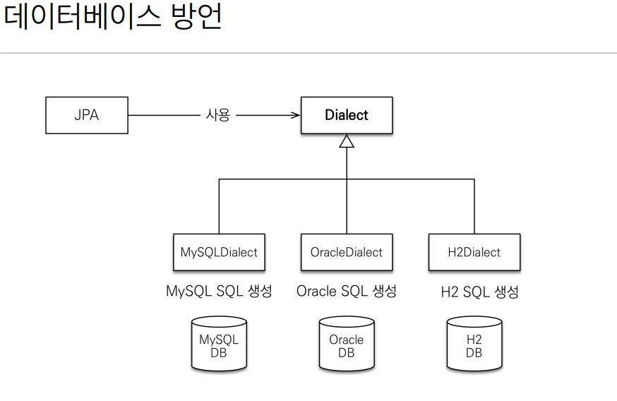
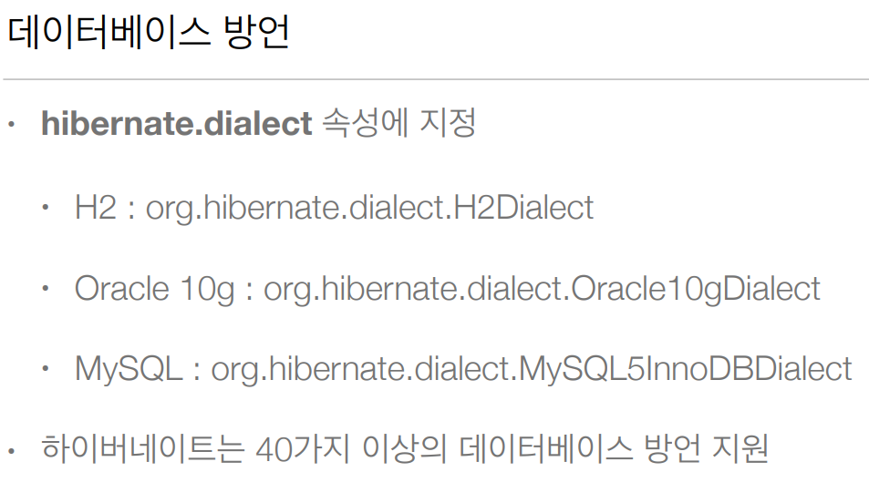
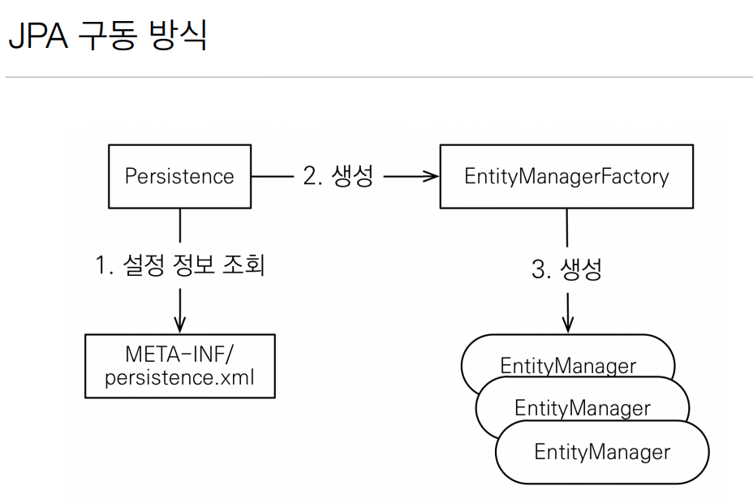
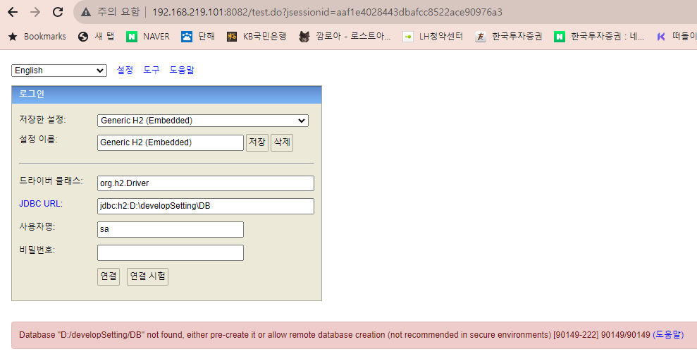
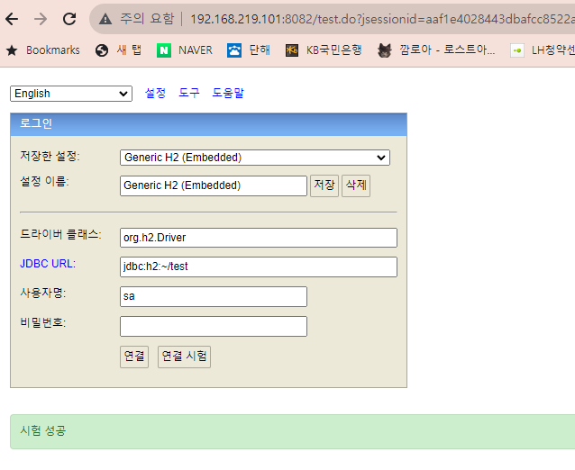

spring 쓰면서 라이브러리 버전은

[spring.io](http://spring.io)  - projects - spring boot에서 버전을 보고 공식문서에 들어가서 어떤 버전을 쓰지 나와있음.

# JPA 시작하기

### pom.xml

```jsx
<dependencies> 
	 <!-- JPA 하이버네이트 --> 
	 <dependency> 
	 <groupId>org.hibernate</groupId> 
	 <artifactId>hibernate-entitymanager</artifactId> 
	 <version>5.3.10.Final</version> 
	 </dependency> 
	 <!-- H2 데이터베이스 --> 
	 <dependency> 
	 <groupId>com.h2database</groupId> 
	 <artifactId>h2</artifactId> 
	 <version>1.4.199</version> 
	 </dependency> 
</dependencies>
```

### persistence.xml

- JPA 설정파일
- /META-INF/persistence.xml 에 위치해야함.
- persistence-unit name으로 이름을 지정.
- javax.persistence로 시작 : JPA 표준 속성이라는 뜻
- hibernate로 시작 : 하이버네이트 전용 속성이라는 뜻

```jsx
<?xml version="1.0" encoding="UTF-8"?>
<persistence version="2.2"
             xmlns="http://xmlns.jcp.org/xml/ns/persistence" xmlns:xsi="http://www.w3.org/2001/XMLSchema-instance"
             xsi:schemaLocation="http://xmlns.jcp.org/xml/ns/persistence http://xmlns.jcp.org/xml/ns/persistence/persistence_2_2.xsd">

    <!-- DB당 하나씩 만드는 편 -->
    <persistence-unit name="hello">
        <properties>
            <!-- 필수 속성 -->
            <property name="javax.persistence.jdbc.driver" value="org.h2.Driver"/>
            <property name="javax.persistence.jdbc.user" value="sa"/>
            <property name="javax.persistence.jdbc.password" value=""/>
            <property name="javax.persistence.jdbc.url" value="jdbc:h2:tcp://localhost/~/test"/>
            <property name="hibernate.dialect" value="org.hibernate.dialect.H2Dialect"/> <!-- 방언. 선택한 DB에 따라 달라짐. -->

            <!-- 옵션 -->
            <property name="hibernate.show_sql" value="true"/> <!--실제 날라가는 쿼리 보임여부 -->
            <property name="hibernate.format_sql" value="true"/> <!-- 쿼리 이쁘게 포맷팅해줌 -->
            <property name="hibernate.use_sql_comments" value="true"/> <!-- 해당 쿼리가 왜 나왔는지 주석으로 알려줌. -->
            <!--<property name="hibernate.hbm2ddl.auto" value="create" />-->
        </properties>
    </persistence-unit>
</persistence>
```

### 데이터베이스 방언

---

• JPA는 특정 데이터베이스에 종속 X<br>
• 각각의 데이터베이스가 제공하는 SQL 문법과 함수는 조금씩 다름<br>
• 가변 문자: MySQL은 VARCHAR, Oracle은 VARCHAR2<br>
• 문자열을 자르는 함수: SQL 표준은 SUBSTRING(), Oracle은 SUBSTR()<br>
• 페이징: MySQL은 LIMIT , Oracle은 ROWNUM<br>
• 방언: SQL 표준을 지키지 않는 특정 데이터베이스만의 고유한 기능<br>





### JPA 구동 방식



### 객체와 테이블 생성하고 매핑

@Entity : JPA가 관리할 객체

@Id : DB PK와 매핑

```jsx
package hellpjpa;

import javax.persistence.Entity;
import javax.persistence.Id;
import javax.persistence.Table;

@Entity // JPA를 사용하는애구나 인식.
//@Table(name="USER") // 테이블 명을 지정할 수 있음.
public class Member {
    @Id// PK가 뭔지는 알려줘야 함.
    private Long id;
    private String name;

    public Long getId() {
        return id;
    }

    public void setId(Long id) {
        this.id = id;
    }

    public String getName() {
        return name;
    }

    public void setName(String name) {
        this.name = name;
    }
}
```

### 주의!!

앤티티 매니저 팩토리는 하나만 생성해서 애플리케이션 전체에서 공유.

엔티티 매니저는 쓰레드간에 공유는 하면 안됨!!!!!! (사용하고 버려야함)

**JPA의 모든 데이터 변경은 트랜잭션 안에서 실행되어야 함.**

### 실행 시 오류

자바 버전 맞지 않아서 발생한 문제로 추정

```jsx
8월 28, 2023 12:12:42 오후 org.hibernate.jpa.internal.util.LogHelper logPersistenceUnitInformation
INFO: HHH000204: Processing PersistenceUnitInfo [
	name: hello
	...]
8월 28, 2023 12:12:42 오후 org.hibernate.Version logVersion
INFO: HHH000412: Hibernate Core {5.3.10.Final}
8월 28, 2023 12:12:42 오후 org.hibernate.cfg.Environment <clinit>
INFO: HHH000206: hibernate.properties not found
Exception in thread "main" java.lang.NoClassDefFoundError: javax/xml/bind/JAXBException
	at org.hibernate.boot.spi.XmlMappingBinderAccess.<init>(XmlMappingBinderAccess.java:43)
	at org.hibernate.boot.MetadataSources.<init>(MetadataSources.java:86)
	at org.hibernate.jpa.boot.internal.EntityManagerFactoryBuilderImpl.<init>(EntityManagerFactoryBuilderImpl.java:212)
	at org.hibernate.jpa.boot.internal.EntityManagerFactoryBuilderImpl.<init>(EntityManagerFactoryBuilderImpl.java:174)
	at org.hibernate.jpa.boot.spi.Bootstrap.getEntityManagerFactoryBuilder(Bootstrap.java:76)
	at org.hibernate.jpa.HibernatePersistenceProvider.getEntityManagerFactoryBuilder(HibernatePersistenceProvider.java:171)
	at org.hibernate.jpa.HibernatePersistenceProvider.getEntityManagerFactoryBuilderOrNull(HibernatePersistenceProvider.java:119)
	at org.hibernate.jpa.HibernatePersistenceProvider.getEntityManagerFactoryBuilderOrNull(HibernatePersistenceProvider.java:61)
	at org.hibernate.jpa.HibernatePersistenceProvider.createEntityManagerFactory(HibernatePersistenceProvider.java:50)
	at javax.persistence.Persistence.createEntityManagerFactory(Persistence.java:79)
	at javax.persistence.Persistence.createEntityManagerFactory(Persistence.java:54)
	at hellpjpa.JpaMain.main(JpaMain.java:8)
Caused by: java.lang.ClassNotFoundException: javax.xml.bind.JAXBException
	at java.base/jdk.internal.loader.BuiltinClassLoader.loadClass(BuiltinClassLoader.java:641)
	at java.base/jdk.internal.loader.ClassLoaders$AppClassLoader.loadClass(ClassLoaders.java:188)
	at java.base/java.lang.ClassLoader.loadClass(ClassLoader.java:525)
	... 12 more
```

pom.xml에 아래 내용 추가

```jsx
<dependency>
    <groupId>javax.xml.bind</groupId>
    <artifactId>jaxb-api</artifactId>
    <version>2.3.1</version>
</dependency>
```

### H2 연결

[localhost:8082](http://localhost:8082) 로 접속하며,

처음 시작할 때 [연결 시험]을 먼저 누르면 오류가 발생함.

```jsx
Database "D:/developSetting/DB" not found, either pre-create it or allow remote database creation
```

DB가 없는데 연결 시험을 하려고 해서 발생하는 오류로, [연결]을 눌러 먼저 연결 후에 나중에 [연결 시험]하면 아래와 같이 성공이 떨어짐.





**한 트랜잭션 마다 eneityanager가 하나씩 만들어져야함.**

코드

```jsx
package hellpjpa;

import javax.persistence.EntityManager;
import javax.persistence.EntityManagerFactory;
import javax.persistence.EntityTransaction;
import javax.persistence.Persistence;

public class JpaMain {
    public static void main(String[] args) {
        EntityManagerFactory emf = Persistence.createEntityManagerFactory("hello");//persistence.xml 의 <persistence-unit name="hello"> 이름
        EntityManager em = emf.createEntityManager();
        EntityTransaction tx = em.getTransaction();
        tx.begin(); // DB 트랜잭션 시작

        // code
        Member member = new Member();
        member.setId(1L);
        member.setName("helloA"); // jpa 는 트랜잭션이 중요함. 모든 작업이 트랜잭션 안에서 동작해야함.
        em.persist(member);

        tx.commit(); // DB 커밋.

        em.close();
        emf.close();
    }
}
```

로그

```jsx
INFO: HHH000400: Using dialect: org.hibernate.dialect.H2Dialect
Hibernate: 
    /* insert hellpjpa.Member
        */ insert 
        into
            Member
            (name, id) 
        values
            (?, ?)
8월 28, 2023 1:00:13 오후 org.hibernate.engine.jdbc.connections.internal.DriverManagerConnectionProviderImpl stop
INFO: HHH10001008: Cleaning up connection pool [jdbc:h2:tcp://localhost/~/test]

Process finished with exit code 0
```

```jsx
<!-- 옵션 -->
<property name="hibernate.show_sql" value="true"/> <!--실제 날라가는 쿼리 보임여부 -->
<property name="hibernate.format_sql" value="true"/> <!-- 쿼리 이쁘게 포맷팅해줌 -->
<property name="hibernate.use_sql_comments" value="true"/> <!-- 해당 쿼리가 왜 나왔는지 주석으로 알려줌. -->
```

```jsx
 /* insert hellpjpa.Member
        */
```

—> use_sql_comments 옵션

```jsx
insert 
	into
	    Member
	    (name, id) 
	values
	    (?, ?)
```

—> format_sql 옵션

코드

```jsx
package hellpjpa;

import javax.persistence.EntityManager;
import javax.persistence.EntityManagerFactory;
import javax.persistence.EntityTransaction;
import javax.persistence.Persistence;

public class JpaMain {
    public static void main(String[] args) {
        EntityManagerFactory emf = Persistence.createEntityManagerFactory("hello");//persistence.xml 의 <persistence-unit name="hello"> 이름
        EntityManager em = emf.createEntityManager();
        EntityTransaction tx = em.getTransaction();
        tx.begin(); // DB 트랜잭션 시작

        try {
            Member findMember = em.find(Member.class, 1L);
            System.out.println("findMember.id = " + findMember.getId());
            System.out.println("findMember.name = " + findMember.getName());

            findMember.setName("helloJPA");
//            em.persist(findMember); // 필요없음.

            tx.commit(); // DB 커밋.
        } catch (Exception e) {
            tx.rollback();
        } finally {
            em.close();
            emf.close();
        }

    }
}
```

로그

```jsx
INFO: HHH000400: Using dialect: org.hibernate.dialect.H2Dialect
Hibernate: 
    select
        member0_.id as id1_0_0_,
        member0_.name as name2_0_0_ 
    from
        Member member0_ 
    where
        member0_.id=?
findMember.id = 1
findMember.name = helloA
Hibernate: 
    /* update
        hellpjpa.Member */ update
            Member 
        set
            name=? 
        where
            id=?
8월 28, 2023 1:08:18 오후 org.hibernate.engine.jdbc.connections.internal.DriverManagerConnectionProviderImpl stop
INFO: HHH10001008: Cleaning up connection pool [jdbc:h2:tcp://localhost/~/test]

Process finished with exit code 0
```

JPA 가 커밋되는 시점에 변경된 내역 다 체크하여 바뀐게 있으면 업데이트 쿼리를 날림.


이미지 및 내용 출처 : 
https://www.inflearn.com/course/ORM-JPA-Basic/dashboard