# 객체와 테이블 매핑

### 엔티티 매핑 소개

객체와 테이블 매핑 : @Entity, @Table

필드와 컬럼 매핑 : @Column

기본 키 매핑 : @Id

연관관계 매핑 : @ManyToOne, @JoinColumn

### @Entity

@Entity가 붙은 클래스는 JPA가 관리하며, 엔티티라고 함.

JPA를 사용해서 테이블과 매핑할 클래스는 @Entity 필수!

주의!

**기본 생성자는 필수**

JPA 라이브러리들이 동적으로 뭔가를 할 때 객체를 프록시하거나할 때 기본 생성자가 필요.<br>
final 클래스, enum, interface, inner 클래스 사용X

**저장할 필드에 final 사용 X**

### @Entity 속성

name : JPA에서 사용할 엔티티 이름을 지정.
<br>기본값 - 클래스 이름을 그대로 사용.
<br>같은 클래스 이름이 없으면 가급적 기본값을 사용

### @Table

엔티티와 매핑할 테이블 지정

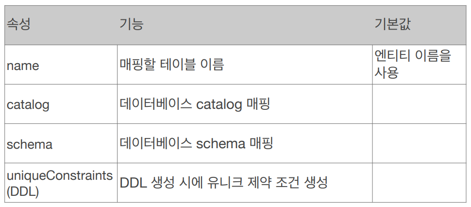

# 데이터베이스 스키마 자동생성

### 데이터베이스 스키마 자동 생성

DDL을 애플리케이션 실행 시점에 자동 생성.

데이터베이스 방언을 활용해서 데이터베이스에 맞는 적절한 DDL 생성

**개발단계에서 사용!!! 운영단계에서는 사용하지마…!** 

### 데이터베이스 스키마 자동 생성 - 속성

`hibernate.hbm2ddl.auto`

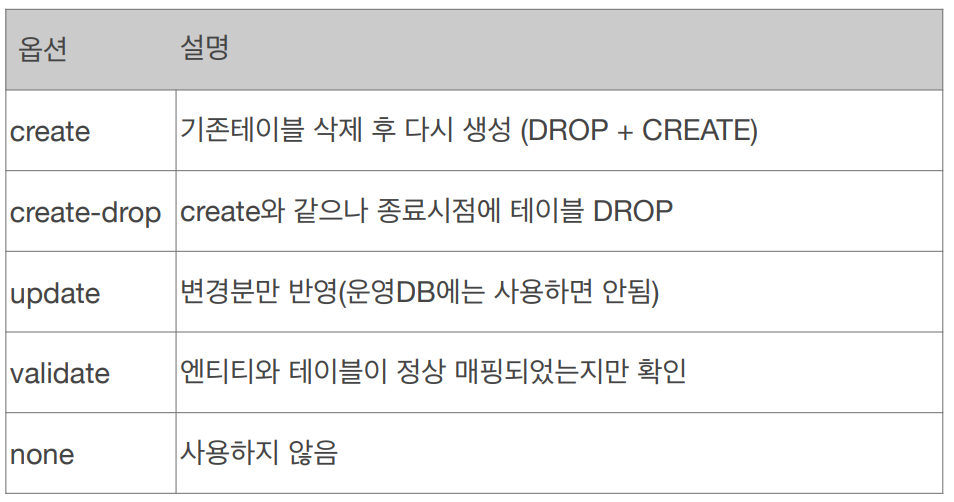

create-drop : 테스트코드 돌릴 때 유용

### 데이터베이스 스키마 자동 생성 - 주의

**운영장비에서는 절대 `create`, `create-drop`, `update` 사용하면 안됨**

개발 초기 단계는 `create` 또는 `udpate`<br>
테스트 서버는 `update` 또는 `validate`<br>
스테이징 운영서버는 `validate` 또는 `none`<br>

### DDL 생성 기능

제약조건 추가 : 회원이름은 필수, 10자 초과X

```java
@Column(nullable = false, length = 10)
```

유니크 제약조건 추가

```java
@Table(uniqueConstraints = {@UniqueConstraint(name="NAME_AGE_UNIQUE",
																								columnNames = {"NAME", "AGE"})})
```

DDL 생성 기능은 DDL을 자동 생성할 때만 사용되고 JPA의 실행로직에는 영향을 주지 않음.

# 필드와 컬럼 매핑

```java
@Entity 
public class Member { 
		 @Id 
		 private Long id; 

		 @Column(name = "name") 
		 private String username; 

		 private Integer age; 

		 @Enumerated(EnumType.STRING) 
		 private RoleType roleType; 

		 @Temporal(TemporalType.TIMESTAMP) 
		 private Date createdDate; 

		 @Temporal(TemporalType.TIMESTAMP) 
		 private Date lastModifiedDate; 

		 @Lob 
		 private String description; 
		 //Getter, Setter… 
}
```

### 매핑 어노테이션 정리

`@Column` : 컬럼 매핑

`@Temporal` : 날짜 타입 매핑

`@Enumerated` : enum 타입 매핑

`@Lob` : BLOB, CLOB 매핑

`@Transient` : 특정 필드를 컬럼에 매핑하지 않음 ( 매핑 무시 )

### @Column 속성

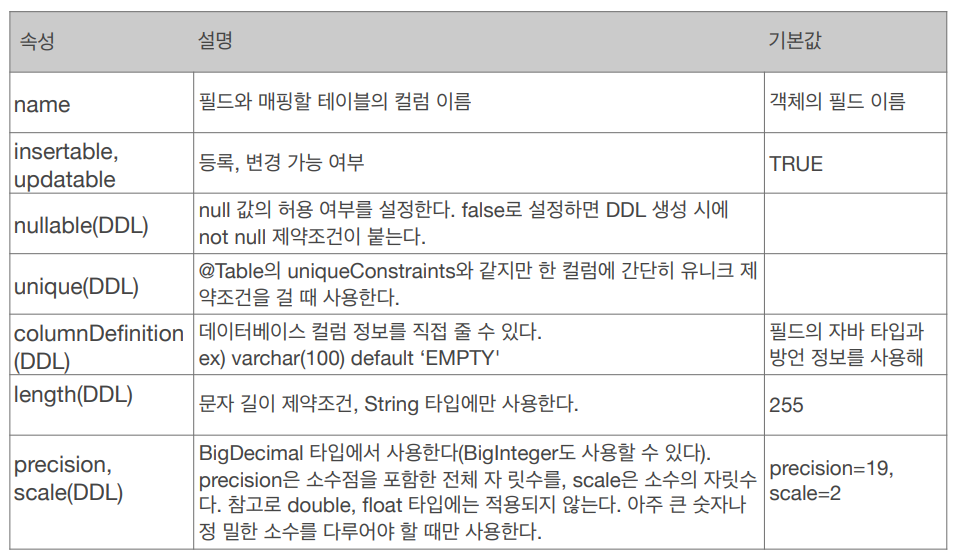

### @Enumerated

자바 enum 타입을 매핑 할 때 사용

**주의! ORDINAL 사용 X ( 기본값임. 즉 꼭 @Enumerated(value=”EnumType.STRING”)으로 넣기. )**

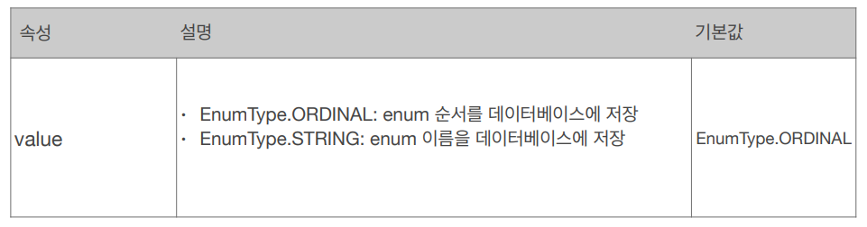

```java
public Member {
	...
	@Enumerated
	private Enum RoleType;
}

public enum RoleType {
	USER, ADMIN
}

Member member = new Member();
member.setId(1L);
member.setName("A");
member.setRoleType(RoleType.USER);

em.persist();

Member member = new Member();
member.setId(2L);
member.setName("B");
member.setRoleType(RoleType.ADMIN);

em.persist();
```

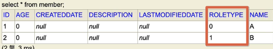

이런식으로 ROLETYPE에 enum 순서로 들어감.

그런데 이후에 enum에 새로운 값이 하나 추가가 된다면 아래와 같은 문제 발생.

```java
public Member {
	...
	@Enumerated
	private Enum RoleType;
}

// GUEST 추가
public enum RoleType {
	GUEST, USER, ADMIN
}

Member member = new Member();
member.setId(3L);
member.setName("C");
member.setRoleType(RoleType.GUEST);

em.persist();

```

**GUEST**를 앞에 추가하니, 0번으로 들어감.

이러면 기존의 USER로 넣었던 데이터와 구분이 되지 않음. ( 데이터가 틀어짐 )

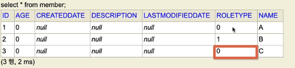
### @Temporal

날짜 타입( java.util.Date, java.util.Calendar )을 매핑할 때 사용

**참고 : LocalDate, LocalDateTime을 사용할 때는 생략 가능 ( 최신 하이버네이트가 지원 )**

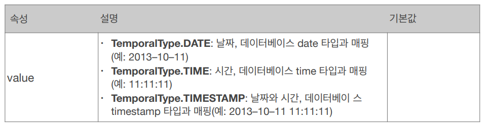
### @Lob

데이터베이스 BLOB, CLOB 타입과 매핑

@Lob는 속성이 없음.

매핑하는 필드 타입이 문자면 CLOB 매핑, 나머지는 BLOB 매핑

CLOB : String, char[], java.sql.CLOB

BLOB : byte[], java.sql.BLOB

### @Transient

필드 매핑 X

데이터베이스에 저장X, 조회X

주로 메모리상에서만 임시로 어떤 값을 보관하고 싶을 때 사용

# 기본 키 매핑

### 기본 키 매핑 어노테이션

`@Id` , `@GeneratedValue`

```java
@Id @GeneratedValue(strategy = GenerationType.AUTO)
private Long id;
```

### 기본 키 매핑 방법

직접 할당 : `@Id` 만 사용

자동 생성 ( `@GeneratedValue` )

`IDENTITY` : 데이터베이스에 위임, MYSQL

`SEQUENCE` : 데이터베이스 시퀀스 오브젝트 사용, ORCLE

@SequenceGenerator 필요

`TABLE` : 키 생성용 테이블 사용, 모든 DB에서 사용. 단, 최적화에는 좋지 않음. identity나 sequence는 숫자를 뽑아내는데 최적화가 잘되어 있는데, table은 그렇지는 않음.

@TableGenerator 필요

`AUTO` : 방언에 따라 자동 지정. **기본(default)**

[기본키 커스텀 생성](https://www.notion.so/67d67c2b2c1c420a94d24b1b69397f8f?pvs=21)

### IDENTITY 전략 - 특징

기본 키 생성을 데이터베이스에 위임.

JPA는 보통 트랜잭션 커밋시점에 INSERT문을 실행.

AUTO_INCREMENT는 데이터베이스에 INSERT문 실행한 후에 ID 값을 알 수 있음.

IDENTITY 전략은 em.persist()시점에 즉시 INSERT문 실행하고 DB에서 식별자를 조회.

```java
Member member = new Member();
member.setName("C");

System.out.println("1. =============================");
em.persist(member);
System.out.println("memeber.id= "+ member.getId());
System.out.println("2. ==============================");

tx.commit();
```

```java
1. =============================
Hibernate: 
    /* insert hellpjpa.Member
        */ insert 
        into
            Member
            (id, name) 
        values
            (null, ?)
memeber.id= 1
2. =============================
```

로그를 확인했을 때, persist시점에 insert쿼리가 날라감

IDNETITY 전략은 DB에 insert를 해봐야 어떤 값이 세팅되는지 앎.

commit이 되어 실제로 DB에 반영되기 전까지는 영속성 컨텍스트 1차캐시에 내부에 저장하며, PK값으로 데이터를 구분함.

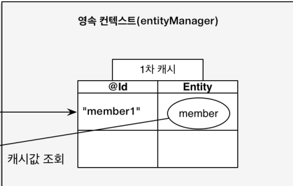

하지만 위 코드의 경우 persist()에서 1차캐시로 저장하는 시점에는 PK값이 세팅되지 못함. ( insert 쿼리가 날라 가봐야지만 pk 값을 알 수 있기 때문) 따라서 1차 캐시에서 값을 찾아올 수 있는 방법이 없음.

**이를 해결하기 위해 em.persist()하는 시점에 JPA가 insert쿼리를 날림. (원래는 커밋하는 시점에 insert쿼리가 날라가는게 맞어 )**

물론 persist 할 때마다 insert쿼리가 날라가서 여러 쿼리가 날라갈수 있겠지만

트랜잭션이 여러개 쪼개지면 몰라도 한 트랜잭션 내에서 insert쿼리가 여러개 날라간다고 성능에 큰 영향을 미치지는 않음.

### SEQUENCE 전략 - 특징

```java
@Entity
@SequenceGenerator(
        name = "MEMBER_SEQ_GENERATOR",
        sequenceName = "MEMBER_SEQ",
        initialValue = 1, allocationSize = 1 )
public class Member {
    @Id
    @GeneratedValue(strategy = GenerationType.SEQUENCE, generator = "MEMBER_SEQ_GENERATOR")
    private Long id;
    private String name;
```

```java
Member member = new Member();
member.setName("C");

System.out.println("1. =============================");
em.persist(member);
System.out.println("memeber.id= "+ member.getId());
System.out.println("2. ==============================");

tx.commit();
```

```java
1. =============================
Hibernate: 
    call next value for MEMBER_SEQ
memeber.id= 1
2. ==============================
Hibernate: 
    /* insert hellpjpa.Member
        */ insert 
        into
            Member
            (name, id) 
        values
            (?, ?)
```

영속성 컨텍스트 넣으려고 하는데  시퀀스 전략이면 DB에서 시퀀스에서 값을 먼저 얻어와서 영속성 컨텍스트에 밀어넣음

### SEQUENCE - @SequenceGenerator

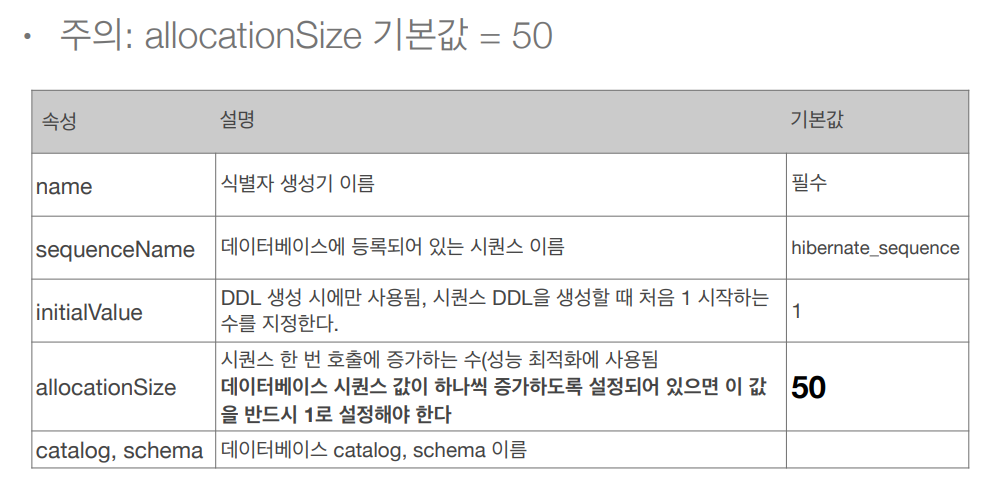

매번 시퀀스을 호출하는 것이 부담스러울 수 있음.

 →  allocationSize 옵션을 사용하여 미리 시퀀스를 떙겨올 수 있음.

기본값은 50이며, 처음 조회할떄 시퀀스를 1~50번까지 땡겨오며, 50개를 다 쓸 때까지 시퀀스를 조회해오지 않음.

### 권장하는 식별자 전략

기본키 제약 조건 : null이 아니며 유일하고 변해서는 안됨

미래까지 이 조건을 만족하는 자연키는 찾기 어려움. 대리키(대체키)를 사용.

예를들어 주민번호는 기본키로 적절하지 않음.

권장 : Long형  + 대체키 + 키 생성전략 사용

# 실전 예제 1 - 요구사항 분석과 기본 매핑

### 도메인 모델 분석

1. 회원과 주문의 관계: 회원은 여러 번 주문할 수 있다. (일대다)
2. 주문과 상품의 관계: 주문할 때 여러 상품을 선택할 수 있다. 반대로 같은 상품도 여러 번 주문될 수 있다. 주문상품 이라는 모델을 만들어서 다대다 관계를 일다대, 다대일 관계로 풀어냄

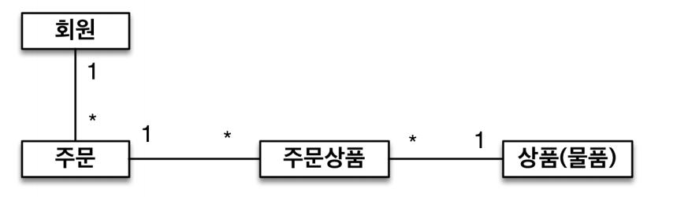

### 테이블 설계

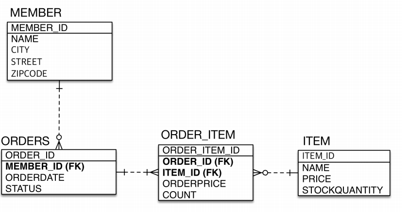

### 엔티티 설계와 매핑

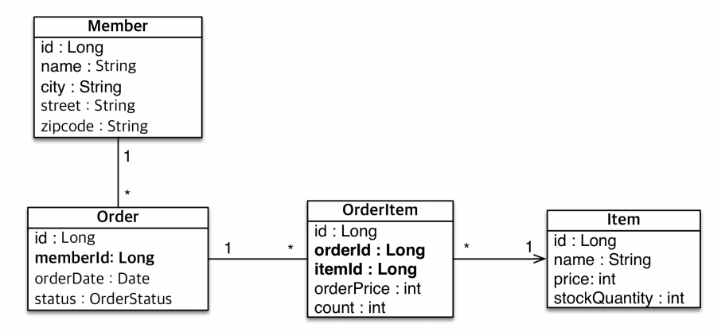

### 데이터 중심 설계의 문제점

현재 방식은 객체설계를 테이블 설계에 맞춘 방식

테이블의 외래키를 객체에 그대로 가져옴

객체 그래프 탐색이 불가능

참조가 없으므로 UML도 잘못됨.


이미지 및 내용 출처 : 
https://www.inflearn.com/course/ORM-JPA-Basic/dashboard