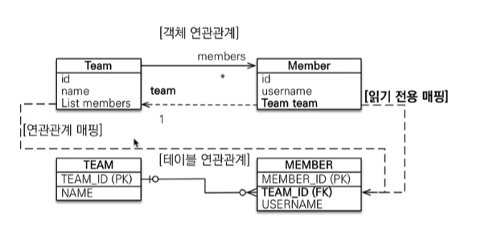
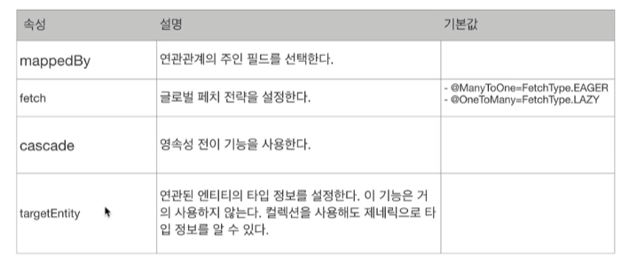

# 다중성

DB 기준의 다중성으로. ( 애매할때는 반대관계로 생각해보기 )

다대일 : `@ManyToOne`

일대다 : `@OneToMany`

일대일 : `@OneToOne`

다대다 : `@ManyToMany` - 실무에서는 쓰면 안됨

# 단방향, 양방향

### 테이블

- 외래 키 하나로 양쪽 조인 가능
- 사실 방향이라는 개념이 없음

### 객체

- 참조용 필드가 있는 쪽으로만 참조가능
- 한쪽만 참조하면 단방향
- 양쪽이 서로 참조하면 양방향 ( 객체입장에서는 방향이 하나임.. 단방향이 2개인거지 양방향인게 아님 )

# 연관관계 주인

테이블은 외래 키 하나로 두 테이블이 연관관계를 맺음

객체 양방향 관계는 A → B, B → A 처럼 참조가 2군데

객체 양방향 관계는 참조가 2군데 있음. 둘 중 테이블의 외래 키를 관리할 곳을 지정해야 함.

연관관계의 주인 : 외래 키를 관리하는 참조

주인의 반대편 : 외래 키에 영향을 주지 않음. 단순 조회만 가능.

# 다대일[N:1]

### 다대일 단방향

가장 많이 사용하는 관계


MEmber가 연관관계 주인 (FK 가지고 있으니깐)

이름 앞부분에 나오는 부분이 연관관계 주인. ex) 다대일 : ‘다’가 앞에 있으므로 N인 곳이 연관관계 주인임. 위 경우 Member가 N이므로 연관관계 주인이다.

### 다대일 양방향

외래키가 있는 쪽이 연간관계의 주인

양쪽을 서로 참조하도록 개발

# 일대다[1:N]

### 일대다 단방향

여기서는 1이 연관관계 주인이다.

해당 내용은 권장하지 않음. ( 실무에서 사용 X )


```java
public class Member {
		@Column(name = "USERNMAE")
    private String username;

}

@Entity
public class Team {
    @OneToMany
    @JoinColumn(name = "TEAM_ID")
    **private List<Member> members = new ArrayList<>();**
}

------------------------------------------------------------------------------

Member member =new Member();
member.setUsername("member1");

em.persist(member);

Team team = new Team();
team.setName("teamA");
// 여기가 좀 애매해짐.
// team테이블에 insert 될 내용이 아니긴 한데
// membe에 있는 team_id 가 update됨.
team.getMembers().add(member);

em.persist(team);

```

```java
ibernate: 
    call next value for MEMBER_SEQ
Hibernate: 
    call next value for hibernate_sequence
Hibernate: 
    /* insert hellpjpa.Member
        */ insert 
        into
            Member
            (USERNMAE, id) 
        values
            (?, ?)
Hibernate: 
    /* insert hellpjpa.Team
        */ insert 
        into
            Team
            (name, TEAM_ID) 
        values
            (?, ?)
Hibernate: 
    /* create one-to-many row hellpjpa.Team.members */ update
        Member 
    set
        TEAM_ID=? 
    where
        id=?
```

team입장에서 setName은 그냥 넣으면 되는데,

team.getMembers().add(member); 하고 em.persist를 치면. 엮여있는 member쪽을 업데이트 할수밖에 없음. → 왜 member를 업데이트하지? 왜 member에서 더티체킹이 일어나지?

→ 연관관계 주인은 team이지만 DB 테이블상 FK는 member가 가지고 있음.

team의 members가 수정되면 member도 같이 수정되어야 해.

**—> 문제는 member는 저장을 한거니깐. 문제가 없는데, 코드만 봤을떄는 team에서는 team만 손을 댓는데, 쿼리에는 member를 업데이트 하고 있으니깐 “??” 가 뜨기 마련.**

실무에서는 테이블 수십 개가 엮여있는 상태에서는  운영이 더 힘들어짐.

- 일대다 단방향은 일대다(1:N)에서 일(1)이 연관관계의 주인.
- 테이블 일대다 관계는 항상 다(N) 쪽에 외래키가 있음
- 객체와 테이블의 차이 때문에 반대편 테이블의 외래 키를 관리하는 특이한 구조
- @JoinColumn을 꼭 사용해야함. 그렇지 않으면 조인 테이블 방식을 사용함 ( 중간에 테이블을 하나 추가함 )
    - 
    
    ```java
    @Entity
    public class Team {
        @OneToMany
        //@JoinColumn(name = "TEAM_ID")
    		//@JoinTable
        private List<Member> members = new ArrayList<>();
    }
    
    여기서 @JoinColumn을 제거하면 아래와 같이 못보던 테이블이 생김.
    해당 테이블의 설정을 @JoinTable을 사용( 이게 default값이라 @JoinColumn을 꼭써줘야함. )
    
    Hibernate: 
        
        create table Team_Member (
           Team_TEAM_ID bigint not null,
            members_id bigint not null
        )
    ```
    

    
- 일대다 단방향 매핑의 단점
    - **엔티티가 관리하는 외래키가 다른 테이블에 있음**
    - **연관관계 관리를 위해 추가로 update sql실행**
- 일대다 단방향 매핑보다는 `다대일 양방향 매핑`을 사용. ( **참조를 더 하더라도 다대일 양방향으로 가는게 좋음)**

### 일대다 양방향



```java
@Entity
public class Member {
		@ManyToOne
    @JoinColumn(name ="TEAM_ID", insertable = false, updatable = false) // 얘는 읽기 전용. 매핑은 다 되는데 최종적으로 insert, update는 안함.
    private Team team;
}

@Entity
public class Team {
		@OneToMany
    @JoinColumn(name = "TEAM_ID")
    private List<Member> members = new ArrayList<>();
}
```

- 이런 매핑은 공식적으로 존재X
- @JoinColumn(insertable=false, updateable=false)
- 읽기 전용 필드를 사용해서 양방향처럼 사용하는 방법
- 그냥 **다대일 양방향 사용하자..!**

# 일대일[1:1]

### 일대일 관계

일대일 관계는 그 반대도 일대일

주 테이블이나 대상 테이블 중에 외래키 선택 가능

주 테이블에 외래키

대상 테이블에 외래키

외래키에 데이터베이스 유니크(UNI) 제약조건 추가.

### 일대일 : 주 테이블에 외래 키 단방향


다대일(@ManyToOne) 단방향 매핑과 유사

다대일 양방향 매핑처리 외래키가 있는 곳이 연관관계의 주인

반대편은 mappedBy적용

```java
@Entity
public class Member {
		@OneToOne
    @JoinColumn(name ="LOCKER_ID")
    private Locker locker;
}

@Entity
public class Locker {

    @Id
    @GeneratedValue
    private Long id;

    private String name;

		// 일대일이여도 양방향으로 만들고 싶다면 mappedBY 잡아주면 됨.
    @OneToOne(mappedBy = "locker") // 읽기전용
    private Member member;

}
```

### 일대일 : 대상 테이블에 외래 키 단방향


Member에 있는 locker가 연관관계 주인을 하고 싶은데 왜래키가 LOCKER에 있음.

마치 일대다 단방향처럼..!

이런 아예 안됨. 지원도 안되고 방법이 없음.

( 양방향 관계에서는 가능 )

### 일대일 : 대상 테이블에 외래 키 양방향

양방향 관계에서는 가능

사실 일대일 주 테이블에 외래키 양방향과 매핑 방법은 같음

트레이드 오프…

사실상 Member 테이블에 locker_id(FK) 가 있던 Locker 테이블에 member_id(FK)가 있던 큰 문제는 안됨.

하지만 나중을 생각해보면 한 locker에 여러 member가 있을 수 있다고 하면 Member 테이블에 locker_id(FK)가 있는게 맞음.

하지만 반대로 한 member에 여러 Locker가 있다고 하면 Locker테이블에 member_id(FK)가 있는게 맞음…

뭐가 맞다는게 참 애매함..

하지만 비즈니스 로직적으로 봤을 때는 Member테이블에 locker_id(FK)있는게 편함.

대개 로직에서는 Member를 더 많이 조회해서 사용할 거고, 이럴 때마다 lockerf유무 등을 쉽게 파악할 수 있음.

편리하기 함…

- 주테이블에 외래키
    - 주 객체가 대상 객체의 참조를 가지는 것처럼 주 테이블에 외래 키를 두고 대상 테이블을 찾음
    - 객체지향 개발자 선호
    - JPA 매핑 관리
    - 장점 : 주 테이블만 조회해도 대상 테이블에 데이터가 있는지 확인 가능
    - 단점 : 값이 없으면 외래 키에 null허용
- 대상 테이블에 외래 키
    - 대상 테이블에 외래 키가 존재
    - 전통적인 데이터베이스 개발자 선호
    - 장점 : 주 테이블과 대상 테이블을 일대일에서 일대다 관계로 변경할 대 테이블 구조 유지
    - 단점: 프록시 기능의 한계로 지연 로딩으로 설정해도 항상 즉시 로딩됨(프록시는 뒤에서 설명)

# 다대다[N:M]

관계형 데이터베이스는 정규화된 테이블 2개로 다대다 관계를 표현할 수 없음

**연결 테이블을 추가해서 일대다, 다대일 관계로 풀어내야함.**


객체는 컬렉션을 사용해서 객체 2개로 다대다 관계가 가능함.


객체Member는 product를 가질 수 있고, 객체 Product도 Member를 가질 수 있음.

ORM에서 강제로 member_product라는 중간 테이블을 강제로 만들어줌

```java
Hibernate: 
  
  create table MEMBER_PRODUCT (
     Member_id bigint not null,
      products_id bigint not null
  )

Hibernate: 
    
    alter table MEMBER_PRODUCT 
       add constraint FKc6hsxwm11n18ahnh5yvbj62cf 
       foreign key (products_id) 
       references Product
```

### 다대다 매핑의 한계

편리해 보이지만 실무에서 사용X

연결 테이블이 단순히 연결만 하고 끝나지 않음

주문 시간, 수량 같은 데이터가 들어올 수 있음.

쿼리도 생각치도 못한 쿼리가 나갈 수 있음.

### 다대다 한계 극본

연결 테이블용 엔티티 추가(연결 테이블을 엔티티로 승격)

@ManyToMany → @OneToMany, @ManyToOne


```java
@Entity
public class MemberProduct {

    @Id @GeneratedValue
    private Long id;

    @ManyToOne
    @JoinColumn(name = "MEMBER_ID")
    private Member member;

    @ManyToOne
    @JoinColumn(name = "PRODUCT_ID")
    private Product product;

}
```

```java
@Entity
public class Member {

		@OneToMany(mappedBy = "member")
    private List<MemberProduct> memberProducts = new ArrayList<>();
}
```

```java
@Entity
public class Product {

    @OneToMany(mappedBy = "product")
    private List<MemberProduct> memberProducts = new ArrayList<>();
}
```

# 실전예제1

### 배송, 카테고리 추가 - 엔티티

주문과 배송은 1:1(@OneToMany)

상품과 카테고리는 N:M(@ManyToMany)


### 배송, 카테고리 추가 - ERD

주테이블(ORDER)에 FK 추가.


### @JoinColumn

**외래키를 매핑할 때 사용**


### @ManyToOne - 주요속성

다대일 관계 매핑 - 다대일을 쓰면 연관관계 주인이 되어야한다.


### @OneToMnay- 주요속성

일대다 관계 매핑




이미지 및 내용 출처 : 
https://www.inflearn.com/course/ORM-JPA-Basic/dashboard