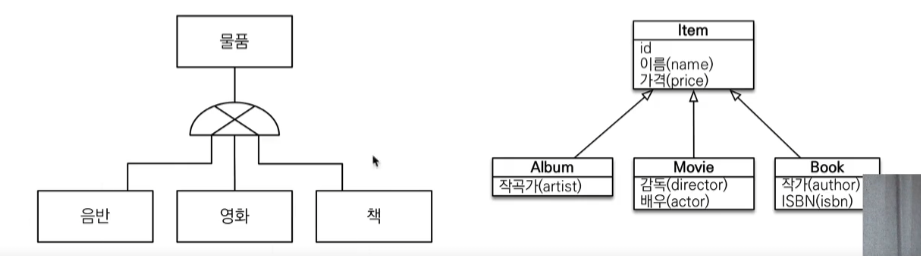
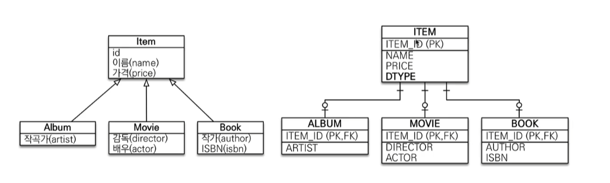
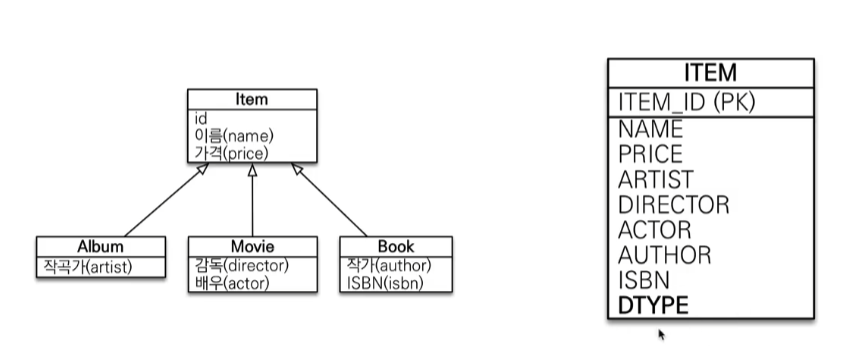
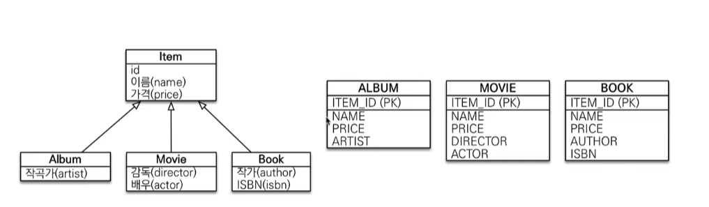
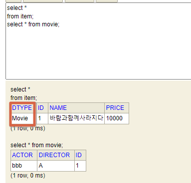
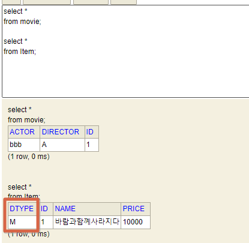
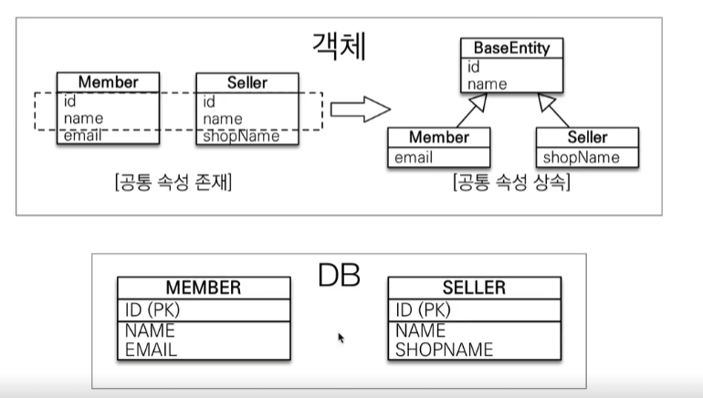
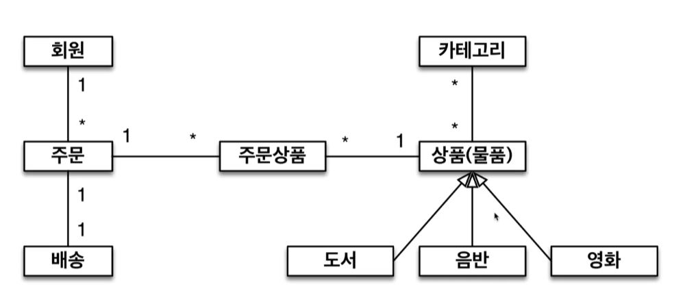
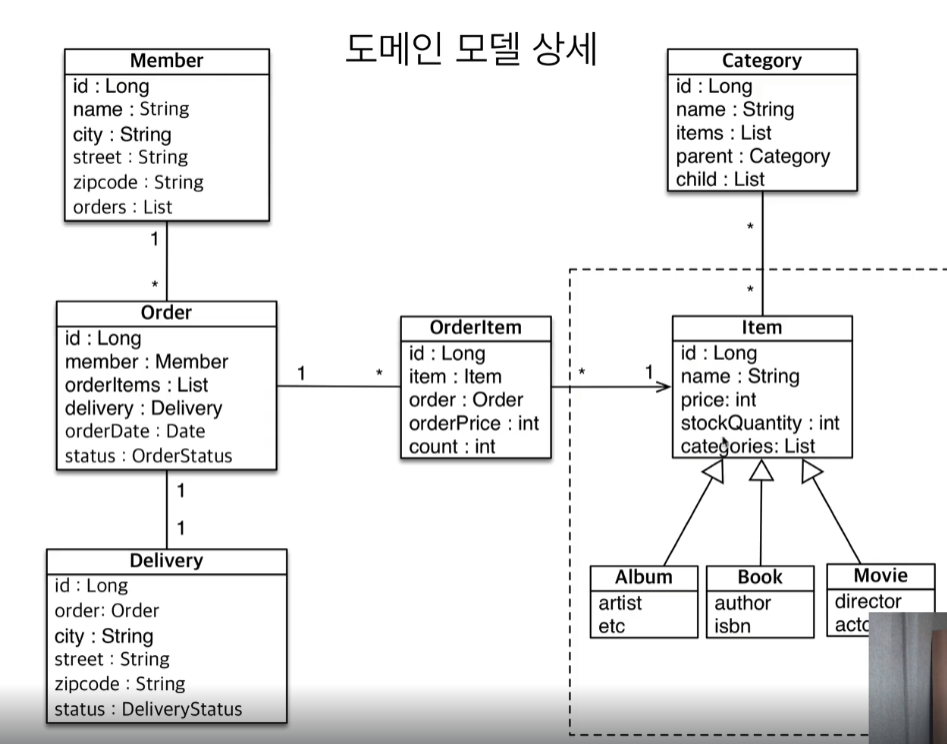

# 상속관계 매핑

### 상속관계 매핑

관계형 데이터베이스는 상속관계 X

슈퍼타입 서브타입 관계라는 모델링 기법이 객체 상속과 유사

상속관계 매핑 :  객체의 상속과 구조와 DB의 슈퍼타입 서브타입 관계를 매핑



### 1. 조인전략

item이라는 테이블을 만들고, 각 테이블을 만들고, 조인으로 구성.



### 2. 단일 테이블 전략

한 테이블로 다 합침



### 3. 구현 클래스마다 테이블 전략



```java
@Entity
public class Book extends Item{

    private String author;
    private String isbn;
}

@Entity
public class Movie extends Item{

    private String director;
    private String actor;
}

@Entity
public class Album extends Item{

    private String artist;
}

@Entity
public class Item {

    @Id @GeneratedValue
    private Long id;

    private String name;
    private int price;
}
```

```java
Hibernate: 
    
    create table Item (
       DTYPE varchar(31) not null,
        id bigint not null,
        name varchar(255),
        price integer not null,
        actor varchar(255),
        director varchar(255),
        author varchar(255),
        isbn varchar(255),
        artist varchar(255),
        primary key (id)
    )
```

- 기본적으로 `단일 테이블 전략`으로 만들어짐

### 주요 어노테이션

`@Inheritance(strategy = InheritanceType.XXX)`

JOINED : 조인전략

**SINGLE_TABLE : 단일 테이블 전략 ( 기본값 )**

TABLE_PRE_CLASS : 구현 클래스마다 테이블 전략

`@DiscriminatorColumn(name="DTYPE")` : 기본값 : DTYPE

`@DiscriminatorValue(”XXX”)` : dtype 컬럼에 들어갈 이름 ( 기본값 : 테이블명 )

### 조인전략

```java
@Entity
**@Inheritance(strategy = InheritanceType.JOINED) // 조인전략**
public class Item {
...
}
```

```java
Hibernate: 
    
    create table Album (
       artist varchar(255),
        id bigint not null,
        primary key (id)
    )
Hibernate: 
    
    create table Book (
       author varchar(255),
        isbn varchar(255),
        id bigint not null,
        primary key (id)
    )
Hibernate: 
    
    create table Item (
       id bigint not null,
        name varchar(255),
        price integer not null,
        primary key (id)
    )
Hibernate: 
    
    create table Movie (
       actor varchar(255),
        director varchar(255),
        id bigint not null,
        primary key (id)
    )
Hibernate: 
    
    alter table Album 
       add constraint FKcve1ph6vw9ihye8rbk26h5jm9 
       foreign key (id) 
       references Item
Hibernate:
```

```java
Movie movie = new Movie();
movie.setDirector("A");
movie.setActor("bbb");
movie.setName("바람과함꼐사라지다");
movie.setPrice(10000);

em.persist(movie);
```

```java
Hibernate: 
    /* insert jpabook.jpashop.domain.Movie
        */ insert 
        into
            Item
            (name, price, id) 
        values
            (?, ?, ?)
Hibernate: 
    /* insert jpabook.jpashop.domain.Movie
        */ insert 
        into
            Movie
            (actor, director, id) 
        values
            (?, ?, ?)
```

```java
Movie movie = new Movie();
movie.setDirector("A");
movie.setActor("bbb");
movie.setName("바람과함꼐사라지다");
movie.setPrice(10000);

em.persist(movie);

em.flush();
em.clear();

Movie findMovie = em.find(Movie.class, movie.getId());
System.out.println("findMovie = " + findMovie);
```

```java
Hibernate: 
    select
        movie0_.id as id1_2_0_,
        movie0_1_.name as name2_2_0_,
        movie0_1_.price as price3_2_0_,
        movie0_.actor as actor1_3_0_,
        movie0_.director as director2_3_0_ 
    from
        Movie movie0_ 
    **inner join
        Item movie0_1_ 
            on movie0_.id=movie0_1_.id** 
    where
        movie0_.id=?
```

- 알아서 조인해서 가져옴.

### DTYPE

`@DiscriminatorColumn` : 조인된 엔티티명이 들어가게 됨.

안 넣어도 되지만, 넣어주면 편리함.



만일 테이블명이 아닌 다른 이름이 들어가게 하고 싶다면 조인된 테이블에 `@DiscriminatorValue` 어노테이션 추가

```java
@Entity
**@DiscriminatorValue("M")**
public class Movie extends Item{
	...
}
```



**단일 테이블 전략은 `DiscriminatorColumn`이 없어도 dtype 이 자동으로 들어감.**

### 조인전략 - 장단점

장점

테이블 정규화

외래키 참조 무결성 제약조건 활용가능

저장공간 효율화

단점

**조회시 조인을 많이 사용 → 성능저하**

조회 쿼리가 복잡함

데이터 저장 시 insert문 2번 호출

—> 그렇지만 그렇게 큰 단점은 아님… ( insert 문이 여러개 나가는 건 성능에 큰 영향은 안미침 )

### 단일 테이블 전략 - 장단점

장점

**조인이 필요 없으므로 일반적으로 조회 성능이 빠름**

조회 쿼리가 단순함

단점

**자식 엔티티가 매핑한 컬럼은 모두 null을 허용해줘야함**

단일 테이블에 모든 것을 저장하므로 테이블이 커질수 있음. 상황에 따라서 조회 성능이 오히려 느려질 수 있음.

### 구현 클래스마다 테이블 전략 - 장단점 ( 웬만하면 쓰지 말아라.. )

이 전략은 데이터베이스 설계자, ORM전문가 둘다 추천 X

장점

서브 타입을 명확하게 구분해서 처리할 떄 효과적

not null 제약조건 사용가능

단점

여러 자식 테이블을 함께 조회할 떄 성능이 느림(UNION 으로 모든 테이블 합쳐서 조회 함… ㄷㄷ;)

자식 테이블을 통합해서 쿼리하기 어려움 ( ex. 정산만 해도 price 합을 위해 모든 테이블 다 뒤져야함)

# @MappedSuperclass (수정일,등록일)

### @MappedSuperclass

**공통 매핑 정보가 필요할 때 사용( id, name )**

상속관계매핑 X

엔티티X, 테이블과 매핑 X

**부모 클래스를 상속받는 자식 클래스에게 매핑 정보만 제공**

조회, 검색 불가( em.find(BaseEntity) 불가 )

**직접 생성해서 사용할 일이 없으므로 추상 클래스 권장**

테이블과 관계없고, 단순히 엔티티가 공통으로 사용하는 매핑 정보를 모으는 역할.

**주로 등록일, 수정일, 등록자, 수정자 같은 전체 엔티티에서 공통으로 적용하는 정보를 모을 때 사용.**

**참고 : @Entity 클래스는 엔티티나 `@MappedSuperclass`로 지정한 클래스만 상속가능.**



```java
**@MappedSuperclass**
public class BaseEntity {
    private String createdBy;
    private LocalDateTime createdDate;
    private String lastModifiedBy;
    private LocalDateTime lastModefiedDate;
		...
}

@Entity.
public class Member extends BaseEntity {
	....
}
```

```java
Hibernate: 
    
    create table Member (
       id bigint not null,
        **createdBy varchar(255),
        createdDate timestamp,
        lastModefiedDate timestamp,
        lastModifiedBy varchar(255),**
        USERNMAE varchar(255),
        LOCKER_ID bigint,
        TEAM_ID bigint,
        primary key (id)
    )

```

# 실전 예제4 - 상속관계 매핑

### 요구사항 추가

상품의 종류는 음반, 도서, 영화가 있고 이후 더 확장될 수 있다.

모든 데이터는 등록일과 수정일이 필수다.

### 도메인 모델




이미지 및 내용 출처 : 
https://www.inflearn.com/course/ORM-JPA-Basic/dashboard