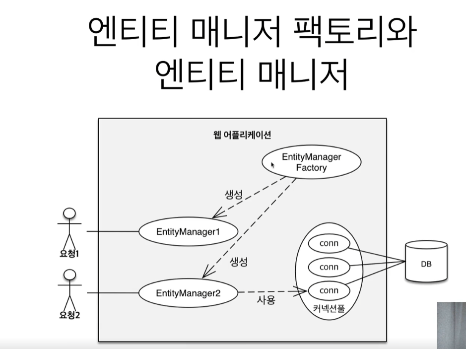
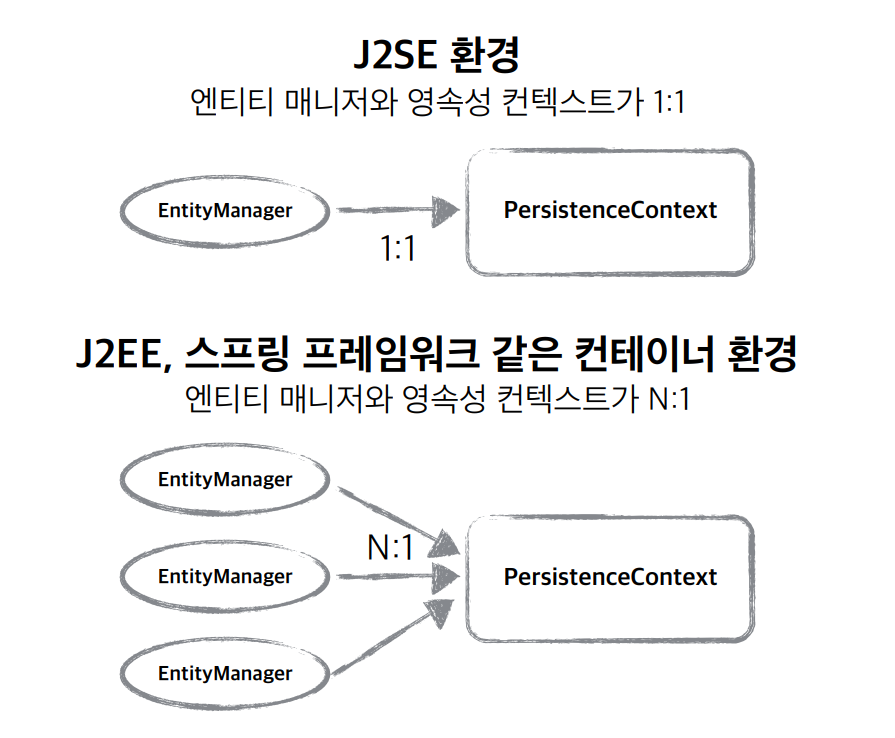
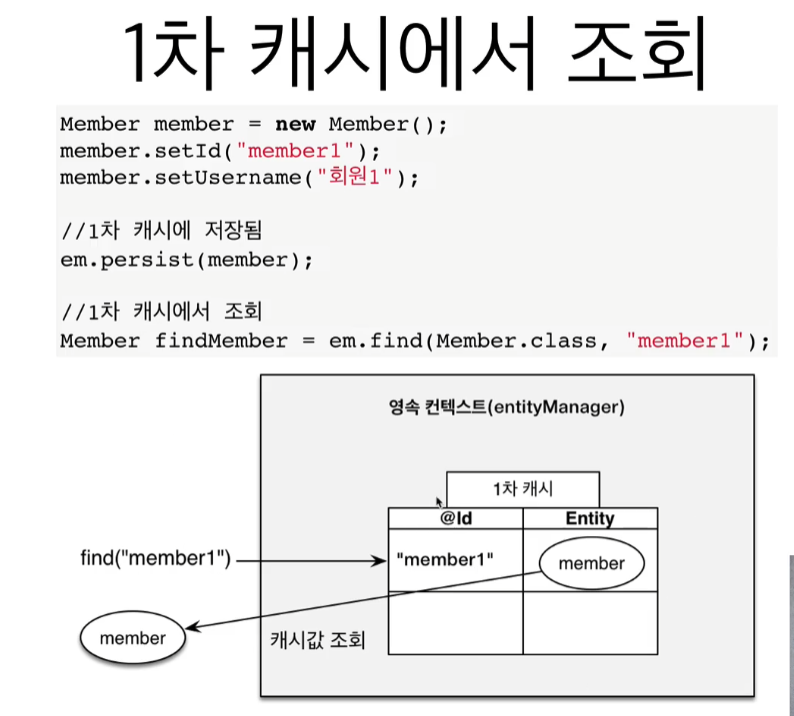
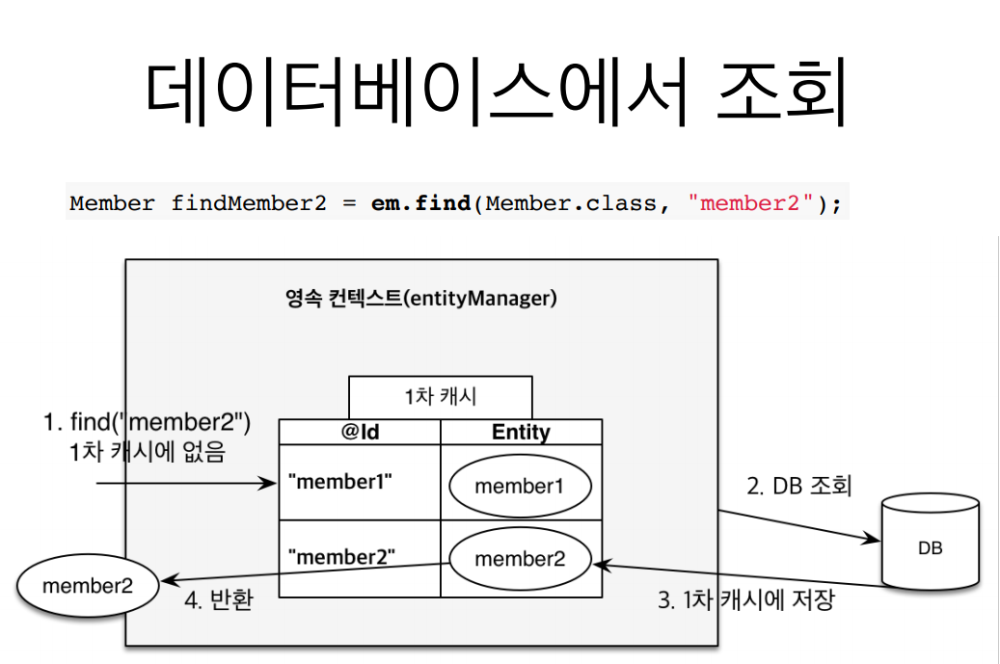
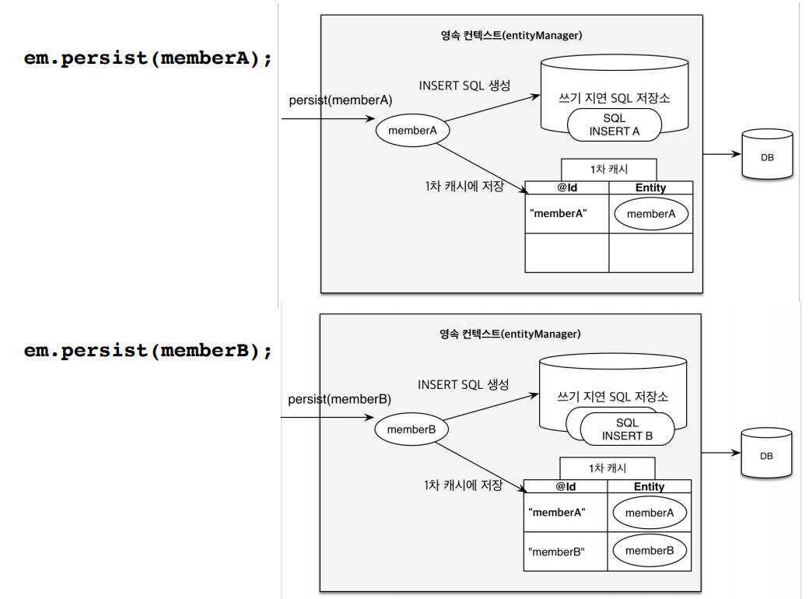
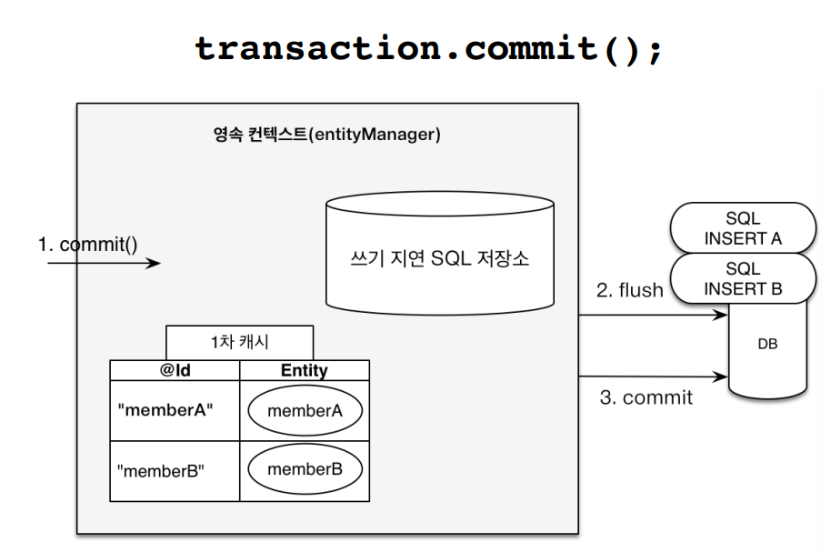
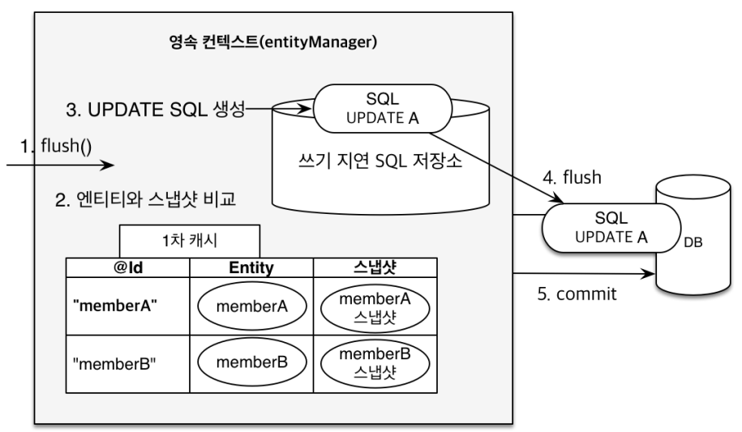

# JPA에서 가장 중요한 2가지

- 객체와 관계형 데이터베이스 매핑하기
- 영속성 컨텍스트

# 엔티티매니저팩토리와 엔티티 매니저



# 영속성 컨텍스트

“엔티티를 영구 저장하는 환경”

**EmtityManager.persisr(entity);**

**: 엔티티 객체를 DB에 저장 == 엔티티를 영속성 컨텍스트에 저장한다.**

# 엔티티 매니저와 영속성 컨텍스트

엔티티 매니저를 통해서 영속성 컨텍스트에 접근



# 엔티티의 생명주기

- `비영속(new/transient)`
    - 영속성 컨텍스트와 전혀 관계가 없는 새로운 상태
        
        ```jsx
        Member member = new Member();
        member.setId(100L);
        member.setName("Test");
        ```
        

- `영속 ( managed )`
    - 영속성 컨텍스트에 관리되는 상태
        
        ```jsx
        EntityManagerFactory emf = Persistence.createEntityManagerFactory();
        EntityManager em = emf.createEntityManager();
        EntityTransaction tx = em.getTransaction();
        
        em.getTransaction().begin();
        
        // 객체를 저장한 상태(영속)
        em.persist(member);
        
        //persist(); 바로 쿼리가 날라가지 않음.
        // 영속상태가 된다고 쿼리가 날라가지 않음.
        // 트랜잭션을 커밋되는 시점에 날라감.!!
        tx.commit();
        ```
        

- `준영속(detached)`
    - 영속성 컨텍스트에 저장되었다가 분리된 상태
        
        ```java
        // 회원 엔티티를 영속성 컨텍스트에서 분리. 준영속 상태. ( 즉, 이후 member는 영속상태가 아님)
        em.detach(member);
        ```
        

- 삭제 ( removed)
    - 삭제된 상태 : DB에서 삭제처리.
        
        ```java
        // 객체를 삭제한 상태(삭제)
        em.remove(member);
        ```
        

# 1차 캐시




영속성 컨텍스트는 트랜잭션 단위로 동작하고 트랜잭션이 끝나면 영속컨텍스트도 종료됨.

고객 요청 하나가 들어와서 비즈니스 로직이 끝나면 영속성 컨텍스트를 지움.

1차 캐시도 다 날라감.

1차 캐시는 한 트랜잭션 안에서만 동작 : 비즈니스가 복잡하지 않은 이상 성능에 큰 영향은 없음. 

어플리케이션 전체에서 공유하는 캐시는 2차캐시임.

- 어차피 트랜잭션이 끝나면 1차캐시는 지워지고, 변경이 생기면 더티체킹으로 인해 1차캐시와 db가 업데이트하는 방식으로 JPA가 알아서 트랜잭션 내 1차캐시와 db 일괄성을 보장해줌.

### 예제1

```java
Member member = new Member();
member.setId(101L);
member.setName("Test1");

System.out.println("====before ====");
em.persist(member);
System.out.println("===after=======");

Membr findMember = em.find(Member.class, 101L);

System.out.println("===findeMember.id =" + findMemger.getId());
System.out.println("===findeMember.name=" + findMemger.getName());
```

```java
====before ====
===after=======

===findeMember.id = 101
===findeMember.name= Test1

Hibernate : 
	/* insert hellojpa.Member
		*/ insert
				into
						Member (name, id)
 ....
```

조회를 햇는데,  select쿼리가 안나감

: persist()에서 1차캐시를 뒤졌기 때문.

### 예제2

```java
Membr findMember1 = em.find(Member.class, 101L);
Membr findMember2 = em.find(Member.class, 101L);
```

```java
Hibernate:
	select 
		....
```

select 쿼리가 한번만 날라감.

처음에 조회하고, 1차캐시에 저장되었기 때문에 findMemeber2는 select 하지 않고 1차 캐시에서 꺼내옴.

# 영속 엔티티의 동일성 보장

```java

Membr findMember1 = em.find(Member.class, 101L);
Membr findMember2 = em.find(Member.class, 101L);

// true 떨어짐.
System.out.println(findMember1  == findMember2);
```

# 엔티티 등록 - 트랜잭션을 지원하는 쓰기지연

```java
Member member1 = new Member(150L, "A");
Member member2 = new Member(151L, "B");

em.persist(member1);
em.persist(member2);

System.out.println("========================================");

tx.commit(); // DB 커밋.
```

```java
========================================
Hibernate: 
    /* insert hellpjpa.Member
        */ insert 
        into
            Member
            (name, id) 
        values
            (?, ?)
Hibernate: 
    /* insert hellpjpa.Member
        */ insert 
        into
            Member
            (name, id) 
        values
            (?, ?)
```


persist : insert문 만들어서 `쓰기지연 SQL 저장소`에 넣어둠. memberA, memberB 둘다.

commit : `쓰기지연 SQL 저장소` 에 저장되어 있는 쿼리문이 flush 되어 db로 날라감.



### 엔티티 수정 : 변경감지(Drity Check)

```java
Member member = em.find(Member.class, 150L);
member.setName("ZZZZZZ");

//em.persist(member);

System.out.println("=======================");

tx.commit(); // DB 커밋.
```

```java
Hibernate: 
    select
        member0_.id as id1_0_0_,
        member0_.name as name2_0_0_ 
    from
        Member member0_ 
    where
        member0_.id=?
=======================
Hibernate: 
    /* update
        hellpjpa.Member */ update
            Member 
        set
            name=? 
        where
            id=?
```

persist가 없어도 update가 됨.

# commit 시점에 발생하는 매커니즘



DB에서 읽어온 최초 상태를 스냅샷에 저장해놓음.

Entity랑 스냅샷이랑 비교하여 바뀐 내용을 update 처리함.

# 플러시

변경감지

수정된 엔티티 쓰기 지연 SQL 저장소에 등록

쓰기 지연 SQL 저장소의 쿼리를 데이터베이스에 전송

**영속성 컨텍스트를 비우지 않음.**

# 영속성 컨텍스트를 플러시하는 방법

1. em.flush() : 직접호출
2. 트랜잭션 커밋 : 플러시 자동 호출
3. JPQL 쿼리 실행 : 플러시 자동 호출

```java
Hibernate: 
    select
        member0_.id as id1_0_0_,
        member0_.name as name2_0_0_ 
    from
        Member member0_ 
    where
        member0_.id=?
=======================
```

flush를 한다고 1차캐시에서 지워지지는 않음

# 준영속 상태

1차캐시에 올라가기만 해도 영속상태임.


이미지 및 내용 출처 : 
https://www.inflearn.com/course/ORM-JPA-Basic/dashboard