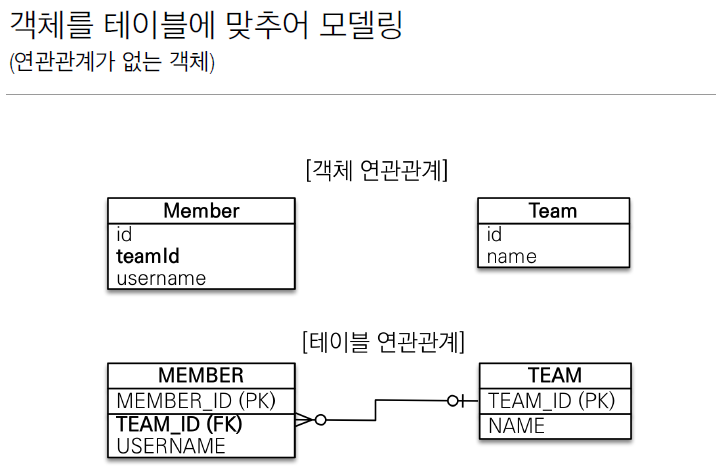
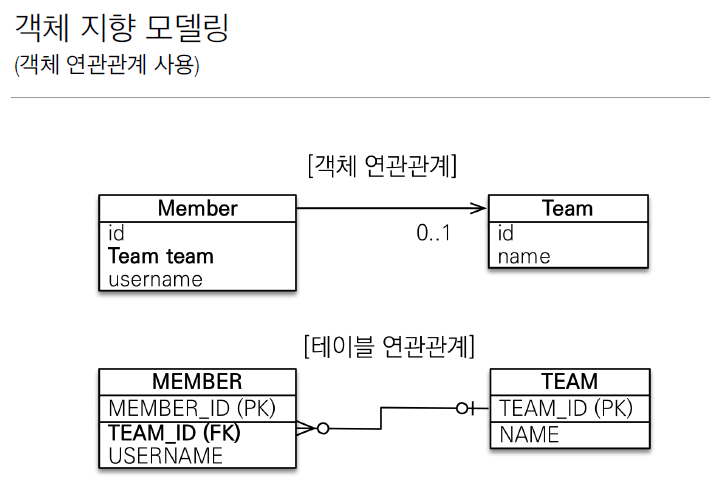
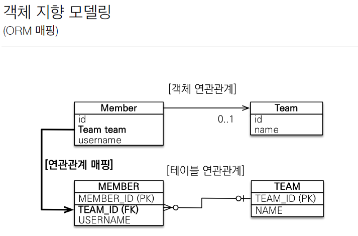
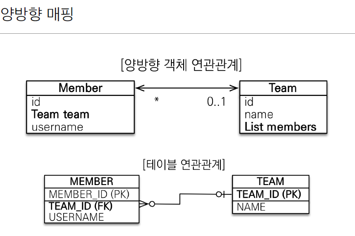
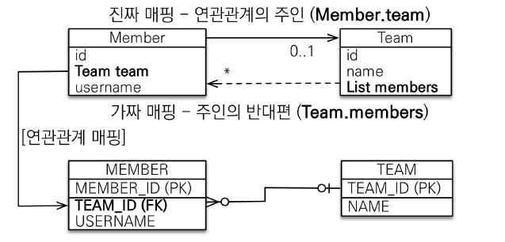
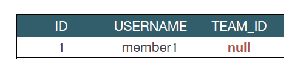
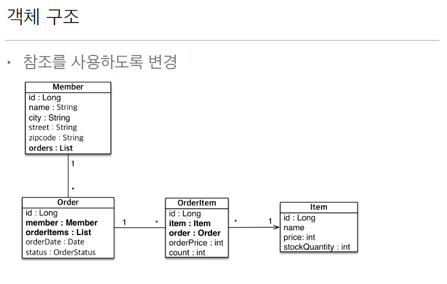

### 용어

방향(Direction) : 단방향, 양방향

다중성(Multiplicity) : 다대일(N:1), 일대다(1:N), 일대일(1:1), 다대다(N:M)

연관관계의 주인(Owner): 객체 양방향 연관관계는 관리 주인이 필요

# 연관관계가 필요한 이유

### 예제 시나리오

회원과 팀이 있다.

회원은 하나의 팀에만 소속될 수 있다.

회원과 팀은 다대일 관계다. ( N:1 )

### 객체를 테이블에 맞췄을 떄.



참조 대신에 외래키를 그대로 사용

```jsx
@Entity
public class Member {
	@Id @GeneratedValue
	private Long id;
	
	@Column(name = "USERNAME")
	private String name;

	@Column(name = "TEAM_ID")
	private Long teamId; // 외래키 그대로 사용

	...
}

@Entity
public class Team {
	@Id @GenerateValue
	private Long id;
	private String name;
	...
}
```

외래 키 식별자를 직접 다룸

```jsx
// 팀 저장
Team team = new Team();
team.setName("TeamA");
em.persist(team);

// 회원 저장
Member member = new Member();
member.setName("member1");
member.setTeamId(team.getId()); // 외래 키 식별자를 직접 다룸
em.persist(member);
```

객체를 테이블에 맞춰서 데이터 중심으로 모델링하면, 협력관계를 만들 수 없다.

- **테이블은 외래키로 조인**을 사용해서 연관된 테이블을 찾음.
- **객체는 참조**로 연관된 객체를 찾음
    
    → 테이블과 객체 사이에 큰 간격이 존재.
    

# 단방향 연관관계



```jsx
@Entity
public class Member {
	@Id @GeneratedValue
	private Long id;
	
	@Column(name = "USERNAME")
	private String name;

	//@Column(name = "TEAM_ID")
	//private Long teamId; // 외래키 그대로 사용

	**@ManyToOne
	@JoinColumn(name = "TEAM_ID")
	private Team team;**
	...
}

```

객체 지향 모델링과 객체를 테이블에 맞춘 모델링 비교



객체 지향 모델링


테이블에 맞춘 모델링

```jsx
// 팀 저장
Team team = new Team();
team.setName("TeamA");
em.persist(team);

// 회원 저장
Member member = new Member();
member.setName("member1");
**member.setTeamId(team.getId()); // 외래 키 식별자를 직접 다룸**
em.persist(member);
```

```jsx
// 팀 저장
Team team = new Team();
team.setName("TeamA");
em.persist(team);

// 회원 저장
Member member = new Member();
member.setName("member1");
//member.setTeamId(team.getId()); // 외래 키 식별자를 직접 다룸
**member.setTeam(team); // 단방향 연관관계 설정. 참조저장**
em.persist(member);
```

### 참조로 연관관계 조회 - 객체 그래프 탐색

```jsx
// 조회
Membme findeMember = em.find(Member.class, member.getId());

// 참조를 사용해서 연관관계 조회
**Team findTeam  = findMember.getTeam();**
```

### 연관관계 수정

```jsx
// 새로운 팀B
Team teamB = new Team();
teamB.setName("TeamB");
em.persist(teamB);

// 회원1에 새로운 팀B 설정
**member.setTeam(teamB);**
```

# 양방향 연관관계와 연관관계의 주인



```jsx
@Entity
public class Member {
	@Id @GeneratedValue
	private Long id;
	
	@Column(name = "USERNAME")
	private String name;

	**@ManyToOne
	@JoinColumn(name = "TEAM_ID")
	private Team team;**
	...
}

@Entity
public class Team {
	@Id @GneratedValue
	private Long id;
	private String name;
	
	**@OneToMany(mappedBy = "team")
	List<Member> members = new ArrayList<Member>();**
}

```

### 연관관계의 주인과 mappedBy

mappedBy == JPA의 멘탈붕괴 난이도.. ㅎㅎ…

**객체와 테이블간에 연관관계를 맺는 차이를 이해야함.**

객체 연관관계 = 2개

- 회원 → 팀 연관관계 1개 ( 단방향 )
- 팀 → 회원 연관관계 1개 ( 단방향 )

테이블 연관관계 = 1개

- 회원 ↔ 팀의 연관관계 1개 ( 양방향 )

### 객체의 양방향 관계

**객체의 양방향 관계는 서로 다른 단반향 관계 2개이다.**

객체를 양방향으로 참조하기 위해서는 단방향 연관관계를 2개 만들어야 함.

```jsx
A -> B ( a.getB() )
B -> A ( b.getA() )

class A {
	B b;
}

class B {
	A a;
}
```

### 테이블의 양방향 연관관계

테이블은 외래 키 하나로 두 에티블의 연관관계를 관리함.

member.team_id 외래키 하나로 양방향 연관관계 가짐.

```jsx
select *
from Member m
join Team t ON m.team_id = t.team_id;

select * 
from Team t
join Member m ON t.team_id = m.team_id;
```

### 연관관계의 주인(Owner)

양방향 매핑 규칙

1. 객체의 두 관계 중 **하나를 연관관계 주인으로 지정**
2. **연관관계의 주인만이 외래 키를 관리**(등록,수정)
3. **주인이 아닌 쪽은 읽기만 가능.**
4. 주인은 mappedBy 속성 사용XXXXXXXX
5. 주인이 아니면 mappedBy 속성으로 주인을 지정해줘.

### 주인은 누구로?

**외래 키가 있는 곳을 주인으로 정해라.**

여기서는 Member.team이 연관관계 주인.



Member가 team의 외래키를 가지고 있으므로 연관관계의 주인이 되고,

team은 연관관계 주인이 아니니깐 mappedBy를 가질거얌.

연관관계의 주인은 Member인데 team에다가 설정해버리면 null값 들어가니 주의해라

```jsx
Team team = new Team();
team.setName("TeamA");
em.persist(team);

Member member = new Member();
member.setName("member1");

//역방향. 연관관계 주인이 아닌 놈에만 설정하고 주인은 설정하지 않았따
team.getMembers().add(member);

em.persist(member);
```


```jsx
Team team = new Team();
team.setName("TeamA");
em.persist(team);

Member member = new Member();
member.setName("member1");

team.getMembers().add(member);
**member.setTeam(team); // 연관관계 주인도 값을 가져야 한다.**

em.persist(member);
```

### 양방향 연관관계 주의사항

항상 양쪽에 값을 설정하자

: 하지만 사람이란 실수를 하는 법..! 그러니 연관관계 편의 메서드를 생성해놓자.

양방향 매핑시에 무한 루프를 조심해라.

: ex) toString(), lombok, JSON 생성 라이브러리

### 양방향 매핑 정리

단방향 매핑만으로도 이미 연관관계 매핑은 완료된 것.!!

양방향 매핑은 반대 방향으로 조회(객체 그래프 탐색) 기능이 추가된 것 뿐임.

**일단 단방향 매핑을 잘해놓으면 양방향은 필요할 때 추가하는 식으로 하면 됨.!!**

(결국 단방향부터 잘해놓는게 좋다)

### 연관관계의 주인을 정하는 기준

비즈니스 로직을 기준으로 연관관계의 주인으로 선택하면 안됨.

**연관관계의 주인은 외래 키의 위치를 기준으로!!!**



이미지 및 내용 출처 : 
https://www.inflearn.com/course/ORM-JPA-Basic/dashboard