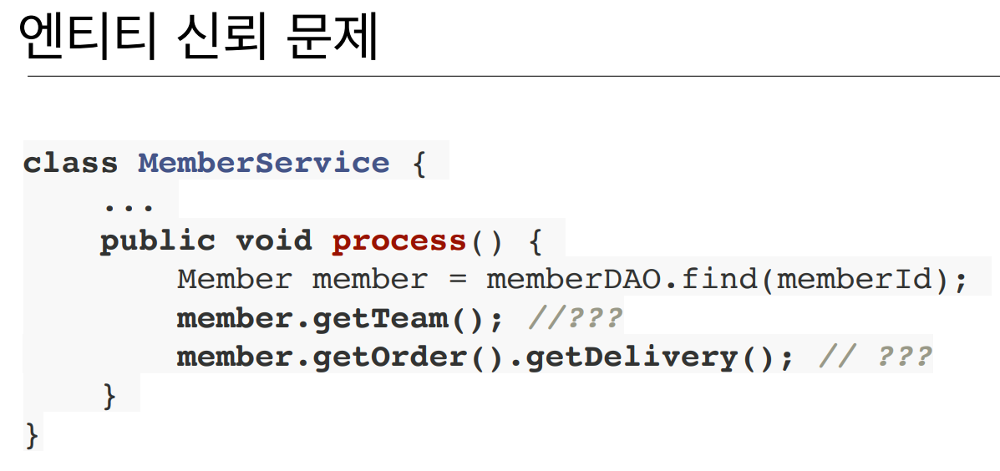

# SQL 개발의 문제

관계형DB를 사용.

SQL 중심적인 개발.

: 무한반복,,, 지루한 코드… CRUD

**컬럼이 하나면 추가되어도 CRUD 쿼리를 다 고쳐야함.**

하지만 실무에서 SQL에 의존적인 개발을 피하기는 어렵다..

# 패러다임의 불일치

객체 VS 관계형 데이터베이스

객체 지향 프로그래밍은 추상화, 캡슐화, 정보은닉, 상속, 다형성 등 시스템의 복잡성을 제어할 수 있는 다양한 장치들을 제공함.

객체 —> SQL 변환 —> SQL - RDB

이 일을 개발자가 함. SQL Mapper…

# 객체와 관계형 데이터베이스의 차이

### 상속

- 상속관계는 DB로 표현하기 어려움
- **DB에 저장할 객체에는 상속관계를 안쓴다..**

### 연관관계

- 객체는 참조를 사용. 하지만 테이블은 왜래 키를 사용.
- 객체를 테이블에 맞춰서 모델링…
- 객체는 자유롭게 객체 그래프를 탐색할 수 있어야함.
    

    
- 처음 실행하는 SQL에 탐색범위가 정해짐.
- 데이터를 주면 믿고 쓸수있어야함. 그래야 계층이 성립이 됨.
    - **service 계층에서 DAO 코드를 다 열어봐 알 수 있음.**
    - 객체답게 모델링 할수록 매핑 작업만 늘어남 ㅠ
    

    
1. 데이터 타입
2. 데이터 식별방법

### 계층형 아키텍쳐 : 진정한 의미의 계층 분할이 어려움…

**—> 객체답게 모델링 할수록 매핑 작업만 늘어남…**

### 객체를 자바 컬렉션에 저장하듯이 DB에 저장할 수 는 없을까?!

---

### JPA(Java Persistence API)

자바 진영의 ORM 기술 표준

### ORM?

---

- Object-relational mapping(객체 관계 매핑) : 기술.
- 객체는 객체대로 설계
- 관계형 데이터베이스는 관계형 데이터베이스대로 설계
- ORM 프레임워크가 중간에서 매핑
- 대중적인 언어에는 대부분 ORM 기술이 존재

EJB는 너무 복잡해서 실용이 안좋았어. 성능도 안나오고 ㅠ

EJB를 사용하다가 만든게 오픈소스 하이버네이트이고, 이를 기반으로 표준으로 만든게 JPA임.

 **표준명세 : 인터페이스의 모음**

중간에 뭔가 있으면 모아서 보내는게 가능.

버퍼, 캐싱이 가능.

JPA 가 중간에 끼기 때문에 이런게 가능.

### JPA의 성능 최적화 기능

1. 1차 캐시와 동일성(Identity) 보장
    

    
2. 트랜잭션을 지원하는 쓰기지연(trasactional write-behind)
    

    

    
3. 지연 로딩(Lazy loading)
    

    

처음에 지연로딩으로 쓰다가 성능 개선할떄 즉시로딩으로 수정하는 편

이미지 및 내용 출처 : 
https://www.inflearn.com/course/ORM-JPA-Basic/dashboard