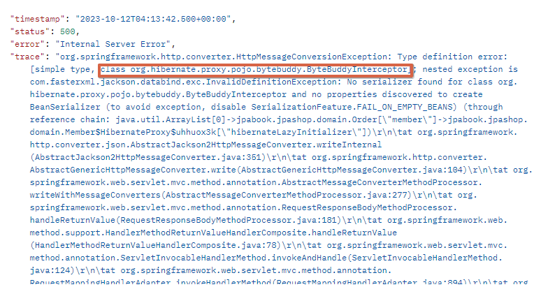

[회원 등록,수정,조회 API](https://www.notion.so/API-98be18cb8de2439f9dfe3e76bc1eb3b8?pvs=21)

**프레젠테이션 계층의 검증이 엔티티에 들어가서는 안됨.**

[**엔티티의 필드가 많을 때 업데이트 방법?**](https://www.notion.so/396458d9af494678b64ff9350990b38d?pvs=21)

---

# API 개발 고급 - 지연로딩과 조회 성능 최적화

## V1. 엔티티 직접 노출

- 엔티티가 변하면 API 스펙이 변한다.
- 트랜잭션 안에서 지연 로딩 필요
- 양방향 연관관계 문제 → @JsonIgnore

### 엔티티를 반환할때 문제점 1

```java
@GetMapping("/api/v1/sample-orders")
public List<Order> ordersV1() {
    List<Order> orders = orderRepository.findAllByString(new OrderSearch());
    return orders;
}
```

위 경우 아래와 같은 오류와 함께 무한루프에 빠짐.

왜냐면 Order안에 Member가 있고, Member안에도 orders가 있는 구조임. ( Member와 Order가 서로 참조하고 있는 구조 )

[JSON 반환 시 무한루프 발생](https://www.notion.so/JSON-4de091023d8244cfad89a79b20b8301e?pvs=21)

그래서 return 할 때 @RestController니깐 json으로 결과값을 말려고 하는데, 위 구조때문에 무한루프가 걸리는 것.  

( JSON 직렬화를 처리하는 라이브러리는 JSON을 만들기 위해서 A -> B, B -> A를 참조하는 경우에는 모든 참조를 순환하기 때문 )

→ 그래서 이 순환을 끊어내기 위해 순환이 걸려있는 곳에 전부 @JsonIgnore을 붙여줘야 함. ( 둘 중하나라도 끊으면 됨 )

### 엔티티를 반환할때 문제점 2

위 문제로 @JsonIgnore을 붙여서 돌려도 아래와 같은 오류가 발생함.



`class org.hibernate.proxy.pojo.bytebuddy.ByteBuddyInterceptor`

`@ManyToOne(fetch = FetchType.*LAZY*)`

패치가 지연로딩(LAZY)인 경우 new 객체()를 하지 않는 이상 DB에서 값을 끌고오는게 아닌 프록시 객체를 넣어두는데, 이걸 bytebuddy라이브러리에서 수행함.

그 프록시 객체는 new ByteBuddyInterceptor()임.

즉, 아래와 같이 보이지 않도록 프록시 객체가 들어가 있는거임

```java
public class Order {

    @ManyToOne(fetch = FetchType.LAZY)
    @JoinColumn(name = "member_id")
    private Member member = **new ByteBuddyInterceptor();**
```

이 상태에서 return할 때 결과를 JSON으로 말려고 보니깐 Order안에 있는 Member가 실제 객체가 아닌 이상한 프록시 객체가 들어있으니, bytebuddy라이브러리 입장에서는 이게 머야! 라면서 오류를 뱉어나는 것.

( Order 안에 있는 Member는 지연로딩이기 때문에 Order 조회할 때는 프록시 객체가 들어있다가 직접 new Member를 하든 order.getMember().getName()과 같이 요소에 접근하지 않는 이상 프록시 초기화가 일어나지 않음. )

위 오류를 해결하기 위해 

Hibernate가 json아 그냥 이런애들은 포함시키지마 할 수 있음.

이걸 하기 위해 : `Hibernate5Module` 을 설치하고 Bean으로 등록해주면 됨.

( 해당 모듈은 지연로딩 무시하고 json 포함시킬수 있도록 해줌. 그래서 따로 설정해주지 않는 이상 지연로딩 걸리는 값은 null로 떨어짐. 반대로 설정만 해준다면 지연로딩이여도 로딩되게 해서 나갈 수 있음. )

---

추가적으로

모듈을 추가하면 member 값은 null이 들어감. 여기서 member값은 나오게 하고 싶으면 위와 같이 프록시 객체로 있는 member를 초기화 시켜서 실제 객체로 넣어주면 됨.

```java
@GetMapping("/api/v1/sample-orders")
    public List<Order> ordersV1() {
        List<Order> orders = orderRepository.findAllByString(new OrderSearch());
        for (Order order : orders) {
            **order.getMember().getName(); // Lazy 강제 초기화. order.getMember()까지는 프록시였다가 order.getMember().getName() 접근하면서 실제 객체로 변함.**
            order.getDelivery().getAddress();
        }
        return orders;
    }
```

… 그냥 이런방법이 있다 정도로만 알고 사실 엔티티만 노출하지 않으면 이런문제가 발생하지도 않음.

> **항상 지연로딩(LAZY)을 기본으로 하고, 성능 최적화가 필요한 경우에는  fetch join을 사용해라.**
> 

---

## V2. 엔티티를 조회해서 DTO로 변환(fetch join 사용X)

- 트랜잭션 안에서 지연 로딩 필요

```java
@GetMapping("/api/v2/simple-orders")
public List<SimpleOrderDto> ordersV2() {
    List<Order> orders = orderRepository.findAll();
    List<SimpleOrderDto> result = orders.stream()
																			.map(o -> new SimpleOrderDto(o))
																			.collect(toList());
    return result;
}

@Data
static class SimpleOrderDto {
    private Long orderId;
    private String name;
    private LocalDateTime orderDate; //주문시간    
    private OrderStatus orderStatus;
    private Address address;

    public SimpleOrderDto(Order order) {
        orderId = order.getId();
        name = order.getMember().getName(); // Lazy 초기화
        orderDate = order.getOrderDate();
        orderStatus = order.getStatus();
        address = order.getDelivery().getAddress(); // Lazy 초기화
    }
}
```

DB 쿼리가 너무 많이 나감.

order가 1번 조회되고, stream에서 루프가 돌면서 각 Member와 delivery가 Lazy 초기화가 됨.

**이 때 member와 delivery 조회하는 쿼리가 `where member.id = ?` , `where delivery.id = ?` 과 같이 1개씩 나감.**

→ 이 말은 order가 조회된 수가 N개 라면 member와 delivery 쿼리가 각각 N개씩 나가게 됨.

→ 즉, 총 1(Order) + N(Member) + N(delivery) 와 같이 쿼리가 나감.

( 사실 이건 최악의 경우인 거고, 지연로딩은 쿼리를 날리기전에 영속성 컨텍스트를 살피고 나서 없으면 쿼리를 날리기 때문에 이미 쿼리가 나갔던 id 값이 있으면 쿼리를 날리지 않고 영속성 컨텍스트에서 꺼내옴. )

→ 이게 바로 N+1 문제임.

위와 같이 처음 쿼리가 나가고 나서 그 뒤에 N개의 쿼리가 추가로 실행되는 문제를 뜻함.

그렇다고 EAGER로 바꾸게 되면 예상치도 못한 쿼리들이 나가게 됨.

처음에 order를 조회하고 여기에 엮여있는 것들을 한번에 가져오려고 난리를 치기 때문에 EAGER는 쿼리를 예상하기가 어렵다.

→ 그러니 EAGER은 절대 쓰지 말자…

---

## V3. 엔티티를 조회해서 DTO로 변환(fetch join 사용O)

```java
@GetMapping("/api/v3/simple-orders")
public List<SimpleOrderDto> ordersV3() {
    List<Order> orders = orderRepository.**findAllWithMemberDelivery**();
    List<SimpleOrderDto> result = orders.stream()
																			.map(o -> new SimpleOrderDto(o))
																			.collect(toList());
    return result;
}
```

```java
// orderRepository
public List<Order> findAllWithMemberDelivery() {
    return em.createQuery("select o from Order o" 
            + " **join fetch** o.member m" 
            + " **join fetch** o.delivery d", Order.class).getResultList();
    
}
```

→ 패치조인을 사용하면 지연로딩을 무시하고 쿼리에서 join SQL문이 나가서 Member, delivery값을 실제 객체로 채워줌.

`inner join Member on member.id = order.id`, `inner join Delivery on delivery.id = order.id` 와 같이 Order 조회할 때 다 조인처리되어서 쿼리가 1번만 나가고 끝남.

[문제]

order 조회해오는 select 절에서 조회해오는 데이터가 너무 많다.

원하는 데이터만 뽑아오고 싶다…

---

## V4. JPA에서 DTO로 바로 조회

```java
private final OrderSimpleQueryRepository orderSimpleQueryRepository; //의존관계 주입

@GetMapping("/api/v4/simple-orders") 
public List<OrderSimpleQueryDto> ordersV4() {   
	 return orderSimpleQueryRepository.findOrderDtos();
}
```

```java
// repository.order.simplequery.OrderSimpleQueryRepository 조회 전용 리포지토리

@Repository
@RequiredArgsConstructor
public class OrderSimpleQueryRepository {
    private final EntityManager em;

    public List<OrderSimpleQueryDto> findOrderDtos() {
        return em.createQuery("select " +
                "new jpabook.jpashop.repository.order.simplequery.OrderSimpleQueryDto(o.id, m.name, o.orderDate, o.status, d.address)" 
                + " from Order o" 
                + " join o.member m" 
                + " join o.delivery d", OrderSimpleQueryDto.class)
                .getResultList();
    }
}
```

```java
// domain.order.simpleQuery.OrderSimpleQueryDto

@Data
public class OrderSimpleQueryDto {
    private Long orderId;
    private String name;
    private LocalDateTime orderDate; //주문시간    
    private OrderStatus orderStatus;
    private Address address;

    public OrderSimpleQueryDto(Long orderId, String name, LocalDateTime orderDate, OrderStatus orderStatus, Address address) {
        this.orderId = orderId;
        this.name = name;
        this.orderDate = orderDate;
        this.orderStatus = orderStatus;
        this.address = address;
    }
}
```

order를 조회해올 때 select절에서 원하는 값만(OrderSimpleQueryDto) 조회해 올 수 있음.

이런 식으로 네트워크용량 최적화 할 순 잇지만 생각보다 미비함..

그렇다고 V3가 안좋은건 아님.

트레이드오프가 있어..

V4는 원하는 것만 가져올 수는 있으나, 재사용성이 없다. ( 너무 하나에 최적화 되어 있어 )

V3는 모든걸 다 가져오기 때문에 활용성은 높다.

그리고 위 DTO는 굉장히 API 스팩에 맞춰져 있음. 이렇게 API 스팩에 맞춰져 있는 코드가 리파지토리까지 영향이 있는 건 좋지 않음.

( 만일 API 스팩을 수정이 되면 리파지토리까지 영향이 끼치니깐. 리파지토리는 객체 그래프 탐색해오는 정도로만 쓰는게 좋음. )

→ 이 때문에 OrderRepository에 같이 두지 않고, repository 패키지 밑에 order.simplequery 라는 패키지를 새로 따서 그 밑에 새로운 OrderSimpleQueryRepository 클래스를 새로 땀.

일반적인 OrderRepository는 순수하게 JPA 조회용으로 사용하고, 위와 같이 특정 화면에, 특정API에 최적화된 것들은 따로 빼서 관리해주는 게 좋음.  ( 저기서 사용하는 DTO도 마찬가지로 새로 패키지 따서 관리.)

따라서

엔티티를 DTO로 변환하거나, DTO로 바로 조회하는 두가지 방법은 각각 장단점이 있다. 

둘중 상황에 따라서 더 나은 방법을 선택하면 된다. 

엔티티로 조회하면 리포지토리 재사용성도 좋고, 개발도 단순해진다. 따라서 권장하는 방법은 다음과 같다.

## 쿼리 방식 선택 권장 순서

1. 우선 엔티티를 DTO로 변환하는 방법을 선택한다. 
2. 필요하면 페치 조인으로 성능을 최적화 한다. →  대부분의 성능 이슈가 해결된다.
3. 그래도 안되면 DTO로 직접 조회하는 방법을 사용한다. 
4. 최후의 방법은 JPA가 제공하는 네이티브 SQL이나 스프링 JDBC Template을 사용해서 SQL을 직접 사용한다.  

---

# API 개발 고급 - 컬렉션(OneToMany) 조회 최적화

XToOne ( OneToOne, ManyToOne )가 아닌 OneToMany 조회 및 최적화.

Order - OrderItem, Item

V3

- 페이징 시에는 N 부분을 포기해야함(대신에 batch fetch size? 옵션 주면 N -> 1 쿼리로 변경
가능)

V4. JPA에서 DTO로 바로 조회, 컬렉션 N 조회 (1 + N Query)

- 페이징 가능

V5. JPA에서 DTO로 바로 조회, 컬렉션 1 조회 최적화 버전 (1 + 1 Query)

- 페이징 가능

V6. JPA에서 DTO로 바로 조회, 플랫 데이터(1Query) (1 Query)

- 페이징 불가능...

### 패치조인

```java
public List<Order> findAllWithItem() {
	 return em.createQuery("select distinct o from Order o" +
                " join fetch o.member m" +
                " join fetch o.delivery d" +
                " join fetch o.orderItems oi" +
                " join fetch oi.item i", Order.class)
            .getResultList();
    }
```

distinct 를 사용한 이유는 1대다 조인이 있으므로 데이터베이스 row가 증가한다. 

그 결과 같은 order엔티티의 조회 수도 증가하게 된다.

JPA의 distinct는 SQL에 distinct를 추가하고, 더해서 같은 엔티티가 조회되면, 애플리케이션에서 중복을 걸러준다. 이 예에서 order가 컬렉션 페치 조인 때문에 중복 조회 되는 것을 막아준다.

단점
: 페이징 불가능

`HHH000104: firstResult/maxResults specified with collection fetch; applying in memory!`

```java
public List<Order> findallwithItem() {
    return em.createQuery("select distinct o from Order o" +
                " join fetch o.member m" +
                " join fetch o.delivery d" +
                " join fetch o.orderItems oi" +
                " join fetch oi.item i", Order.class)
            .setFirstResult(1)
            .setMaxResults(100)
            .getResultList();
}
```

```java
2023-10-21 16:43:16.753  WARN 13344 --- [nio-8080-exec-1] o.h.h.internal.ast.QueryTranslatorImpl   : HHH000104: firstResult/maxResults specified with collection fetch; applying in memory!
```

> 참고: **컬렉션 페치 조인을 사용하면 페이징이 불가능하다.** 하이버네이트는 경고 로그를 남기면서 모든 데이터를 DB에서 읽어오고, **메모리에서 페이징 해버린다(매우 위험하다**). 
컬렉션 페치 조인은 1개만 사용할 수 있다. 컬렉션 둘 이상에 페치 조인을 사용하면 안된다. 데이터가 부정합하게 조회될 수 있다
자세한 내용은 자바 ORM 표준 JPA프로그래밍의 페치 조인 부분을 참고하자.
> 

**컬렉션을 페치 조인하면 페이징이 불가능하다.**
컬렉션을 페치 조인하면 일대다 조인이 발생하므로 데이터가 예측할 수 없이 증가한다.
일다대에서 일(1)을 기준으로 페이징을 하는 것이 목적이다. 그런데 데이터는 다(N)를 기준으로 row
가 생성된다. Order를 기준으로 페이징 하고 싶은데, 다(N)인 OrderItem을 조인하면 OrderItem이 기준이 되어버린다.
이 경우 하이버네이트는 경고 로그를 남기고 모든 DB 데이터를 읽어서 메모리에서 페이징을 시도한다. 최악의 경우 장애로 이어질 수 있다

### 한계돌파

그러면 페이징 + 컬렉션 엔티티를 함께 조회하려면 어떻게 해야할까?

지금부터 코드도 단순하고, 성능 최적화도 보장하는 매우 강력한 방법을 소개하겠다. 대부분의 페이징 + 컬렉션 엔티티 조회 문제는 이 방법으로 해결할 수 있다.

1. **먼저 XToOne(OneToOne, ManyToOne) 관계를 모두 패치조인 한다. XToOne 관계는 row수를 증가시키지 않으므로 페이징 쿼리에 영향을 주지 않는다.**

2. 컬렉션은 지연 로딩으로 조회한다.
3. 지연 로딩 성능 최적화를 위해 hibernate.default_batch_fetch_size , @BatchSize 를 적용한다.
`hibernate.default_batch_fetch_size`: 글로벌 설정
`@BatchSize`: 개별 최적화
이 옵션을 사용하면 컬렉션이나, 프록시 객체를 한꺼번에 설정한 size 만큼 IN 쿼리로 조회한다

```java
jpa:
    hibernate:
      ddl-auto: create
    properties:
      hibernate:
#        show-sql: true
        format_sql: true
        **default_batch_fetch_size: 100**
```

개별로 설정하려면 @BatchSize 를 적용하면 된다. (컬렉션은 컬렉션 필드에, 엔티티는 엔티티 클래스에 적용)

[장점]
쿼리 호출 수가 `1 + N`  → `1 + 1` 로 최적화 된다.
조인보다 DB 데이터 전송량이 최적화 된다. (Order와 OrderItem을 조인하면 Order가 OrderItem 만큼 중복해서 조회된다. 이 방법은 각각 조회하므로 전송해야 할 중복 데이터가 없다.)
페치 조인 방식과 비교해서 쿼리 호출 수가 약간 증가하지만, DB 데이터 전송량이 감소한다.
컬렉션 페치 조인은 페이징이 불가능 하지만 이 방법은 페이징이 가능하다.

[결론]
**XToOne 관계는 페치 조인해도 페이징에 영향을 주지 않는다.**

 **따라서 XToOne 관계는 페치조인으로 쿼리 수를 줄이고 해결하고, 나머지는`hibernate.default_batch_fetch_size` 로 최적화 하자.**

> 참고: default_batch_fetch_size 의 크기는 적당한 사이즈를 골라야 하는데, 100~1000 사이를 선택하는 것을 권장한다. 이 전략을 SQL IN 절을 사용하는데, 데이터베이스에 따라 IN 절 파라미터를 1000으로 제한하기도 한다. 1000으로 잡으면 한번에 1000개를 DB에서 애플리케이션에 불러오므로 DB에 순간 부하가 증가할 수 있다. 하지만 애플리케이션은 100이든 1000이든 결국 전체 데이터를 로딩해야 하므로 메모리 사용량이 같다. 1000으로 설정하는 것이 성능상 가장 좋지만, 결국 DB든 애플리케이션이든 순간 부하를 어디까지 견딜 수 있는지로 결정하면 된다.
> 

### 스프링 부트 3.1 - 하이버네이트 6.2 바뀐점

```java
where in (?, ?)
where array_contains (?, ?) --> 성능 최적화 이슈 해결
select * from order where id in (?, ?)
```

pk 기준으로 in절이면 성능상 나쁘지 않아요. 오히려 좋아요.
DB가 sql문을 실행하면 저 쿼리문을 캐싱을 해두거든요?
실제로 delveloper에서 똑같은 쿼리를 계속 실행하다보면 실행 시간이 줄어들어요
실행해서 파싱된 sql 구문을 .db가 내부에서 캐싱을 해두고 있어서 그래요 

--> 결과값을 캐싱하는게 아니라 파싱된 구문을 캐싱.
sql 구문 자체를 캐싱하기 때문에 바인딩되는 부분 [?]에 데이터가 변경이 되어도 캐싱된 sql 구문을 그대로 사용할 수 잇어요

그런데 여기서 조금 자그만한 이슈? 라고 하면
구문을 캐싱한다고 했잖아요. 그리고 바인딩되는 부분 [?] 데이터가 바뀌어도 괜찮다! 라고 햇는데.
in 절의 바인딩 변수가 개수가 변하면 쿼리문이 변하는 것이므로 캐싱된 sql 구문을 사용할 수 없어요.

```java
select *from order where id in (?, ?)
select * from order where id in (?,?,?)
```

--> 같은 구문으로 보여도 바인딩 변수 부분 개수가 다르기 때문에 다른 sql 구문으로 판단하여 캐싱된 sql을 사용하지 못함.
따라서 성능이 떨어짐.

근데 array_contains 를 사용하면 해결가능.
array_contains는 왼쪽에 넣어요. 배열에 들어 있는 숫자가 id에 있으면 true임.

```java
select * from order where array_contains(?, id)
select * from order where id in (?,?,?)

select * from order where array_contains([1,2,3], id)
select * from order where id in (1,2,3)
```

array_contains는 바인딩되는 부분이 하나로 고정.
그렇기 때문에 찾아야하는 id 개수가 달라지더라도 sql 구문은 똑같기 때문에 캐싱된 sql문을 사용.

**DTO 직접 조회란, 엔티티의 다른 필요없는 컬럼을 보여주지 않기 위해서 OrderDto의 형태로 리턴해주는 것이 아니라, 따로 패키지를 만들정도의 DTO 를 칭하는 것인가요 ??**

JPQL의 결과로 엔티티로 조회하지 않는 것은 다 DTO로 조회하는 것으로 이해하면 됩니다.

---
참고내용
https://www.inflearn.com/course/%EC%8A%A4%ED%94%84%EB%A7%81%EB%B6%80%ED%8A%B8-JPA-API%EA%B0%9C%EB%B0%9C-%EC%84%B1%EB%8A%A5%EC%B5%9C%EC%A0%81%ED%99%94/dashboard