# JPA

SQL 중심적인 개발의 무한반복,, 지루한 코드를 개선.

객체기반으로 DB를 설계 → 객체와 관계형데이터베이스의 패러다임의 불일치.

1. 관계형 데이터베이스는 상속을 구현하기 어려움.
2. 객체를 테이블에 맞춰 모델링하다보니 FK값 같은게 들어감.

객체는 아래와 같이 memeber-order-orderItem-Item 이렇게 자유롭게 탐색할 수 있으나,

DB의 경우 정해진 그래프 범위로 넘어갈수 없으며, 데이터가 없으면 탐색할 수 없다.

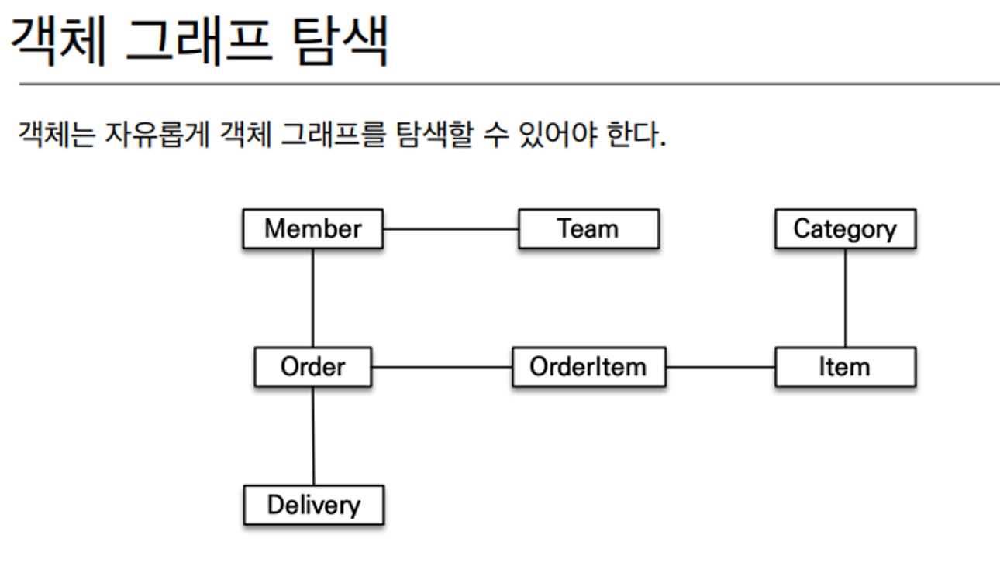

객체답게 모델링 할수록 매핑 작업만 늘어간다.

객체를 자바 컬렉션에 저장 하듯이 DB에 저장 → JPA

### JPA(Java Persistence API)

Java 진영의 ORM 기술 표준.

원래는 EJB라는 자바 표준을 썼는데, 너무 복잡하고 어려워서 빡친 개발자가 하나가 오픈소스인 하이버네이트를 만듦.

이게 인기가 좋다보니 자바에서 이걸 기반으로 자바표준인 JPA를 만들어냄.

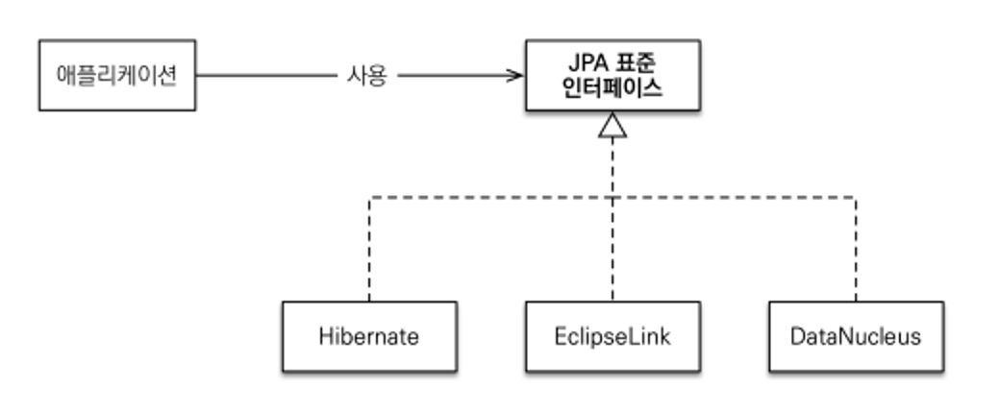

### ORM(Object Relational Mapping)(객체 관계 매핑)

객체는 객체대로 설계하고, RDB는 RDB대로 설계해라.

그러면 ORM 프레임워크가 중간에서 매핑해주리라..!!

JPA는 아래와 같이 애플리케이션과 JDBC 사이에서 동작함.

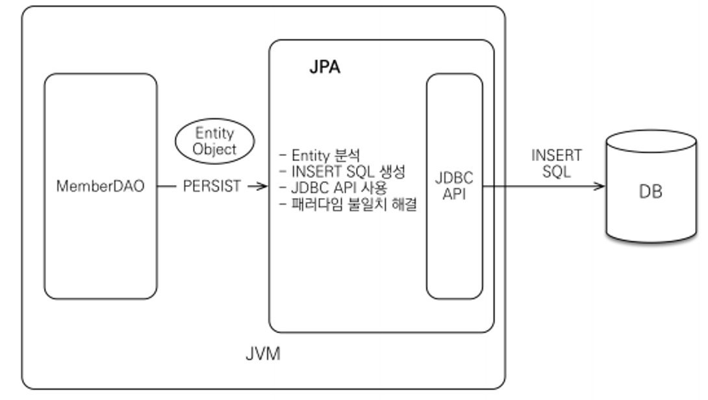

### JPA를 사용해야하는 하는 이유

1. SQL 중심적 개발 → 객체 중심으로 개발
2. 생산성, 유지보수  : 필드변경시 모든 SQL 수정했어야 했자나..ㅠ
3. 패러다임의 불일치 해결.
4. 데이터 접근 추상화와 벤더 독립성.
5. 상속 : 개발자는 jap.persist(album)만 하면 되고 나머지 insert into item,… Insert Into Album… 은 JPA가 처리.

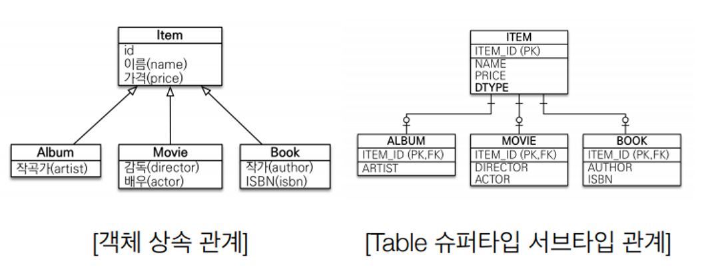

: 조회도 `jpa.find(Album.class, albumID);` 만 하면 JPA가 알아서 `select * from Item i join album on i.item_id = a.item_id` 를 JPA가 처리.

1. 객체 그래프 탐색
    
    ```java
    //연관관계 저장
    member.setTeam(team);
    jpa.persis(member);
    
    // 객체 그래프 탐색
    Member member = jpa.find(Member.class, memberId);
    Team team = member.getTeam();
    ```
    

**JPA 는 동일한 트랜잭션에서 조회한 엔티티 같음을 보장한다.**

### JPA 성능 최적화 기능

1. 1차캐시와 동일성 보장
2. 트랜잭션을 지원하는 쓰기 지연 - insert는 커밋하기 전까지 모았다가 한번에 SQL 전송.
3. 지연로딩(Lazy Loading)

---

### JPA 구동방식

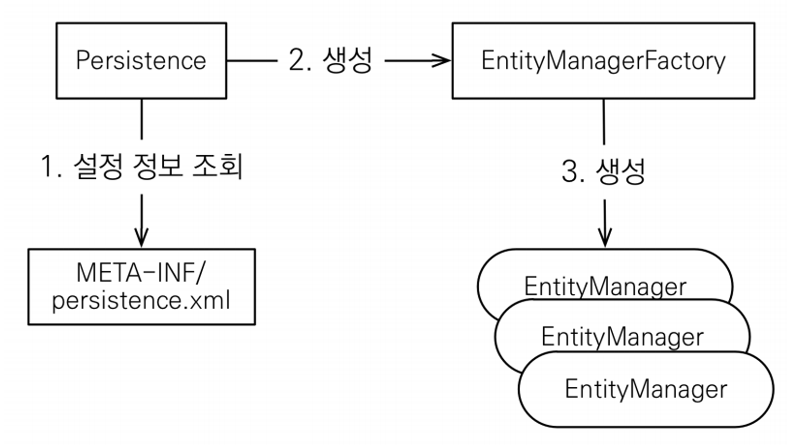

`EntityManagerFactory` : 하나만 생성해서 어플리케이션 전체가 공유

`EntityManager` : 쓰레드간 공유 X

**JPA의 모든 데이터 변경은 트랜잭션 안에서 실행.**

@Entity : JPA 가 관리할 객체

@Id : 데이터베이스 PK와 매핑.

### JPQL

JPA는 SQL을 추상화한 JPQL이라는 객체지향쿼리 언어 제공함.

테이블이 아닌 객체를 대상으로 검색하는 객체지향쿼리

### 영속성 컨텍스트****

엔티티를 영구 저장하는 환경. `EntityMamger.persist(entity);`

( 논리적인 개념이며, **EntityManager를 통해 영속성 컨텍스트에 접근**)

# 엔티티의 생명주기

- `비영속(new/transient)`
    - 영속성 컨텍스트와 전혀 관계가 없는 새로운 상태
        
        ```jsx
        Member member = new Member();
        member.setId(100L);
        member.setName("Test");
        ```
        

- `영속 ( managed )`
    - 영속성 컨텍스트에 관리되는 상태
        
        ```jsx
        EntityManagerFactory emf = Persistence.createEntityManagerFactory();
        EntityManager em = emf.createEntityManager();
        EntityTransaction tx = em.getTransaction();
        
        em.getTransaction().begin();
        
        // 객체를 저장한 상태(영속)
        em.persist(member);
        
        //persist(); 바로 쿼리가 날라가지 않음.
        // 영속상태가 된다고 쿼리가 날라가지 않음.
        // 트랜잭션을 커밋되는 시점에 날라감.!!
        tx.commit();
        ```
        

- `준영속(detached)`
    - 영속성 컨텍스트에 저장되었다가 분리된 상태
    - JPA 사용시, 트랜잭션을 서비스계층까지만 유지함. ( 그러면 물론 영속성 컨텍스트도 거기에 맞춰 서비스 계층까지만 유지.) → 이 경우 컨트롤러에서는 영속성컨텍스트가 존재하지 않기 때문에 준영속 상태가 됨.
        
        ```java
        // 회원 엔티티를 영속성 컨텍스트에서 분리. 준영속 상태. ( 즉, 이후 member는 영속상태가 아님)
        em.detach(member);
        ```
        

- 삭제 ( removed)
    - 삭제된 상태 : DB에서 삭제처리.
        
        ```java
        // 객체를 삭제한 상태(삭제)
        em.remove(member);
        ```
        

### 1차 캐시

1차 캐시는 한 트랜잭션 안에서만 동작 : 비즈니스가 복잡하지 않은 이상 성능에 큰 영향은 없음. 

어플리케이션 전체에서 공유하는 캐시는 2차캐시임.

- 어차피 트랜잭션이 끝나면 `1차 캐시`는 지워지고, 변경이 생기면 `더티체킹`으로 인해 `1차캐시`와 db가 업데이트하는 방식으로 J**PA가 알아서 트랜잭션 내 1차캐시와 db 일괄성을 보장해줌.**

### 쓰기지연

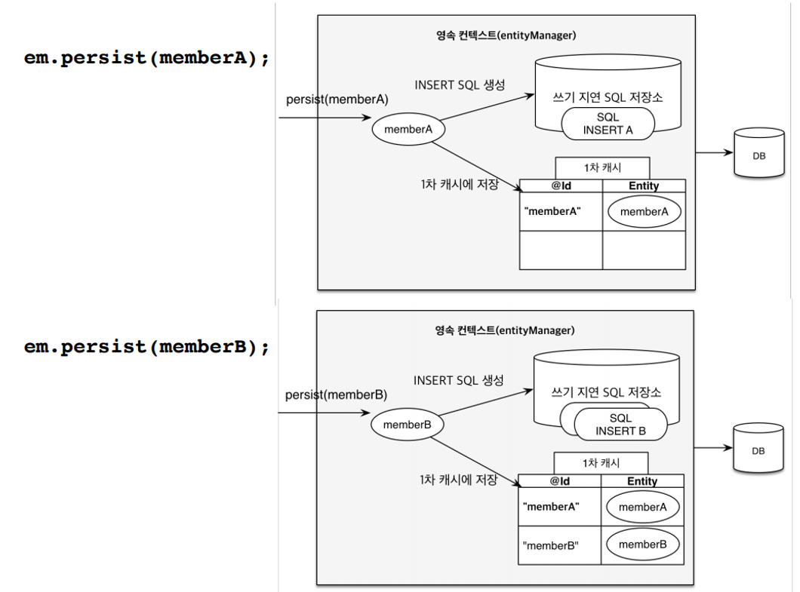

`persist` : insert문 만들어서 `쓰기지연 SQL 저장소`에 넣어둠. memberA, memberB 둘다.

`commit` : `쓰기지연 SQL 저장소` 에 저장되어 있는 쿼리문이 flush 되어 db로 날라감.

### 변경감지(Drity Check)

update문과 persist가 없어도 `영속성 컨텍스트`와 비교하여 값이 변경됐으면 커밋 시, update문 날라감.

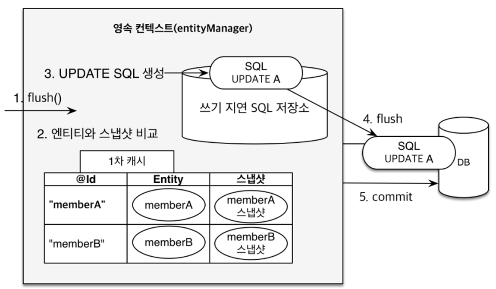

DB에서 읽어온 최초 상태를 스냅샷에 저장해놓음.

**Entity랑 스냅샷이랑 비교하여 바뀐 내용을 update 처리함.**

### 플러시(flush)

`em.flush()` : 직접호출

`트랜잭션 커밋` : flush 자동 호출

`JPQL 쿼리 실행` : flush 자동호출

**영속성 컨텍스트의 변경 내용을 데이터베이스에 반영.**

**( 영속성 컨텍스트를 비우는게 아니라 변경내용을 DB에 동기화는 것 뿐! )**

---

객체와 테이블 매핑 : @Entity, @Table

필드와 컬럼 매핑 : @Column

기본 키 매핑 : @Id

연관관계 매핑 : @ManyToOne, @JoinColumn

### @Entity

@Entity 붙은 클래스는 JPA가 관리. → 엔티티라 함.

주의!

**기본 생성자 필수**

**final 클래스, ENUM, Interface, Inner 클래스는 사용 불가.**

**저장할 필드에 final 사용 불가. ( 컬럼으로 사용할 필드 )**

### @Table

엔티티와 매핑할 테이블 지정.

### 매핑 관련 어노테이션 정리

`@Column`  : 컬럼매핑 ( 컬럼이름과 변수명이 다른경우 컬럼이름을 명시 ) ( 여러 옵션으로 제약조건 등 설정가능 )

`@Temporal` : 날짜 타입 매핑 ( LocalDate, LocalDateTime 사용시는 생략가능 )

`@Enumerated` : enum 타입 매핑 : 절대 ORDIANL(기본값) 옵션 사용 금지. **`STRING`** 사용

`@Lob` : BLOB, CLOB 매핑

`@Transient` : 특정 필드를 컬럼에 매핑하지 않음 ( 매핑 무시 )

### 기본키 매핑 어노테이션

`@Id` : PK를 설정. 사용자가 직접 할당할 때 @Id 만 사용.

`@GeneratedValue` : DB가 자동으로 할당. ( @Id 와 함께 사용)

IDENTITY : Mysql

SEQUENCE : Oracle. @SequenceGenerator 필요. ( allocationSize는 기본값이 50. 시작값임. 1로 설정해야함. )

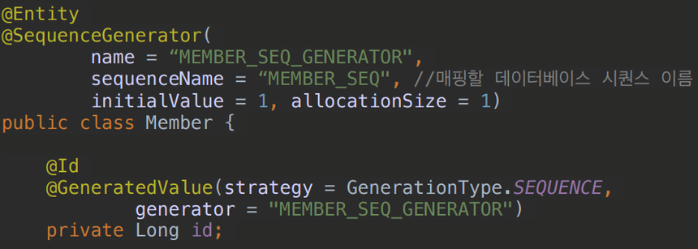

AUTO : 방언에 따라 자동 지정 (default)

TABLE : 키 생성용 테이블 사용. → 모든 DB에서 사용. @TableGenerator 필요

---

### 단방향 연관관계 ( 한쪽만 설정 )

`@ManyToOne` : N:1 관계. ( FK는 1쪽에 )

`@JoinColumn` : 조인할 외래키 설정

```java
@Entity
public class Member {
	@ManyToOne
	@JoinColumn(name = "TEAM_ID")
	private Team team;
}
```

`member.setTeam(team);` → 이런 식으로 단방향 연관관계 설정.

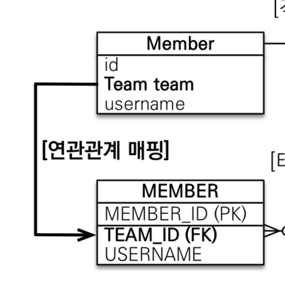

### 양방향 매핑 ( 양쪽 다 설정 )

Member는 단방향과 동일.

Team 쪽에 컬렉션을 추가

```java
@Entity
public class Team {
	**@OnToMany**(**mappedBy** = "team") // mappedBy가 중요. mappedBy를 가졌다는건 주인이 아니라는 뜻.
	List<Member> members = new ArrayList<Member>();
}
```

`mappedBy = “team”`에서 team은 연관관계 주인이 가지고 있는 Team의 변수명 임.

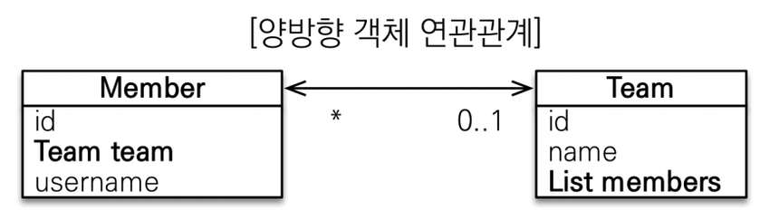

**양방향 매핑에서는 둘 중 하나는 외래키를 관리해야 함. → 외래키를 갖는자가 `연관관계의 주인`이다.**

### 연관관계 주인(Owner) : 외래키를 관리.

테이블은 `외래키` 하나로 두 테이블이 연관관계를 맺음 하지만 객체는 `A→B`, `B→A` 같이 참조가 2곳

주인이 아닌자는 읽기만 가능. 

**주인이 아닌자가** `mappedBy` 속성으로 주인을 지정.

위 Member와 Team 관계에서는 mappedBy를 Team이 가지고 있으니, 연관관계 주인은 Member다.

```java
Team team = new Team();
 team.setName("TeamA");
 em.persist(team);

 Member member = new Member();
 member.setName("member1");
 team.getMembers().add(member); 

 //연관관계의 주인에 값 설정
 member.setTeam(team);
 em.persist(member);
```

**양방향 매핑은 무한루프를 조심해라.**

ex) toString(), lombok, JSON 생성 라이브러리

### 연관관계의 주인을 정하는 기준

비즈니스 로직 기준으로 선택하면 안됨!!!

**연관관계 주인은 외래 키의 위치를 기준으로 정해야 함.**

### 일대다(1:N) 단방향 : 특이한 구조니 주의 → 왠만하면 `N:1 양방향`을 사용하자

1:N 에서는 일(1)이 연관관계 주인.

( 테이블에서는 다(N) 쪽에 외래 키가 있음 ) → 특이한 구조 : 객체와 테이블 차이 때문.

`@JoinColumn` 꼭 사용. ( 사용 안하면 중간에 테이블 자동으로 추가 됨 )

—> `1:N 단방향` 보단 `**N:1 양방향**` 매핑을 사용하자.

### 일대다(1:N) 양방향 → 공식적으로 존재 X → `N:1 양방향`을 사용하자

### 일대일(1:1) 양방향 → 다대일(N:1) 과 비슷하니 똑같이 설정.

### 일대일(1:1) 단방향은 JPA가 지원하지 않음.

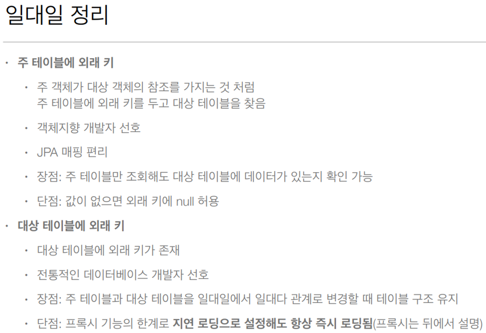

### N:N(다대다) → 실무에서 사용 X

객체는 컬렉션으로 가능하나, RDB는 정규화된 테이블 2개로 다대다 관계를 표현할 수 없음.

연결 테이블을 추가해서 `일대다(1:N)`, `다대일(N:1)` 관계로 풀어내야 함.

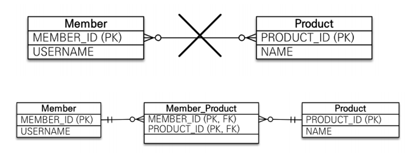

@ManyToMany → `@OneToMany`,  `@ManyToOne` 으로 수정.

연결 테이블용 엔티티를 따로 추가

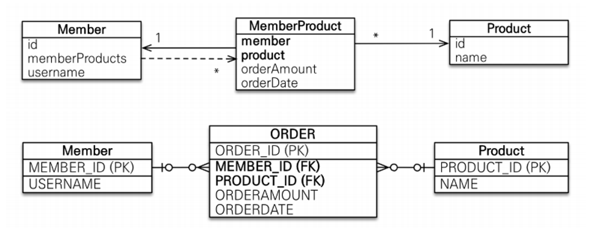

---

### 상속관계 매핑

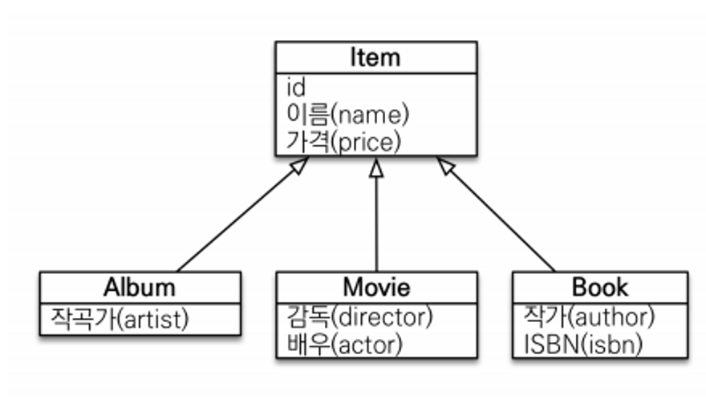

`@MappedSuperclass` : 테이블과 관계 없고, 단순히 엔티티가 공통으로 사용하는 매핑
정보를 모으는 역할 ex) 등록일, 수정일, 등록자, 수정자.

상속관계매핑 이런거 아니고, 그냥 공통적인 속성을 같이 쓰고 싶을 때 사용.

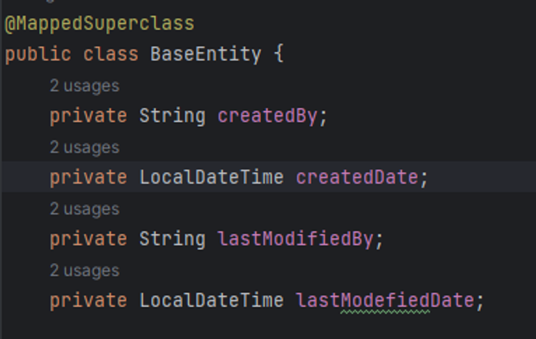
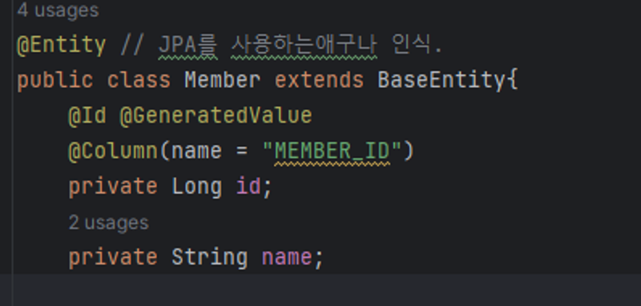

→ 근데 생성일, 수정일은 어노테이션으로 제공됨…

---

### 프록시 - 지연로딩

**지연로딩(LAZY) 사용시, 프록시 객체를 조회해옴. ( 실제로 DB에서 조회해오지 않음 )**

**** 가급적 지연 로딩만 사용(특히 실무에서)..!!!!**

즉시로딩을 적용하면 예상치못한 SQL 이 발생

나는 Member만 조회를 했는데, 이에 엮여있는 모든 테이블이 다 join되어서 조회되다 보니, 예상치 못한 sql이 날라가는 것.

—> 성능 문제 발생 가능.

**`@ManyToOne`, `@OneToOne`은 기본값이 `즉시로딩(EAGER)`  : (@XToOne )**

→ `지연로딩(LAZY)`로 설정

**@OneToMany, @ManyToMany는 기본값이 `지연로딩(LAZY)` : (@XToMany)**

### inner join 과 join fetch 차이

inner join : 처음 조회해올 때 조인쿼리가 나간 후. 값에 접근할 떄마다 영속성 컨텍스트 접근 또는 sql 을 날림.

`join fetch` : inner join으로 SQL이 날라가서 쿼리가 1번만 나감.

### 패치조인 - 정리

모든 것을 패치 조인으로 해결할 수는 없음.

패치 조인은 객체 그래프를 유지할 때 사용하면 효과적.

(조건을 줘서 뽑아와서는 안됨 )

여러 테이블을 조인해서 엔티티가 가진 모양이 아닌 전혀 다른 결과를 내야하면, 패치 조인보다는 일반조인을 사용하고 필요한 데이터들만 조회해서 DTO로 반환하는 것이 효과적.

( ex. Team이 가진 members를 패치조인으로 뽑아낼 때, 전체 members를 가져와야지, 추가조건으로 member.age> 10과 같이 조건을 줘서는 안됨. Team 이 기대한 members의 값이 아니게 됨.)